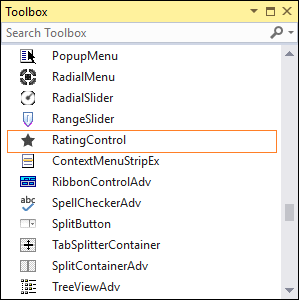

# Getting Started 

## Assembly deployment

Refer to the [control dependencies](https://help.syncfusion.com/windowsforms/control-dependencies#ratingcontrol) section to get the list of assemblies or details of NuGet package that needs to be added as a reference to use the control in any application.

Click [NuGet Packages](https://help.syncfusion.com/windowsforms/visual-studio-integration/nuget-packages) to learn how to install nuget packages in Windows Forms application.

## Adding Rating control via designer

1) Create a new Windows Forms project in Visual Studio to display the Rating control with its different shapes.

2) The **RatingControl** can be added to an application by dragging it from the toolbox to a designer view. The following dependent assemblies will be added automatically:

* Syncfusion.Grid.Base
* Syncfusion.Grid.Windows
* Syncfusion.Shared.Base
* Syncfusion.Shared.Windows
* Syncfusion.Tools.Base
* Syncfusion.Tools.Windows

## Adding Rating control via code

To add the control manually in C#, follow the given steps:

1) Create a C# or VB application via Visual Studio.

2) Add the following assembly references to the project:

* Syncfusion.Grid.Base
* Syncfusion.Grid.Windows
* Syncfusion.Shared.Base
* Syncfusion.Shared.Windows
* Syncfusion.Tools.Base
* Syncfusion.Tools.Windows

3) Include the required namespaces.




using Syncfusion.Windows.Forms.Tools;




Imports Syncfusion.Windows.Forms.Tools


 

4) Create an instance of **RatingControl** control, and add it to the form.




RatingControl ratingControl1 = new RatingControl ();
this.Controls.Add(ratingControl1);




Dim  ratingControl1 As RatingControl = New RatingControl
Me.Controls.Add(ratingControl1)




5) Set the rating value by using `Value` property.




ratingControl2.Value = 3;




ratingControl2.Value = 3




## Built-in shapes for rating

In RatingControl, there are six predefined shapes available for customization. 

* Star
* Circle
* Triangle
* Heart
* Diamond
* Kite

You can customize the shapes of the RatingControl using the [Shape](https://help.syncfusion.com/cr/windowsforms/Syncfusion.Tools.Windows~Syncfusion.Windows.Forms.Tools.RatingControl~Shape.html) property. 



//Setting shape
this.ratingControl1.Shape = Syncfusion.Windows.Forms.Tools.Shapes.Heart;


‘Setting shape
Me.ratingControl1.Shape = Syncfusion.Windows.Forms.Tools.Shapes.Heart



