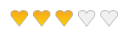

# Styling

Styling of shapes can be done either by using predefined visual styles or by BackColor, BorderColor, HighlightColor, SelectionColor and GradientColor settings.

## Built-in

Rating control supports predefined visual styles such as Default, Office2007, Office2010, Metro, Office2016ColorFul, Office2016DarkGray, Office2016White, Office2016Black  for Office Styles. The style can be set by the VisualStyle property.



this.ratingControl1.VisualStyle = Syncfusion.Windows.Forms.Tools.RatingControl.Style.Office2016ColorFul;





Me.ratingControl1.VisualStyle = Syncfusion.Windows.Forms.Tools.RatingControl.Style.Office2016ColorFul


OfficeColorScheme for Rating Control can be set using below code 



this.ratingControl1.OfficeColorScheme = Syncfusion.Windows.Forms.Tools.OfficeColorSchemes.Blue;





Me.ratingControl1.OfficeColorScheme = Syncfusion.Windows.Forms.Tools.OfficeColorSchemes.Blue



## Custom

The properties ItemHighlightStartColor, ItemHighlightEndColor, ItemSelectionStartColor, ItemSelectionEndColor are applied only if the ApplyGradientColors property is enabled.



this.ratingControl3.ItemHighlightEndColor = Color.Red;

this.ratingControl3.ItemHighlightStartColor = Color.Green;

this.ratingControl3.ItemSelectionEndColor = Color.Yellow;

this.ratingControl3.ItemSelectionStartColor = Color.LightYellow;





Me.ratingControl3.ItemHighlightEndColor = Color.Red

Me.ratingControl3.ItemHighlightStartColor = Color.Green

Me.ratingControl3.ItemSelectionEndColor = Color.Yellow

Me.ratingControl3.ItemSelectionStartColor = Color.LightYellow





this.ratingControl1.ApplyGradientColors = true;





Me.ratingControl1.ApplyGradientColors = True



