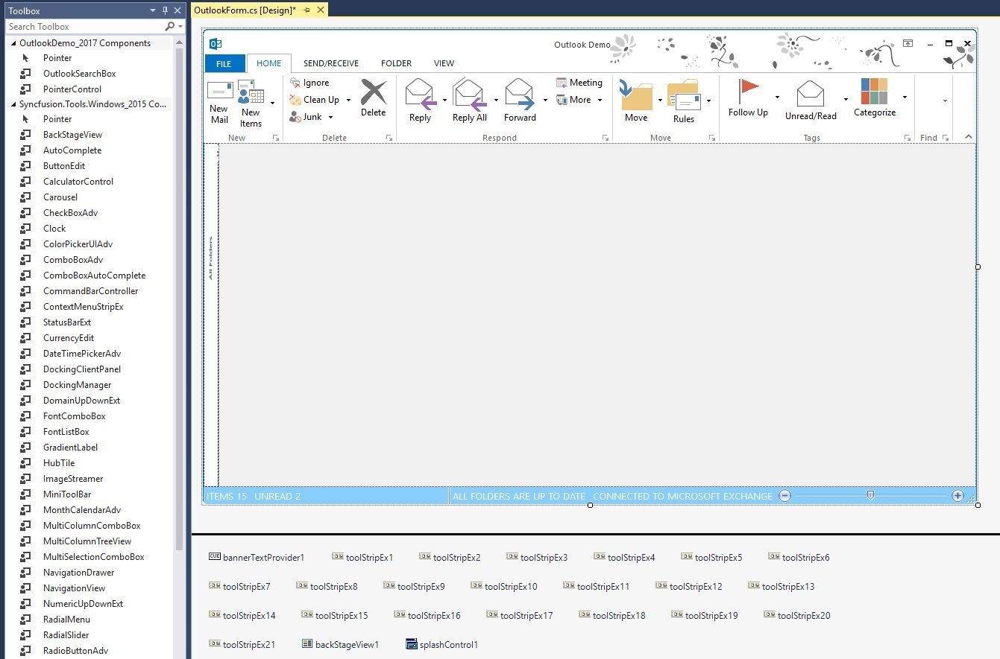
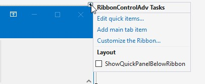

# Ribbon Designer

Ribbon designer is the visual designer for the Ribbon control. It is used to add custom tabs, control and groups to the Ribbon without running the application.

Image shows toolbox on the left side and designer on the right top and controls below the designer.

## Smart Tag support

Smart Tag feature allows you to quickly access the most commonly used properties and options, as well as perform tasks without having to leave the control’s design surface. (resembles a right-pointing arrow)

