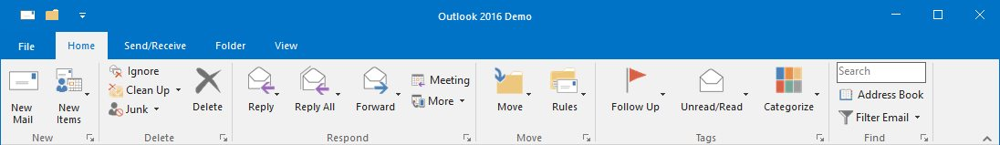

# Ribbon Designer

Ribbon designer is the visual designer for the Ribbon control. It is used to add custom tabs, control and groups to the Ribbon without running the application.

Image shows toolbox on the left side and designer on the right top and controls below the designer.

## AutoLayoutToolStrip

AutoLayoutToolStrip property enables Standard size and Layout for RibbonControlAdv and its items. The default value of the AutoLayoutToolStrip is False. ToolStripItems can be arranged in the RibbonControlAdv in the following three different sizes:

**Large:** ToolStripItem’s DisplayStyle is ImageAndText and TextImageRelation is ImageAboveText/ ImageBelowText.

**Small:** ToolStripItem’s DisplayStyle is ImageAndText and TextImageRelation is ImageBeforeText/ ImageAfterText.

**Extra Small:** ToolStripItem’s DisplaySyle is Image. 

**Margin and Padding:** ToolStripItems Margin and Padding are defined internally by comparing with items in the MS Ribbon so that the ToolStripItems are arranged properly to one another in RibbonControlAdv.

**Image Scaling:** Images used inside RibbonControlAdv has been scaled internally for different screen resolution. We have used the below defined image size for the different item size.

<table>
<tr>
<th>
Size Form</th><th>
Image Size</th></tr> 

<tr>
<td>
Large Size form</td><td>
32*32</td></tr>
<tr>
<td>
Small and Extra Small size form</td><td>
16*16</td></tr>
</table>

**RibbonControlAdv Height:** RibbonControlAdv Height is defined internally to accommodate the items, arranged inside with the desired layout by comparing with MS Ribbon. 





this.ribbonControlAdv1.AutoLayoutToolStrip = true;





Me.ribbonControlAdv1.AutoLayoutToolStrip = True





## Smart Tag support

Smart Tag feature allows you to quickly access the most commonly used properties and options, as well as perform tasks without having to leave the control’s design surface. (resembles a right-pointing arrow)

In Ribbon Smart Tag, we have now included the support to change some of the frequently used properties related to the Appearance, Behavior and links to access documentation and support resources of Ribbon.

In ToolStripEx Smart Tag, we can now set the Text for the ToolStripEx and add Horizontal and Vertical Layout ToolStripPanelItem from the Smart Tag. 

