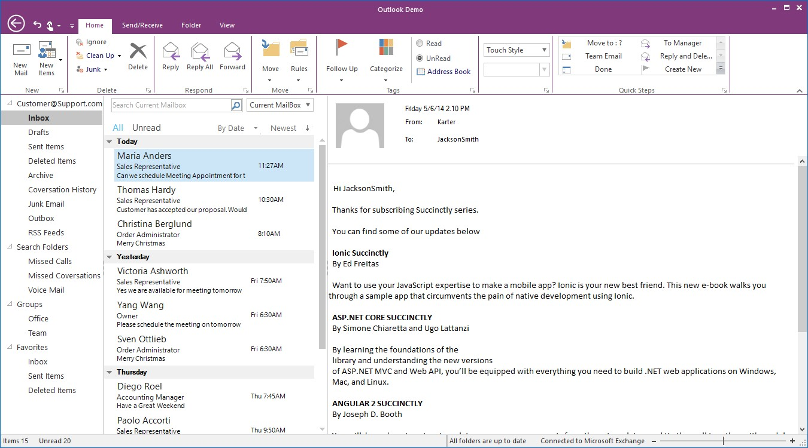
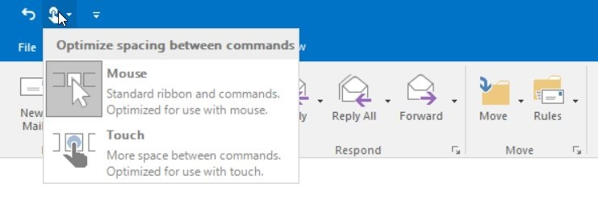

# Touch Support

Ribbon control have touch support and it provides Touch UI which is easy to access the elements in Ribbon.

## Enable Touch Style

You can control touch mode settings of RibbonControlAdv control using the following property.

<table>
<tr>
<th>
Property  </th><th>
Type  </th><th>
Description  </th></tr>
<tr>
<td>
RibbonTouchModeEnabled  </td><td>
Boolean  </td><td>
Enabling the RibbonTouchModeEnabled property in RibbonControlAdv, increases the size according to Microsoft touch mode size. Disabling the property retains its original size.  </td></tr>
</table>





//Enables touch mode
this.ribbonControlAdv1.RibbonTouchModeEnabled = true;
this.ribbonControlAdv1.TouchMode = true;





Me.ribbonControlAdv1.RibbonTouchModeEnabled = True
Me.ribbonControlAdv1.TouchMode = True





## Switching between Touch and Mouse Mode

During this mode, an extra dropdown button will be added in QAT. This dropdown contains two modes `Touch` and `Mouse`.

Selecting the touch will provide extra spaces between the elements for better touch support and Mouse mode will take back to standard ribbon size.
