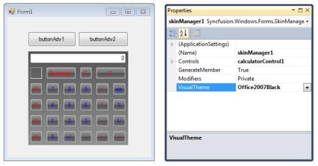
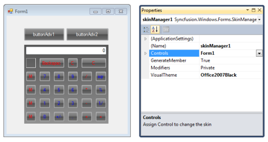
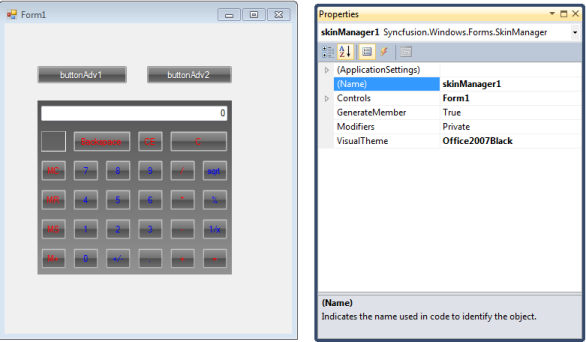
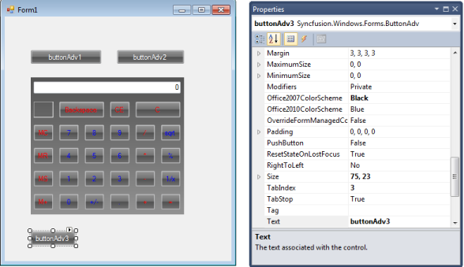
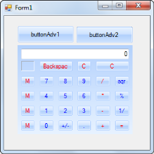
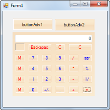

# Getting Started

## Adding skin manager component to a Windows Forms application

### Through Visual Studio

The following are steps to add the Skin Manager control to an application through Visual Studio:

 Create a new Windows Form application in Visual Studio. 

1. Drag the Skin Manager from the Toolbox tab to the designer.

   

2. Skin Manager is added.  
3. Open the Properties Window to assign parent control and apply skin. 

### Through code

You can add Skin Manager to one of the controls in your form or to the entire control as needed by specifying the root control. You can specify the root control using the _Control_ property.

To add Skin Manager to one of the controls, specify the control as root control. The following code illustrates this: 




SkinManager.SetVisualStyle(this.buttonAdv1, VisualTheme.Office2007Blue );





SkinManager.SetVisualStyle(Me.buttonAdv1, VisualTheme.Office2007Blue)




To add Skin Manager to the entire form, specify the form as root control. The following code illustrates this: 




SkinManager.SetVisualStyle(this, VisualTheme.Office2007Blue );





SkinManager.SetVisualStyle(Me, VisualTheme.Office2007Blue)




## Applying theme 

### Through designer

The following are the steps to apply the required skin to the form through designer: 

1. Open the Properties Window.
2. In the Controls field assign the root control for which you want to apply the theme. 

## Adding themes to controls with skin manager at designer time

Once the SkinManager is applied to a parent form or container, the new controls being added to it will also be updated with the theme applied in the SkinManager.

The following images describe the same in applying the Office2007Black theme to the newly added control [ButtonAdv] after the theme is applied to the form through the SkinManager.

### Through code

You can apply the required skin to the form using the _VisualTheme_ property. 

The following code illustrates how to apply Office 2007 theme:




SkinManager.SetVisualStyle(this, VisualTheme.Office2007Blue );





SkinManager.SetVisualStyle(Me, VisualTheme.Office2007Blue)




The following code illustrates how to apply Managed themes:




Office12ColorTable.ApplyManagedColors(this.buttonAdv1,Color. Orange);





Office12ColorTable.ApplyManagedColors(Me.buttonAdv1,Color.Orange )




