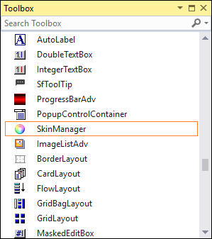
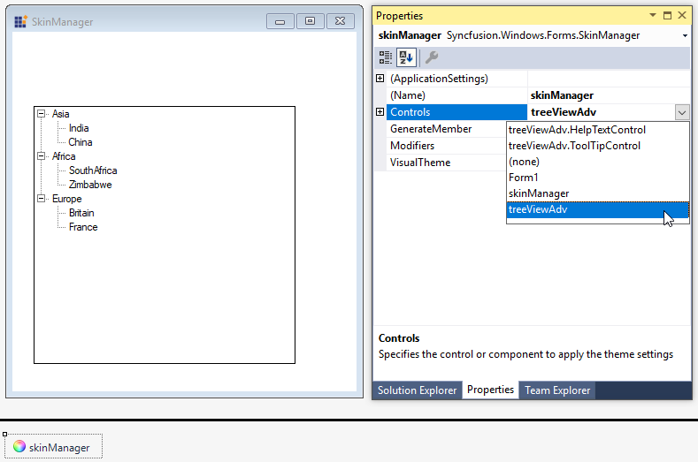

# Getting Started with Windows Forms skins (SkinManager)

This section briefly describes how to create a new Windows Forms project in Visual Studio and apply themes using the **SkinManager** component.

## Assembly deployment and theme assemblies

SkinManager presents in the `Syncfusion.Shared.Base` assembly. 

<table>
<tr>
<th>Theme name</th>
<th>Assembly name</th>
</tr>
<tr>
<td>Office2016Theme</td>
<td>Syncfusion.Office2016Theme.WinForms.dll assembly reference is needed only for the SfDataGrid, SfButton, SfDateTimeEdit, SfNumericTextBox, SfToolTip, and SfSmithChart controls only.
</td>
</tr>
<tr>
<td>Office2019Theme</td>
<td>Syncfusion.Office2019Theme.WinForms.dll</td>
</tr>
<tr>
<td>HighContrastTheme</td>
<td>Syncfusion.HighContrastTheme.WinForms.dll</td>
</tr>
<tr>
<td>Other Themes</td>
<td>Themes are included in the control assembly itself.</td> 
</tr>
</table>

## Loading theme assemblies

Skin manager loads theme assembly using the [LoadAssembly](https://help.syncfusion.com/cr/windowsforms/Syncfusion.Windows.Forms.SkinManager.html#Syncfusion_Windows_Forms_SkinManager_LoadAssembly_System_Reflection_Assembly_) method before applying theme. This is applicable for the themes loaded from separate assembly, and not applicable for the themes loaded from built-in assembly.





// Loading Office2019Theme assembly
SkinManager.LoadAssembly(typeof(Office2019Theme).Assembly);

//Loading HighContrastTheme assembly
SkinManager.LoadAssembly(typeof(HighContrastTheme).Assembly);

// Loading Office2016Theme assembly
SkinManager.LoadAssembly(typeof(Syncfusion.WinForms.Themes.Office2016Theme).Assembly);





' Loading Office2019Theme assembly
SkinManager.LoadAssembly(GetType(Office2019Theme).Assembly)

' Loading HighContrastTheme assembly
SkinManager.LoadAssembly(GetType(HighContrastTheme).Assembly)

' Loading Office2016Theme assembly
SkinManager.LoadAssembly(GetType(Syncfusion.WinForms.Themes.Office2016Theme).Assembly)





## Adding skin manager component

## Through designer

1) Create a new Windows Forms application in Visual Studio.

2) The `SkinManager` component can be added to designer by dragging it from the toolbox to the design view. 

The following dependent assemblies will be added automatically: 

* Syncfusion.Shared.Base

### Applying theme

After the SkinManager component has been added into the designer, select the SkinManager component, and go to properties window. Here, you can apply theme for a control or form using the `Controls` property.

N> SkinManager does not support the custom themes ( themes generated using ThemeStudio). It works only with predefined themes.

### Applying theme to the form

Skin manager supports to apply theme for all the control in the form or a container by applying theme to the form or container. So, you do not need to apply theme for each control.

## Through code

Theme for a control or form can be applied by settings `Controls` property of `SkinManager`. 





using Syncfusion.Windows.Forms;

this.components = new System.ComponentModel.Container();
SkinManager skinManager1 = new SkinManager(this.components);
skinManager1.Controls = treeViewAdv1;





Imports Syncfusion.Windows.Forms

Me.components = New System.ComponentModel.Container()
Dim skinManager1 As New SkinManager(Me.components)
skinManager1.Controls = treeViewAdv1





### Applying theme to the form

Skin manager supports to apply theme for all the control in the form or a container by applying theme to the form or container. So, you do not need to apply theme for each control.





skinManager1.Controls = this;
skinManager1.VisualTheme = VisualTheme.Office2016Black;





skinManager1.Controls = Me
skinManager1.VisualTheme = VisualTheme.Office2016Black





## Apply Themes to entire application

Skin manager allows to apply theme for all the controls and forms in an application by setting the [ApplicationVisualTheme](https://help.syncfusion.com/cr/windowsforms/Syncfusion.Windows.Forms.SkinManager.html#Syncfusion_Windows_Forms_SkinManager_ApplicationVisualTheme) property. It allows you to theme entire application using single `ApplicationVisualTheme` property. 




static void Main() 
{ 
    SkinManager.ApplicationVisualTheme = "Office2019Colourful";
    Application.EnableVisualStyles(); 
    Application.SetCompatibleTextRenderingDefault(false); 
    Application.Run(new Form1()); 
} 




N> Set the `ApplicationVisualTheme` property before main form is initialized.

## Apply theme for individual control

Theme can be applied to individual component using skin manager or by setting the `ThemeName` property. You need to call the [LoadAssembly](https://help.syncfusion.com/cr/windowsforms/Syncfusion.Windows.Forms.SkinManager.html#Syncfusion_Windows_Forms_SkinManager_LoadAssembly_System_Reflection_Assembly_) method for required themes when applying using the `ThemeName` property also.





this.treeViewAdv1.ThemeName = "Office2019Colorful";





Me.treeViewAdv1.ThemeName = "Office2019Colorful"





## Theme studio based themes

The Office2019Colorful and HighContrastBlack themes can be customized using the WinForms theme studio. Refer to the theme studio documentation to know how to create custom themes.

N> Appearance customization settings done in control level will not take effect when theme studio based theme is applied. So, for customization, refer to the Style section.

### Change font for entire application

When using theme studio based themes, the font for entire application can be customized by setting the [CanOverrideFontFamily](https://help.syncfusion.com/cr/windowsforms/Syncfusion.WinForms.Theme.FontHelper.html#Syncfusion_WinForms_Theme_FontHelper_CanOverrideFontFamily) property to true. This property is used only in constructor.





FontHelper.CanOverrideFontFamily = true;
FontHelper.FontFamily = new FontFamily("Algerian");





FontHelper.CanOverrideFontFamily = True
FontHelper.FontFamily = New FontFamily("Algerian")





### Styles

When using theme studio based themes, the appearance for each control or component can be customized using the `ThemeStyle` property.

N> If the control name starts with **Sf**, you can access appearance properties using the `Style` property, and for the remaining controls, use the `ThemeStyle` property.

For example, in the following code, different style of each control has been changed.





this.treeViewAdv1.ThemeStyle.BackColor = System.Drawing.Color.White;
this.treeViewAdv1.ThemeStyle.BorderColor = System.Drawing.Color.SteelBlue;
this.treeViewAdv1.ThemeStyle.LineColor = System.Drawing.Color.DarkBlue;
this.treeViewAdv1.ThemeStyle.TreeNodeAdvStyle.ArrowColor = System.Drawing.Color.Aqua;
this.treeViewAdv1.ThemeStyle.TreeNodeAdvStyle.TextColor = System.Drawing.Color.Red;





Me.treeViewAdv1.ThemeStyle.BackColor = System.Drawing.Color.White
Me.treeViewAdv1.ThemeStyle.BorderColor = System.Drawing.Color.SteelBlue
Me.treeViewAdv1.ThemeStyle.LineColor = System.Drawing.Color.DarkBlue
Me.treeViewAdv1.ThemeStyle.TreeNodeAdvStyle.ArrowColor = System.Drawing.Color.Aqua
Me.treeViewAdv1.ThemeStyle.TreeNodeAdvStyle.TextColor = System.Drawing.Color.Red





### Overriding user customization when applying theme

You can customize the appearance of control using the `Style` or `ThemeStyle` property when using theme studio based themes. Syncfusion control provides option whether theme can override style settings using the `CanOverrideStyle` property.

For example, in the following code, TreeView fore color is customized, and theme is applied after that line. If you run the application, theme will not override the fore color settings since the default value of `CanOverrideStyle` is `false`. If you set the `CanOverrideStyle` property to `true` before setting the theme, then fore color setting will be overridden by theme.





this.treeViewAdv1.CanOverrideStyle = false;
this.treeViewAdv1.ThemeName = "Office2019Colorful";
this.treeViewAdv1.ThemeStyle.TreeNodeAdvStyle.TextColor = System.Drawing.Color.Red;





Me.treeViewAdv1.CanOverrideStyle = False
Me.treeViewAdv1.ThemeName = "Office2019Colorful"
Me.treeViewAdv1.ThemeStyle.TreeNodeAdvStyle.TextColor = System.Drawing.Color.Red





