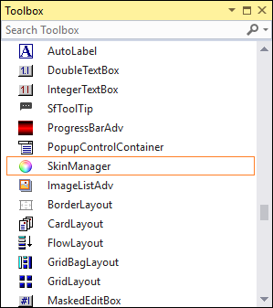
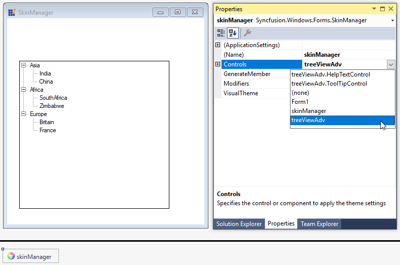
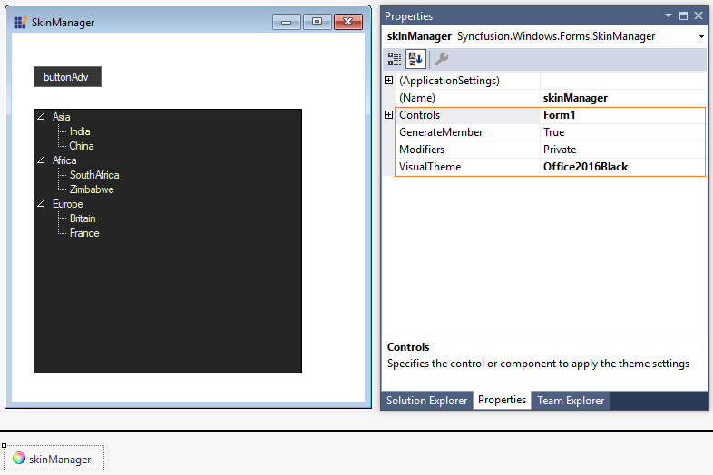
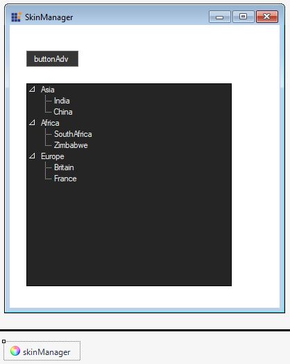

# Getting Started with Windows Forms skins (SkinManager)

This section briefly describes how to create a new Windows Forms project in Visual Studio and apply themes using the **SkinManager** component.

## Assembly deployment and theme assemblies

SkinManager is present in the `Syncfusion.Shared.Base` assembly. 

<table>
<tr>
<th>Theme name</th>
<th>Assembly name</th>
</tr>
<tr>
<td>Office2016Theme</td>
<td>Syncfusion.Office2016Theme.WinForms.dll assembly reference is needed only for the SfDataGrid, SfButton, SfDateTimeEdit, SfNumericTextBox, SfToolTip, and SfSmithChart controls only.
</td>
</tr>
<tr>
<td>Office2019Theme</td>
<td>Syncfusion.Office2019Theme.WinForms.dll</td>
</tr>
<tr>
<td>HighContrastTheme</td>
<td>Syncfusion.HighContrastTheme.WinForms.dll</td>
</tr>
<tr>
<td>Other Themes</td>
<td>Themes are included in the control assembly itself.</td> 
</tr>
</table>

N> The `Syncfusion.Office2016Theme.WinForms.dll` assembly reference is needed only for the `SfDataGrid`, `SfButton`, `SfDateTimeEdit`, `SfNumericTextBox`, `SfToolTip`, and `SfSmithChart` controls.

## Loading theme assemblies

SkinManager loads the theme assembly using the [LoadAssembly](https://help.syncfusion.com/cr/windowsforms/Syncfusion.Windows.Forms.SkinManager.html#Syncfusion_Windows_Forms_SkinManager_LoadAssembly_System_Reflection_Assembly_) method before applying the theme. This is required only for the themes that are shipped in a separate assembly, and is not applicable for the themes that are loaded from the built-in assembly.





// Loading Office2019Theme assembly
SkinManager.LoadAssembly(typeof(Office2019Theme).Assembly);

//Loading HighContrastTheme assembly
SkinManager.LoadAssembly(typeof(HighContrastTheme).Assembly);

// Loading Office2016Theme assembly
SkinManager.LoadAssembly(typeof(Syncfusion.WinForms.Themes.Office2016Theme).Assembly);





' Loading Office2019Theme assembly
SkinManager.LoadAssembly(GetType(Office2019Theme).Assembly)

' Loading HighContrastTheme assembly
SkinManager.LoadAssembly(GetType(HighContrastTheme).Assembly)

' Loading Office2016Theme assembly
SkinManager.LoadAssembly(GetType(Syncfusion.WinForms.Themes.Office2016Theme).Assembly)





## Adding the SkinManager component

## Through designer

Before you begin, make sure the Syncfusion WinForms controls are installed and registered with Visual Studio. Refer to the [Add Syncfusion Controls to Visual Studio Toolbox](https://help.syncfusion.com/windowsforms/add-syncfusion-controls) documentation for the required setup.

1) Create a new Windows Forms application in Visual Studio.

2) The `SkinManager` component can be added to the designer by dragging it from the toolbox to the design view. 

The following dependent assemblies will be added automatically: 

* Syncfusion.Shared.Base

### Applying theme

After the SkinManager component has been added into the designer, select the SkinManager component, and go to the properties window. Here, you can apply a theme to a control or form using the `Controls` property.

N> SkinManager does not support the custom themes ( themes generated using ThemeStudio). It works only with predefined themes.

### Applying theme to the form (designer)

SkinManager supports applying a theme to all controls in a form or a container by applying the theme to the form or container. Therefore, you do not need to apply the theme to each control individually.

## Through code

Theme for a control or form can be applied by setting the `Controls` property of `SkinManager`. You can place the following snippet in the form constructor (or in the `Form_Load` event) of your `Form1` class.





using Syncfusion.Windows.Forms;
using Syncfusion.Windows.Forms.Tools;

// `this.components` is the form's IContainer field that is created by the designer.
this.components = new System.ComponentModel.Container();
SkinManager skinManager1 = new SkinManager(this.components);

// `treeViewAdv1` is a placeholder Syncfusion TreeViewAdv control on the form.
TreeViewAdv treeViewAdv1 = new TreeViewAdv();
this.Controls.Add(treeViewAdv1);

skinManager1.Controls = treeViewAdv1;





Imports Syncfusion.Windows.Forms
Imports Syncfusion.Windows.Forms.Tools

' `Me.components` is the form's IContainer field that is created by the designer.
Me.components = New System.ComponentModel.Container()
Dim skinManager1 As New SkinManager(Me.components)

' `treeViewAdv1` is a placeholder Syncfusion TreeViewAdv control on the form.
Dim treeViewAdv1 As New TreeViewAdv()
Me.Controls.Add(treeViewAdv1)

skinManager1.Controls = treeViewAdv1





### Applying theme to the form (code)

SkinManager supports applying a theme to all controls in a form or a container by applying the theme to the form or container. Therefore, you do not need to apply the theme to each control individually.





skinManager1.Controls = this;
skinManager1.VisualTheme = VisualTheme.Office2016Black;





skinManager1.Controls = Me
skinManager1.VisualTheme = VisualTheme.Office2016Black





## Apply Themes to entire application

SkinManager allows you to apply a theme to all the controls and forms in an application by setting the [ApplicationVisualTheme](https://help.syncfusion.com/cr/windowsforms/Syncfusion.Windows.Forms.SkinManager.html#Syncfusion_Windows_Forms_SkinManager_ApplicationVisualTheme) property. This single property can be used to apply a theme to the entire application.




static void Main()
{
    SkinManager.ApplicationVisualTheme = "Office2019Colorful";
    Application.EnableVisualStyles();
    Application.SetCompatibleTextRenderingDefault(false);
    Application.Run(new Form1());
}




Shared Sub Main()
    SkinManager.ApplicationVisualTheme = "Office2019Colorful"
    Application.EnableVisualStyles()
    Application.SetCompatibleTextRenderingDefault(False)
    Application.Run(New Form1())
End Sub




N> Set the `ApplicationVisualTheme` property before the main form is initialized.

The following table lists some of the theme name string values that can be assigned to `ApplicationVisualTheme`. The exact set of values may vary based on the installed Syncfusion version.

| Theme name string | Description |
|-------------------|-------------|
| `Office2016Colorful` | Office 2016 colorful theme |
| `Office2016Black` | Office 2016 black theme |
| `Office2016White` | Office 2016 white theme |
| `Office2016DarkGray` | Office 2016 dark gray theme |
| `Office2019Colorful` | Office 2019 colorful theme |
| `HighContrastBlack` | High contrast black theme |

## Apply theme for an individual control

A theme can be applied to an individual control using the SkinManager or by setting the `ThemeName` property. You also need to call the [LoadAssembly](https://help.syncfusion.com/cr/windowsforms/Syncfusion.Windows.Forms.SkinManager.html#Syncfusion_Windows_Forms_SkinManager_LoadAssembly_System_Reflection_Assembly_) method for the required themes when applying a theme using the `ThemeName` property.

The `ThemeName` property accepts a string value that identifies the theme. The exact set of supported values may vary based on the installed Syncfusion version. Common values include `Office2016Colorful`, `Office2016Black`, `Office2016White`, `Office2016DarkGray`, `Office2019Colorful`, and `HighContrastBlack`.





this.treeViewAdv1.ThemeName = "Office2019Colorful";





Me.treeViewAdv1.ThemeName = "Office2019Colorful"





## Theme studio based themes

The Office2019Colorful and HighContrastBlack themes can be customized using the WinForms Theme Studio. Refer to the Theme Studio documentation to learn how to create custom themes. The exact capabilities and options may vary based on the installed Syncfusion version.

N> Appearance customizations done at the control level will not take effect when a Theme Studio based theme is applied. For customization, refer to the Styles section below.

### Change font for the entire application

When using Theme Studio based themes, the font for the entire application can be customized by setting the [CanOverrideFontFamily](https://help.syncfusion.com/cr/windowsforms/Syncfusion.WinForms.Theme.FontHelper.html#Syncfusion_WinForms_Theme_FontHelper_CanOverrideFontFamily) property to `true`. This property is used only in the constructor.





FontHelper.CanOverrideFontFamily = true;
FontHelper.FontFamily = new FontFamily("Algerian");





FontHelper.CanOverrideFontFamily = True
FontHelper.FontFamily = New FontFamily("Algerian")





### Styles

When using Theme Studio based themes, the appearance of each control or component can be customized using the `ThemeStyle` property.

N> If the control name starts with **Sf**, you can access the appearance properties using the `Style` property. For the remaining controls, use the `ThemeStyle` property.

#### Customizing a non-Sf control using ThemeStyle

For example, in the following code, the different style settings of the `TreeViewAdv` control have been changed.





this.treeViewAdv1.ThemeStyle.BackColor = System.Drawing.Color.White;
this.treeViewAdv1.ThemeStyle.BorderColor = System.Drawing.Color.SteelBlue;
this.treeViewAdv1.ThemeStyle.LineColor = System.Drawing.Color.DarkBlue;
this.treeViewAdv1.ThemeStyle.TreeNodeAdvStyle.ArrowColor = System.Drawing.Color.Aqua;
this.treeViewAdv1.ThemeStyle.TreeNodeAdvStyle.TextColor = System.Drawing.Color.Red;





Me.treeViewAdv1.ThemeStyle.BackColor = System.Drawing.Color.White
Me.treeViewAdv1.ThemeStyle.BorderColor = System.Drawing.Color.SteelBlue
Me.treeViewAdv1.ThemeStyle.LineColor = System.Drawing.Color.DarkBlue
Me.treeViewAdv1.ThemeStyle.TreeNodeAdvStyle.ArrowColor = System.Drawing.Color.Aqua
Me.treeViewAdv1.ThemeStyle.TreeNodeAdvStyle.TextColor = System.Drawing.Color.Red





#### Customizing an Sf control using Style

For Sf-prefixed controls, use the `Style` property to customize appearance when a Theme Studio based theme is applied.




// `sfButton1` is a placeholder SfButton control on the form.
this.sfButton1.Style.BackColor = System.Drawing.Color.White;
this.sfButton1.Style.ForeColor = System.Drawing.Color.SteelBlue;




' `sfButton1` is a placeholder SfButton control on the form.
Me.sfButton1.Style.BackColor = System.Drawing.Color.White
Me.sfButton1.Style.ForeColor = System.Drawing.Color.SteelBlue




### Overriding user customization when applying theme

You can customize the appearance of a control using the `Style` or `ThemeStyle` property when using Theme Studio based themes. Syncfusion controls provide an option to control whether the theme can override the style settings using the `CanOverrideStyle` property.

For example, in the following code, the TreeView fore color is customized, and the theme is applied after that line. If you run the application, the theme will not override the fore color settings because the default value of `CanOverrideStyle` is `false`. If you set the `CanOverrideStyle` property to `true` before setting the theme, the fore color setting will be overridden by the theme.





this.treeViewAdv1.CanOverrideStyle = false;
this.treeViewAdv1.ThemeName = "Office2019Colorful";
this.treeViewAdv1.ThemeStyle.TreeNodeAdvStyle.TextColor = System.Drawing.Color.Red;





Me.treeViewAdv1.CanOverrideStyle = False
Me.treeViewAdv1.ThemeName = "Office2019Colorful"
Me.treeViewAdv1.ThemeStyle.TreeNodeAdvStyle.TextColor = System.Drawing.Color.Red





## Version compatibility

Refer to the official Syncfusion documentation for the minimum Syncfusion WinForms version and the supported .NET Framework or .NET versions required to use the SkinManager component. The exact assemblies and behavior may vary based on the installed Syncfusion version.

## Troubleshooting

* **Theme is not applied to the control** — Confirm that the `SkinManager` component has been added to the form and that the target control is assigned to the `SkinManager.Controls` property.
* **Missing assembly exception when applying Office2016Theme, Office2019Theme, or HighContrastTheme** — Ensure the corresponding theme assembly is referenced in the project and that the `SkinManager.LoadAssembly` method is called before applying the theme.
* **`SkinManager` does not appear in the toolbox** — Install the Syncfusion WinForms controls and register them with Visual Studio. Refer to the [Add Syncfusion Controls to Visual Studio Toolbox](https://help.syncfusion.com/windowsforms/add-syncfusion-controls) documentation.
* **Customizations are not reflected when using a Theme Studio based theme** — Appearance customizations done at the control level do not take effect when a Theme Studio based theme is applied. Use the `Style` (for Sf controls) or `ThemeStyle` (for non-Sf controls) properties as described in the Styles section.
* **Application-level theme is not applied to a specific form** — Set the `SkinManager.ApplicationVisualTheme` property before the main form is initialized in the `Main` method.
