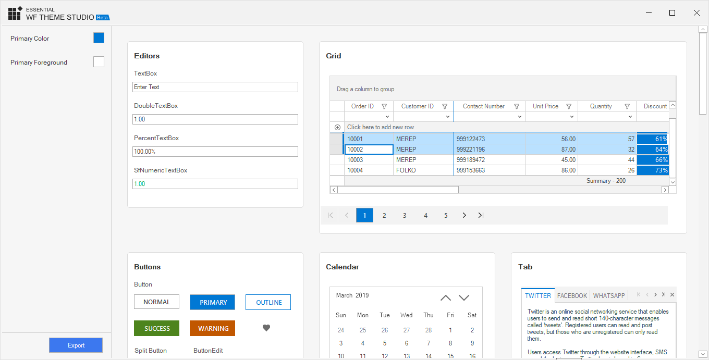

# Windows Forms skins (SkinManager) Overview

The WinForms Skin Manager library provides support to set a theme for all Syncfusion controls in an entire application to maintain a common user interface appearance. It provides support for the following themes.

* Office2007 (Blue, Black, Silver and Managed)
* Office2010 (Blue, Black, Silver and Managed)
* Office2013 (White, Dark Gray, Black and Colorful)
* Office2016 (White, Dark Gray, Black and Colorful)
* Office2019 (Colorful)
* Metro

This feature enables you to easily apply uniform style for all the child controls in the application.

## IT scenarios

When you create an application with multiple controls, you can apply uniform color for the entire form using this feature. 

Properties and Methods Tables for Skin Manager 

### Properties

<table>
<tr>
<th>
Property </th><th>
Description </th><th>
Type </th><th>
Data Type </th><th>
Reference links </th></tr>
<tr>
<td>
Control </td><td>
Specifies the parent control for which theme has to be applied </td><td>
NA </td><td>
Control  </td><td>
NA </td></tr>
<tr>
<td>
VisualTheme</td><td>
Specifies the style </td><td>
NA</td><td>
Enum  </td><td>
NA</td></tr>
</table>

### Methods

<table>
<tr>
<th>
Method </th><th>
Description </th><th>
Parameters </th><th>
Type </th><th>
Return Type </th><th>
Reference links </th></tr>
<tr>
<td>
SetVisualTheme(Control,VisualTheme)</td><td>
Specifies the parent control and theme has to be applied </td><td>
Overloads: 1) (Control, String) 2) (Control,VisualTheme) </td><td>
NA </td><td>
Void </td><td>
NA </td></tr>
</table>
