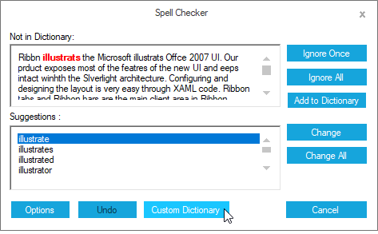
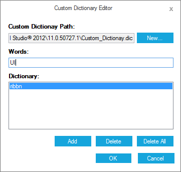

# Custom dictionary

SpellCheckerAdv provides built-in dictionary for English Language and also helps to configure based on your own language using custom dictionary option. You can configure the custom dictionary in SpellCheckerAdv control as follows:

## Configuring custom dictionary via SpellChecker dialog

You can configure custom dictionary by clicking on Custom Dictionary button in the SpellChecker dialog.

You can add their own custom dictionary by referring to the dictionary file path in the Custom Dictionary Editor dialog. Word list can also be customized with the Custom Dictionary Editor dialog and you can add or delete words from this dictionary.

## Configuring custom dictionary via code 

Custom Dictionary can be configured using `CustomDictionaryPath` property.





string path = Path.GetDirectoryName(Application.ExecutablePath) + "\\..\\..\\customdictionary.dic";

this.spellCheckerAdv1.CustomDictionaryPath = path;





Private path As String = Path.GetDirectoryName(Application.ExecutablePath) & "\..\..\customdictionary.dic"

Me.spellCheckerAdv1.CustomDictionaryPath = path





