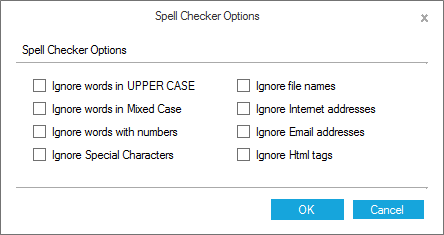

# Customization

SpellCheckerAdv allows customizing options to add misspelled words from the input text to the error list.





SpellCheckerAdv checker = new SpellCheckerAdv();

checker.IgnoreEmailAddress = true;
checker.IgnoreFileNames = true;

checker.IgnoreHtmlTags = true;

checker.IgnoreUrl = true;

checker.IgnoreSpecialSymbols = true;

checker.IgnoreMixedCaseWords = true;

checker.IgnoreUpperCaseWords = true;

checker.IgnoreAlphaNumericWords = true;





Private checker As New SpellCheckerAdv()

checker.IgnoreEmailAddress = True

checker.IgnoreFileNames = True

checker.IgnoreHtmlTags = True

checker.IgnoreUrl = True

checker.IgnoreSpecialSymbols = True

checker.IgnoreMixedCaseWords = True

checker.IgnoreUpperCaseWords = True

checker.IgnoreAlphaNumericWords = True





These options are accessible at runtime through the Spell Checker Options dialog. This can be invoked by Options button available in the SpellChecker dialog.

 

## Getting suggestions for wrong word

SpellCheckerAdv provides support to get suggestion list by passing the wrong word in the below methods.

* [GetSuggestions](https://help.syncfusion.com/cr/windowsforms/Syncfusion.Tools.Windows~Syncfusion.Windows.Forms.Tools.SpellCheckerAdv~GetSuggestions.html)
* [GetPhoneticWords](https://help.syncfusion.com/cr/windowsforms/Syncfusion.Tools.Windows~Syncfusion.Windows.Forms.Tools.SpellCheckerAdv~GetPhoneticWords.html)
* [GetAnagrams](https://help.syncfusion.com/cr/windowsforms/Syncfusion.Tools.Windows~Syncfusion.Windows.Forms.Tools.SpellCheckerAdv~GetAnagrams.html)





this.spellCheckerAdv1.GetSuggestions("Textboxx");

this.spellCheckerAdv1.GetPhoneticWords("Textboxx");

this.spellCheckerAdv1.GetAnagrams("Textbox");





Me.spellCheckerAdv1.GetSuggestions("Textboxx")

Me.spellCheckerAdv1.GetPhoneticWords("Textboxx")

Me.spellCheckerAdv1.GetAnagrams("Textbox")



