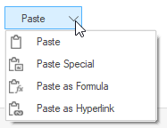

# Overview

The **"SplitButton"** control allows you to create a drop-down button-like interface that is a combination of a regular button and a drop-down list. You can use this control to create a button with options. Once the required option is selected the specified button command will be executed. 

## Features

*Button Mode** – Provides two types of mode. Normal and Toggle mode.

**Appearance** - Supports wide variety of built-in themes and also has ability to customize all elements in control with respect to control state.

**DropDown Item** - Provides support to add new items SplitButton drop-down list.

**DropDown Position** - Provides support to change the drop-down list position.