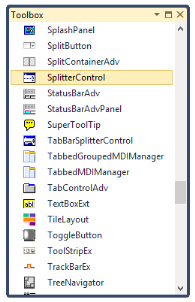
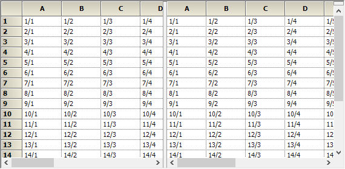

# Getting Started with Windows Forms Splitter

This section briefly describes how to design the SplitterControl in the Windows Forms application.

* Add the SplitterControl control.
* Configure the SplitterControl control.

## Add the SplitterControl

1. Create a new Windows Forms Application Project in VS IDE through the New Project Wizard.
2. Drag and drop the SplitterControl in the Form from the Toolbox.

## Configure the SplitterControl

To add SplitterControl to the Windows Forms Application through the following code example:

1. Include the namespaces Syncfusion.Windows.Forms and Syncfusion.Windows.Forms.Tools.

   
   

   

		//Namespaces.

		using Syncfusion.Windows.Forms.Tools;

		using Syncfusion.Windows.Forms;

   

   

		‘Namespaces.

		Imports Syncfusion.Windows.Forms

		Imports Syncfusion.Windows.Forms.Tools

   

   
   
   {{ codesnippet1 | OrderList_Indent_Level_1 }}

2. Create an instance of the SplitterControl and add it to the Form.

   
   

   

		//Creates the SplitterControl instance.

		SplitterControl splitterControl1=new Syncfusion.Windows.Forms.SplitterControl();

		this.Controls.Add(splitterControl1);

   

    

		‘Creates the SplitterControl instance.

		Dim splitterControl1 As New Syncfusion.Windows.Forms.SplitterControl()

		Me.Controls.Add(splitterControl1)

   

   
   
   {{ codesnippet2 | OrderList_Indent_Level_1 }}
   

