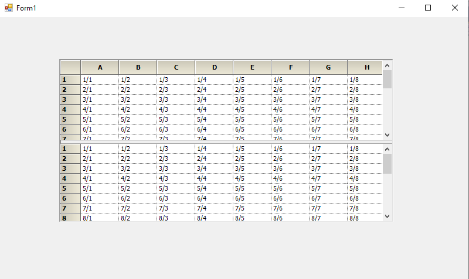

# Hiding the Scrollbars in Windows Forms Splitter

The Horizontal and Vertical scrollbars in SplitterControl can be hidden by using the ShowHorizontalScrollBar and ShowVerticalScrollBar properties.





this.splitterControl1.ShowHorizontalScrollBar = false;

this.splitterControl1.ShowVerticalScrollBar = false;





Me.splitterControl1.ShowHorizontalScrollBar = False

Me.splitterControl1.ShowVerticalScrollBar = False





1. **Hiding Horizontal Scrollbar**

2. **Hiding Vertical Scrollbar**

