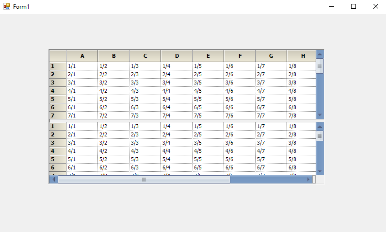

# Scrollbar Customization in Windows Forms Splitter

The appearance of the SplitterControl scrollbar can be customized by using the GridOfficeScrollBars property. The scrollbar can be customized to get the following style look and feel.

* Office2007
* Office2010
* Metro
* None





//Customizes the Scrollbar.

this.splitterControl1.GridOfficeScrollBars= OfficeScrollBars.Office2007;





'Customizes the Scrollbar

Me.splitterControl1.GridOfficeScrollBars= OfficeScrollBars.Office2007





