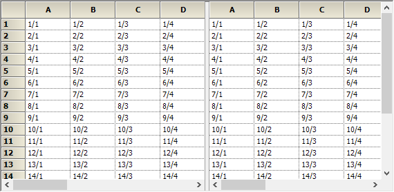

# Splitter Behavior in Windows Forms Splitter

The splitter in the SplitterControl can be supported with Row splitter and Column splitter or both.

* None
* SplitColumns
* SplitRows
* Both

The provided code is used to enable SplitBars exclusively for columns in a user interface.





this.splitterControl1.SplitBars = DynamicSplitBars.SplitColumns;





Me.splitterControl1.SplitBars = DynamicSplitBars.SplitColumns





