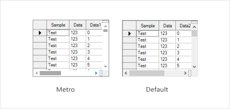

---
layout: post
title: Style in Windows Forms Splitter | Syncfusion
description: Style settings provide Default and Metro themes for customizing the appearance of SplitterControl components.
platform: windowsforms
control: Splitter  
documentation: ug
---

# Style in Windows Forms Splitter

SplitterControl supports visual styles such as Default and Metro. The styles can be set by using Style property.

* Default
* Metro





this.splitterControl1.Style = Syncfusion.Windows.Forms.Appearance.Metro;





Me.splitterControl1.Style = Syncfusion.Windows.Forms.Appearance.Metro





 
