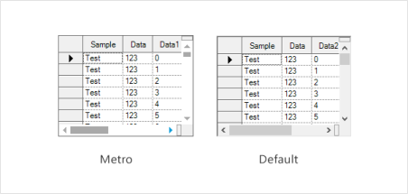

# Style in Windows Forms Splitter

The SplitterControl supports visual styles such as Default and Metro. The styles can be set by using the `Style` property.

* Default
* Metro





this.splitterControl1.Style = Syncfusion.Windows.Forms.Appearance.Metro;





Me.splitterControl1.Style = Syncfusion.Windows.Forms.Appearance.Metro





 
