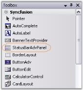
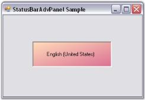
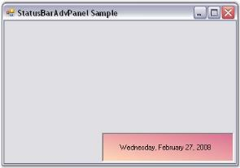

# Getting Started with Windows Forms StatusBarAdvPanel

* [Assembly deployment](#assembly-deployment)
* [Through designer](#through-designer)
* [Through code](#through-code)

This section describes a step-by-step procedure to design the StatusBarAdvPanel control through the designer and programmatically.

## Assembly deployment

Refer to the [control dependencies](https://help.syncfusion.com/windowsforms/control-dependencies#statusbar) section to get the list of assemblies or NuGet packages that need to be added as references to use the control in any application.

You can find more details about installing the NuGet packages in a Windows Forms application at the following link:

[How to install NuGet packages](https://help.syncfusion.com/windowsforms/installation/install-nuget-packages)

To install via the NuGet Package Manager Console, run:

```powershell
Install-Package Syncfusion.Tools.Windows
```

## Through designer

The StatusBarAdvPanel control provides full support for the Windows Forms designer. Dragging the control from the toolbox onto the form automatically adds the following required assembly references to the project:

* Syncfusion.Grid.Base.dll
* Syncfusion.Grid.Windows.dll
* Syncfusion.Shared.Base.dll
* Syncfusion.Shared.Windows.dll
* Syncfusion.Tools.Base.dll
* Syncfusion.Tools.Windows.dll

To create the StatusBarAdvPanel control through the designer,

* Drag-and-drop a StatusBarAdvPanel control from the toolbox onto the form.

  

* Set the desired background using the `BackgroundColor` property in the properties window.
* Set the `PanelType` property for the control.
* Set a custom border color by configuring the `BorderColor` property.
* Build and run the application.

   
  
## Through code

To create the StatusBarAdvPanel control programmatically,

1. Create a new Visual C# or Visual Basic .NET application in Visual Studio.
2. Add the following required assembly references to the project:

   * Syncfusion.Grid.Base.dll
   * Syncfusion.Grid.Windows.dll
   * Syncfusion.Shared.Base.dll
   * Syncfusion.Shared.Windows.dll
   * Syncfusion.Tools.Base.dll
   * Syncfusion.Tools.Windows.dll

   Refer to the [Assembly deployment](#assembly-deployment) section for details.
3. Add the namespace shown below to your form.





using Syncfusion.Windows.Forms.Tools;





Imports Syncfusion.Windows.Forms.Tools




{{ codesnippet1 | OrderList_Indent_Level_1 }}

4. Declare the StatusBarAdvPanel control.





private Syncfusion.Windows.Forms.Tools.StatusBarAdvPanel statusBarAdvPanel1;





Private statusBarAdvPanel1 As Syncfusion.Windows.Forms.Tools.StatusBarAdvPanel




{{ codesnippet2 | OrderList_Indent_Level_1 }}

5. Initialize the control and add it to your form.





this.statusBarAdvPanel1 = new Syncfusion.Windows.Forms.Tools.StatusBarAdvPanel();
this.statusBarAdvPanel1.Location = new System.Drawing.Point(48, 128);
this.Controls.Add(this.statusBarAdvPanel1);





Me.statusBarAdvPanel1 = New Syncfusion.Windows.Forms.Tools.StatusBarAdvPanel()
Me.statusBarAdvPanel1.Location = New System.Drawing.Point(48, 128)
Me.Controls.Add(Me.statusBarAdvPanel1)




{{ codesnippet3 | OrderList_Indent_Level_1 }}

6. Customize the control's appearance by setting its properties.





this.statusBarAdvPanel1.BackgroundColor = new Syncfusion.Drawing.BrushInfo(Syncfusion.Drawing.GradientStyle.BackwardDiagonal, System.Drawing.Color.PaleVioletRed, System.Drawing.Color.PeachPuff);
this.statusBarAdvPanel1.BorderColor = System.Drawing.Color.Black;
this.statusBarAdvPanel1.HAlign = Syncfusion.Windows.Forms.Tools.HorzFlowAlign.Left;
this.statusBarAdvPanel1.Location = new System.Drawing.Point(160, 184);
this.statusBarAdvPanel1.PanelType = Syncfusion.Windows.Forms.Tools.StatusBarAdvPanelType.LongDate;
this.statusBarAdvPanel1.Size = new System.Drawing.Size(216, 48);




Me.statusBarAdvPanel1.BackgroundColor = New Syncfusion.Drawing.BrushInfo(Syncfusion.Drawing.GradientStyle.BackwardDiagonal, System.Drawing.Color.PaleVioletRed, System.Drawing.Color.PeachPuff)
Me.statusBarAdvPanel1.BorderColor = System.Drawing.Color.Black
Me.statusBarAdvPanel1.HAlign = Syncfusion.Windows.Forms.Tools.HorzFlowAlign.Left
Me.statusBarAdvPanel1.Location = New System.Drawing.Point(160, 184)
Me.statusBarAdvPanel1.PanelType = Syncfusion.Windows.Forms.Tools.StatusBarAdvPanelType.LongDate
Me.statusBarAdvPanel1.Size = New System.Drawing.Size(216, 48)




{{ codesnippet4 | OrderList_Indent_Level_1 }}

7. Run the application. The StatusBarAdvPanel displays the date text.

   