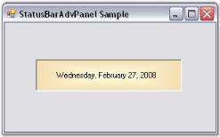

# About Syncfusion® Windows Forms StatusBarAdvPanel 

The StatusBarAdvPanel is a panel-derived class that can display StatusBar information such as the time and key state with several appearance enhancements, both within a StatusBarAdv control and also on a form. Customizing the look and feel can be done by setting the desired properties through the property window and usually there is no need to write any code.

 

