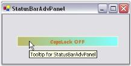

# ToolTip in Windows Forms StatusBarAdvPanel

ToolTip can be set for the StatusBarAdvPanel using the property given below.

Property Table

<table>
<tr>
<th>
StatusBarAdvPanel Property</th><th>
Description</th></tr>
<tr>
<td>
ToolTip</td><td>
Indicates the tooltip of the panel.The text to be displayed in the tooltip can be directly given in the property window.</td></tr>
</table>

This can be done through code as follows.




this.statusBarAdvPanel1.ToolTip = "Tooltip for StatusBarAdvPanel";





Me.statusBarAdvPanel1.ToolTip = "Tooltip for StatusBarAdvPanel"




