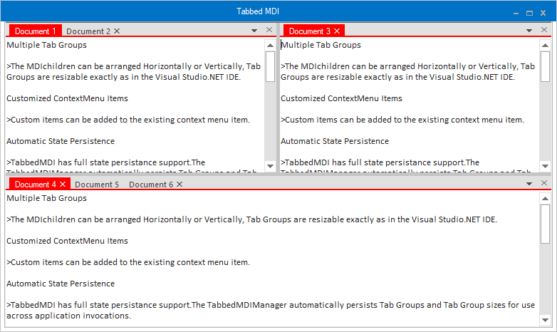
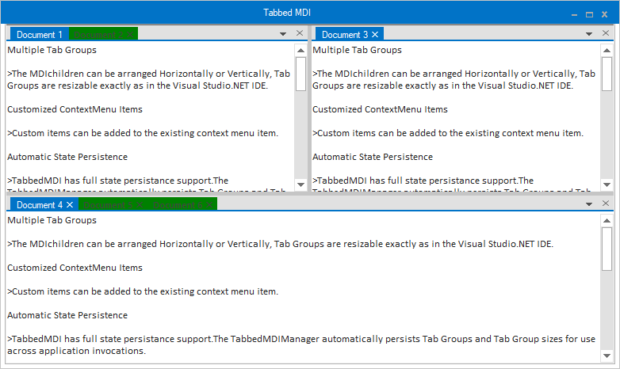
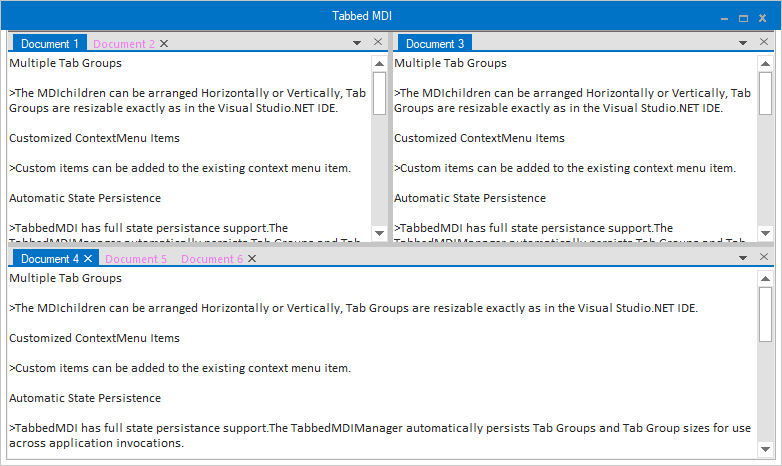
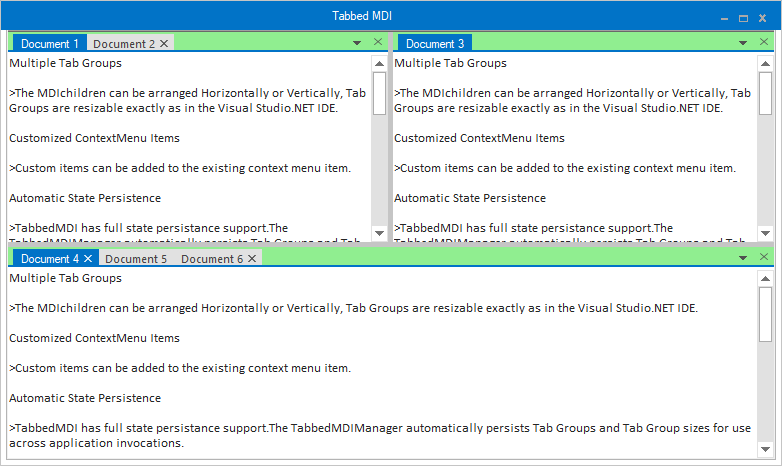
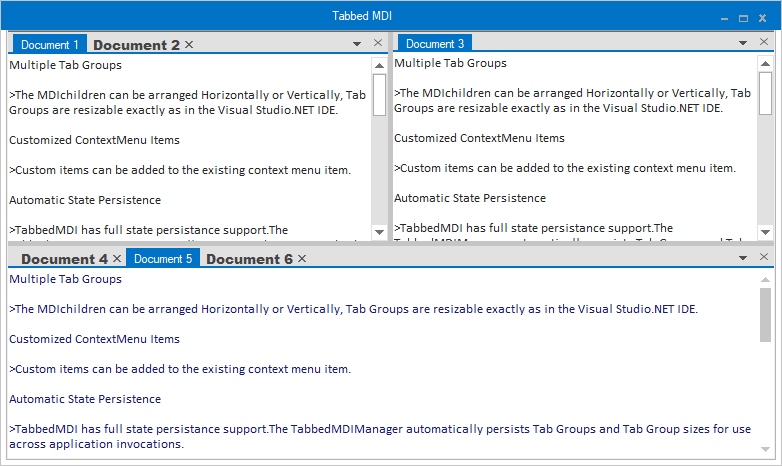
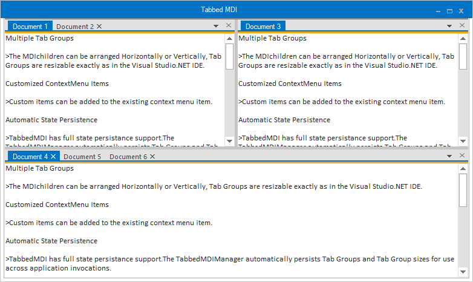

# Appearance Settings in Windows Forms TabbedMDI

The variousAppearance Settings for TabbedMDIManager are discussed in this section.

## Foreground settings

This section guides you in setting the text and icons for the tabs.

### Tab text

The text of the tabs can be set by directly setting the Text property of the form, if the tabbed window is going to be a normal form.

#### Icon settings

The below properties controls the appearance and behavior of the icon settings.

Property table

<table>
<tr>
<th>
 TabbedMDIManager property</th><th>
Description</th></tr>
<tr>
<td>
Icon</td><td>
Gets/sets icons for tabs. When the Icon property is clicked, the browse page will be displayed, through which the user can select the icon to be displayed.</td></tr>
<tr>
<td>
UseIconsInTabs</td><td>
Gets/sets the value which determines whether icons should be added to the MDIChild.</td></tr>
<tr>
<td>
ImageSize</td><td>
The size of the image or icon that you want to add to the tabs can be set using this property.</td></tr>
</table>





this.Text = "Tabbed MDI Demo (Syncfusion Inc.)";

this.Icon = ((System.Drawing.Icon)(resources.GetObject("$this.Icon")));

this.TabbedMDIManager.UseIconsInTabs = false;

this.tabbedMDIManager1.ImageSize = new System.Drawing.Size(16, 16);





Me.Text = "Tabbed MDI Demo (Syncfusion Inc.)" 

Me.Icon = CType((resources.GetObject("$this.Icon")), System.Drawing.Icon)

Me.TabbedMDIManager.UseIconsInTabs = False

Me.TabbedMDIManager1.ImageSize = New System.Drawing.Size(20, 20)





## Applying themes

The TabbedMDIManager Control can be themed by enabling the ThemesEnabled property.





this.tabbedMDIManager1.ThemesEnabled = true;





Me.tabbedMDIManager1.ThemesEnabled = True





## Customization

TabbedMDIManager provides complete support for customizing the active and inactive tabs back color, fore color, and font.

#### ActiveTabBackColor

This option helps to customize the active tab back color.





this.tabbedMDIManager.ActiveTabBackColor = Color.Red;





Me.tabbedMDIManager.ActiveTabBackColor = Color.Red





#### TabBackColor

This option helps to customize the inactive tab back color.





this.tabbedMDIManager.TabBackColor = Color.Green;





Me.tabbedMDIManager.TabBackColor = Color.Green





#### ActiveTabForeColor

This option helps to customize the active tab fore color.





this.tabbedMDIManager.ActiveTabForeColor = Color.Yellow;





Me.tabbedMDIManager.ActiveTabForeColor = Color.Yellow





#### TabForeColor

This option helps to customize the inactive tab fore color.





this.tabbedMDIManager.TabForeColor = Color.Violet;





Me.tabbedMDIManager.TabForeColor = Color.Violet





#### TabPanelBackColor

This option helps to customize the background color of tab panel.





this.tabbedMDIManager.TabPanelBackColor = Color.LightGreen;





Me.tabbedMDIManager.TabPanelBackColor = Color.LightGreen





#### ActiveTabFont

This option helps to customize the active tab font.





this.tabbedMDIManager.ActiveTabFont = new Font("Algerian", 10);





Me.tabbedMDIManager.ActiveTabFont = new Font("Algerian", 10)





#### TabFont

This property helps to customize the inactive tab font.





this.tabbedMDIManager.TabFont = new Font("Arial Black", 10);





Me.tabbedMDIManager.TabFont = new Font("Arial Black", 10)





#### TabPanelBorderColor

This property helps to customize bottom line in tab panel.





this.tabbedMDIManager.TabPanelBorderColor = Color.Orange;





Me.tabbedMDIManager.TabPanelBorderColor = Color.Orange





