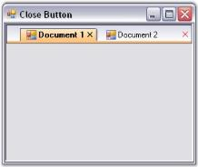

# Button Settings in Windows Forms TabbedMDI

This section discusses about the various buttons available in TabbedMDIManager control and their customization.

## Drop-down button

The MDIChild windows in a TabbedMDI window can be displayed in the form of a drop-down by enabling the [DropDownButtonVisible](https://help.syncfusion.com/cr/windowsforms/Syncfusion.Windows.Forms.Tools.TabbedMDIManager.html#Syncfusion_Windows_Forms_Tools_TabbedMDIManager_DropDownButtonVisible) property.





this.tabbedMDIManager.DropDownButtonVisible = true;





Me.tabbedMDIManager.DropDownButtonVisible = True





The visual drop-down styles can be set by handling the [BeforeDropDownPopup](https://help.syncfusion.com/cr/windowsforms/Syncfusion.Windows.Forms.Tools.TabbedMDIManager.html#Syncfusion_Windows_Forms_Tools_TabbedMDIManager_BeforeDropDownPopup) event using the below code snippet.





//Initializing

this.tabbedMDIManager.BeforeDropDownPopup += new DropDownPopupEventHandler(tabbedMDIManager_BeforeDropDownPopup);

private void tabbedMDIManager_BeforeDropDownPopup(object sender, DropDownPopupEventArgs e)

{

e.ParentBarItem.Style = Syncfusion.Windows.Forms.VisualStyle.Office2003;

}





//Initializing

AddHandler tabbedMDIManager.BeforeDropDownPopup, AddressOf tabbedMDI_BeforeDropDownPopup

Private Sub tabbedMDI_BeforeDropDownPopup(ByVal sender As Object, ByVal e As Syncfusion.Windows.Forms.Tools.DropDownPopupEventArgs) Handles TabbedMDIManager.BeforeDropDownPopup

e.ParentBarItem.Style = Syncfusion.Windows.Forms.VisualStyle.Office2003

e.Cancel = Me.checkBox5.Checked

End Sub





## Close button

On setting the [CloseButtonVisible](https://help.syncfusion.com/cr/windowsforms/Syncfusion.Windows.Forms.Tools.TabbedMDIManager.html#Syncfusion_Windows_Forms_Tools_TabbedMDIManager_CloseButtonVisible) property, the close button will be either visible or hidden.

Enabling the ShowCloseButtonForActiveTabOnly property will display the close button for the active tab only and [ShowCloseButton](https://help.syncfusion.com/cr/windowsforms/Syncfusion.Windows.Forms.Tools.TabbedMDIManager.html#Syncfusion_Windows_Forms_Tools_TabbedMDIManager_ShowCloseButton) property will display the close button for all the tabs.

The close button for individual tabs can also be displayed by implementing the below code snippet.





//Individual Close Buttons enabled.

this.tabbedMDIManager.ShowCloseButton = true;

//Close Buttons for Active Tabs only.

this.tabbedMDIManager.ShowCloseButtonForActiveTabOnly = true;

//Close Button can be made visible.

this.tabbedMDIManager.CloseButtonVisible = true;





' Individual Close Buttons enabled.

Me.tabbedMDIManager.CloseButtonVisible = True

' Close Buttons for active Tabs only.

Me.tabbedMDIManager.ShowCloseButtonForActiveTabOnly = True

' Close Button can be made visible.

Me.tabbedMDIManager.ShowCloseButton = True





 

The color of the close button at the extreme right of the MDI TabStrip can be changed using the [CloseButtonColor](https://help.syncfusion.com/cr/windowsforms/Syncfusion.Windows.Forms.Tools.TabbedMDIManager.html#Syncfusion_Windows_Forms_Tools_TabbedMDIManager_CloseButtonColor) property.





this.tabbedMDIManager.CloseButtonColor = Color.Red;





Me.tabbedMDIManager.CloseButtonColor = Color.Red





#### Middle mouse button

The tabs can be closed by clicking the middle mouse button on enabling the [CloseOnMiddleButtonClick](https://help.syncfusion.com/cr/windowsforms/Syncfusion.Windows.Forms.Tools.TabbedMDIManager.html#Syncfusion_Windows_Forms_Tools_TabbedMDIManager_CloseOnMiddleButtonClick) property.

This functionality can also be added using the code snippet given below.





this.tabbedMDIManager.CloseOnMiddleButtonClick = true;





Me.tabbedMDIManager.CloseOnMiddleButtonClick = True





## Support to show or hide close button for individual tabs

Essential Tools for Windows Forms now provides support to show or hide close button of the individual tabs in TabbedMDI Manager.

#### Use case scenarios

Using this feature you can hide the close button for the tabs you want to restrict close and show for the rest of the tabs.

#### Methods

Method table

<table>
<tr>
<th>
Method </th><th>
Description </th><th>
Parameters </th><th>
Type </th><th>
Return Type </th><th>
Reference links </th></tr>
<tr>
<td>
ShowCloseButtonForForm()</td><td>
This method will display the close button for the specific tabs alone.</td><td>
Form,bool</td><td>
NA</td><td>
void </td><td>
NA </td></tr>
</table>

#### Sample link

To view a sample:

1. Open Syncfusion Dashboard.
2. Click Windows Forms.
3. Click Run Samples. 
4. Navigate to  Tools Sample > Tabbed MDI Package > Tabbed MDI.

Showing or hiding the Close Button for Specific Tabs

You can show or hide close button for specific tasks using the [ShowCloseButtonForForm](https://help.syncfusion.com/cr/windowsforms/Syncfusion.Windows.Forms.Tools.TabbedMDIManager.html#Syncfusion_Windows_Forms_Tools_TabbedMDIManager_ShowCloseButtonForForm_System_Windows_Forms_Form_System_Boolean_) method.





    this.tabbedMDIManager.ShowCloseButtonForForm(form,true );





Me.tabbedMDIManager.ShowCloseButtonForForm(form,True)




