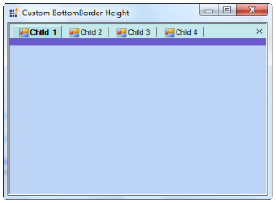

# Customize the distance between the Tab and Control in TabbedMDIManager

The height between the Tab and the Control can be set using the [BottomBorderHeight](https://help.syncfusion.com/cr/windowsforms/Syncfusion.Windows.Forms.Tools.TabHost.html#Syncfusion_Windows_Forms_Tools_TabHost_BottomBorderHeight) property of the TabHost. This property can be accessed by overriding the TabbedMDIManager as shown in the code snippet.





    public class TabbedMDIManagerExt : TabbedMDIManager

    {

        public TabbedMDIManagerExt() : base(){ }

        public TabbedMDIManagerExt(IContainer container): base(container){}

        protected override TabHost CreateTabHost()

        {

            TabHost tabHost = base.CreateTabHost();

            // Sets the Height in pixels.

            tabHost.BottomBorderHeight = 10;

            tabHost.BottomBorderColor = Color.SlateBlue;

            return tabHost;

        }

        protected override MDITabPanel CreateMDITabPanel()

        {

            MDITabPanel tabPanel = base.CreateMDITabPanel();

            tabPanel.ActiveTabColor = Color.PowderBlue;

            return tabPanel;

        }

    }





  Public Class TabbedMDIManagerExt

Inherits TabbedMDIManager

Public Sub New()

MyBase.New()

End Sub

Public Sub New(ByVal container As IContainer)

MyBase.New(container)

End Sub

Protected Overrides Function CreateTabHost() As TabHost

Dim tabHost As TabHost = MyBase.CreateTabHost()

' Sets the Height in pixels.

tabHost.BottomBorderHeight = 10

tabHost.BottomBorderColor = Color.SlateBlue

Return tabHost

End Function

Protected Overrides Function CreateMDITabPanel() As MDITabPanel

Dim tabPanel As MDITabPanel = MyBase.CreateMDITabPanel()

tabPanel.ActiveTabColor = Color.PowderBlue

Return tabPanel

End Function

End Class




