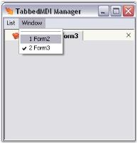

# MDI List in Windows Forms TabbedMDI

By using the TabbedMDIManager Framework, you can make your MDI container form's [MDIChildren](https://help.syncfusion.com/cr/windowsforms/Syncfusion.Windows.Forms.Tools.TabbedMDIManager.html#Syncfusion_Windows_Forms_Tools_TabbedMDIManager_MdiChildren) property obsolete. The value returned by this property will not be an accurate reflection of the MDIChildren. You should instead use the TabbedMDIManager's [MDIChildren](https://help.syncfusion.com/cr/windowsforms/Syncfusion.Windows.Forms.Tools.TabbedMDIManager.html#Syncfusion_Windows_Forms_Tools_TabbedMDIManager_MdiChildren) property to get a list of the MDIChild forms.

Property table

<table>
<tr>
<th>
 TabbedMDIManager property</th><th>
Description</th></tr>
<tr>
<td>
MDIChildren</td><td>
Returns the MDIChild of the associated MDIParent.</td></tr>
<tr>
<td>
MDIParent</td><td>
Returns the current MDIParent form managed.</td></tr>
</table>

You can retrieve the MDIChild forms using the below code.





private void Form1_Load(object sender, System.EventArgs e)

{                        

Form[] mdiFormsList = this.tabbedMdiManager.MdiChildren; 

for(int i=0;i<mdiFormsList.Length;i++)

{

MessageBox.Show(mdiFormsList[i].Text);

}

}





Private Sub Form1_Load(ByVal sender As Object, ByVal e As System.EventArgs) Handles MyBase.Load

Dim mdiFormsList As Form() = Me.tabbedMdiManager.MdiChildren

Dim i As Integer = 0

Do While i < mdiFormsList.Length

MessageBox.Show(mdiFormsList(i).Text)

i += 1

Loop

End Sub





## MDI list in menus

If you want an MDI List in your menus, use the TabbedMDIManager's [MDIListMenuItem](https://help.syncfusion.com/cr/windowsforms/Syncfusion.Windows.Forms.Tools.TabbedMDIManager.html#Syncfusion_Windows_Forms_Tools_TabbedMDIManager_MdiListMenuItem) property. This will duplicate the exact functionality that the MDIList property of the MenuItem class provides. This menu item will then be managed by the TabbedMDIManager, even when it is not attached to your container form.

Also, you can add an MDI List to your tool strip menus, using the TabbedMDIManager's [MDIListToolStripItem](https://help.syncfusion.com/cr/windowsforms/Syncfusion.Windows.Forms.Tools.TabbedMDIManager.html#Syncfusion_Windows_Forms_Tools_TabbedMDIManager_MdiListToolStripItem) property. This will duplicate the exact functionality that the MDI List property of the ToolStripItem class provides.

Property table

<table>
<tr>
<th>
 TabbedMDIManager property</th><th>
Description</th></tr>
<tr>
<td>
MDIListMenuItem</td><td>
Specifies the menu item to which the MDIChildren list should be added. </td></tr>
<tr>
<td>
MDIListToolStripItem</td><td>
Specifies the tool strip menu item to which the MDIChildren list should be added. </td></tr>
</table>





private MenuItem miWindow;

private void Form1_Load(object sender, System.EventArgs e)

{                        

// Add a menu item to the main menu.

this.miWindow = this.mainMenu1.MenuItems.Add("Window");

// Let the TabbedMDIManager insert the MDIChild windows list.

this.tabbedMDIManager.MdiListMenuItem = miWindow;

}





Private miWindow As MenuItem

Private Sub Form1_Load(ByVal sender As Object, ByVal e As System.EventArgs) Handles MyBase.Load

' Add a menu item to the main menu.

Me.miWindow = Me.mainMenu1.MenuItems.Add("Window")

' Let the TabbedMDIManager insert the MDIChild windows list.

Me.tabbedMDIManager.MdiListMenuItem = miWindow

End Sub





## MDI list in XP menus

When using XP Menus in Essential Tools as the MDIContainer's Main Menu, this property need not be set. Instead, use the [MDIListBarItem](https://help.syncfusion.com/cr/windowsforms/Syncfusion.Windows.Forms.Tools.XPMenus.MdiListBarItem.html) in XP Menus to represent the MDIChild windows list.

The XP Menus Framework automatically handles the case when the MDIChild windows layout is managed by the TabbedMDIManager.



[UserControls as Tabs](/windowsforms/tabbedmdi/usercontrols-as-tabs)



