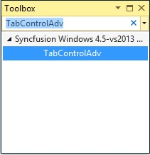
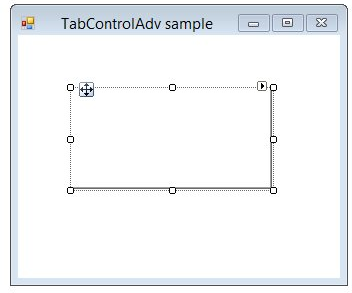

# Getting started

This section explains how to design a `TabControlAdv` control in a Windows Forms application and overview of its basic functionalities.

## Assembly deployment

Refer [control dependencies](https://help.syncfusion.com/windowsforms/control-dependencies#tabcontroladv) section to get the list of assemblies or NuGet package needs to be added as reference to use the control in any application.

Please find more details regarding how to install the nuget packages in windows form application in the below link:

[How to install nuget packages](https://help.syncfusion.com/windowsforms/nuget-packages)

# Creating simple application with TabControlAdv

You can create the Windows Forms application with TabControlAdv control as follows:

1. [Creating the project](#creating-the-project)
2. [Adding control via designer](#adding-control-via-designer)
3. [Adding control manually in code](#adding-control-manually-in-code)

### Creating the project

Create a new Windows Forms project in the Visual Studio to display the TabControlAdv.

## Adding control via designer

To add control through designer, follow the given steps:

**Step 1:** The TabControlAdv control can be added to the application by dragging it from the toolbox and dropping it in a designer view. The following required assembly references will be added automatically:

   * Syncfusion.Grid.Base.dll
   * Syncfusion.Grid.Windows.dll
   * Syncfusion.Shared.Base.dll
   * Syncfusion.Shared.Windows.dll
   * Syncfusion.Tools.Base.dll
   * Syncfusion.Tools.Windows.dll

 

 The following screenshot illustrates after drag and dropping the TabControlAdv from the ToolBox:

 

**Step 2:** TabPages can be added to TabControlAdv through designer by right clicking on the `TabControlAdv` and select the Add Tab option.

 
We can also add tabs with the help of TabPageAdv Collection Editor. In the TabPageAdv Collection Editor, we can add the tabs by clicking `Add` button.

## Adding control manually in code

To add control manually in C#, follow the given steps:

**Step1:** Add the following required assembly references to the project:

   * Syncfusion.Grid.Base.dll
   * Syncfusion.Grid.Windows.dll
   * Syncfusion.Shared.Base.dll
   * Syncfusion.Shared.Windows.dll
   * Syncfusion.Tools.Base.dll
   * Syncfusion.Tools.Windows.dll

**Step2:** Include the namespaces **Syncfusion.Windows.Forms.Tools**.





using Syncfusion.Windows.Forms.Tools;





Imports Syncfusion.Windows.Forms.Tools





**Step3:** Create an instance of `TabControlAdv` and add it to the form.





TabControlAdv tabControlAdv1 = new TabControlAdv();

this.Controls.Add(tabControlAdv1);





Dim tabControlAdv1 As TabControlAdv  = New TabControlAdv()

Me.Controls.Add(tabControlAdv1)





**Step4:** Create an instance of `TabPageAdv` and add it to the TabControlAdv.





this.tabControlAdv1.TabStyle = typeof(Syncfusion.Windows.Forms.Tools.TabRendererOffice2016Colorful);

TabPageAdv tabPageAdv1 = new TabPageAdv();

this.tabPageAdv1.Text = "tabPageAdv1";

this.tabControlAdv1.Controls.Add(this.tabPageAdv1);





Me.tabControlAdv1.TabStyle = GetType(Syncfusion.Windows.Forms.Tools.TabRendererOffice2016Colorful)

Dim tabPageAdv1 As TabPageAdv  = New TabPageAdv()

Me.tabControlAdv1.Controls.Add(Me.tabPageAdv1)

Me.tabPageAdv1.Text = "tabPageAdv1"





