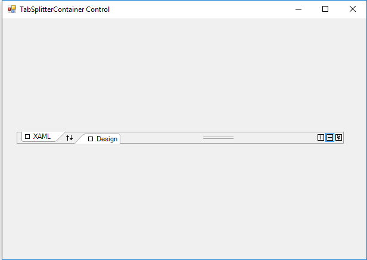
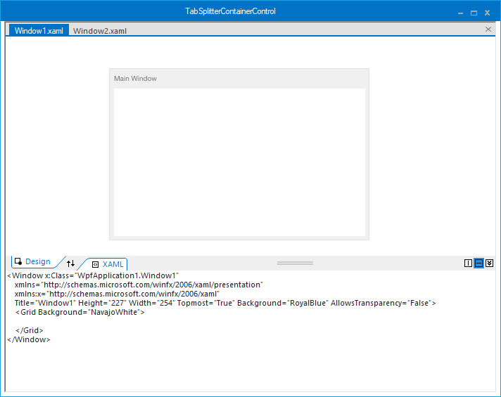
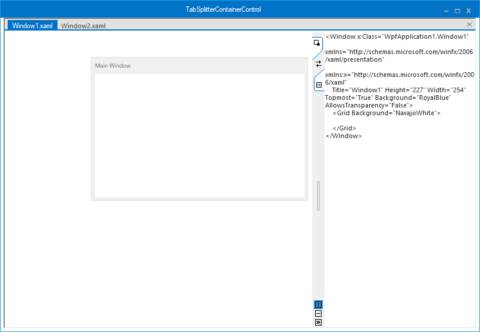
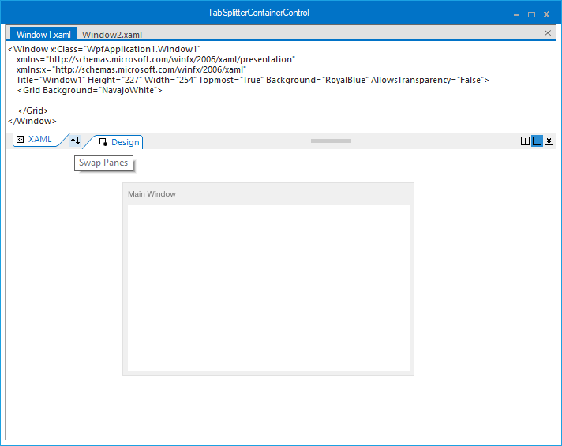
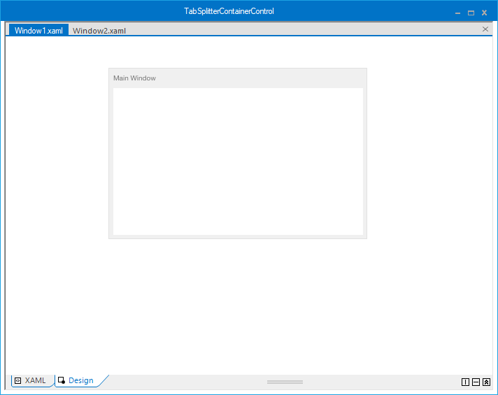

# Getting started

## Assembly deployment

Refer to the [control dependencies](https://help.syncfusion.com/windowsforms/control-dependencies#tabsplittercontainer) section to get the list of assemblies or NuGet package that needs to be added as a reference to use the control in any application.

You can find more details about installing the NuGet packages in a Windows Forms application in the following link: 

[How to install nuget packages](https://help.syncfusion.com/windowsforms/nuget-packages)

## Create a simple application with TabSplitterContainer

You can create a Windows Forms application with TabSplitterContainer using the following steps:

### Create a project

Create a new Windows Forms project in Visual Studio to display the TabSplitterContainer control.

## Add control through designer

The TabSplitterContainer control can be added to an application by dragging it from the toolbox to a designer view. The following assembly references are added automatically:

* Syncfusion.Grid.Base.dll
* Syncfusion.Grid.Windows.dll
* Syncfusion.Shared.Base.dll
* Syncfusion.Shared.Windows.dll
* Syncfusion.Tools.Base.dll
* Syncfusion.Tools.Windows.dll

## Add tab pages

Add pages into TabSplitterContainer by clicking **Add primary page** and **Add secondary page** from Smart Tags of TabSplitterContainer.

## Add control manually in code

To add the control manually in C#, follow the given steps:

**1.**	Add the following required assembly references to the project: 

* Syncfusion.Grid.Base.dll
* Syncfusion.Grid.Windows.dll
* Syncfusion.Shared.Base.dll
* Syncfusion.Shared.Windows.dll
* Syncfusion.Tools.Base.dll
* Syncfusion.Tools.Windows.dll

**2.** Include the **Syncfusion.Windows.Forms.Tools** namespace.



using Syncfusion.Windows.Forms.Tools;


Imports Syncfusion.Windows.Forms.Tools

 

**3.** Create a TabSplitterContainer instance, and add it to the window.



TabSplitterContainer tabSplitterContainer1 = new TabSplitterContainer();
this.tabSplitterContainer1.Size = new System.Drawing.Size(248, 77);
this.Controls.Add(tabSplitterContainer1);


Dim tabSplitterContainer1 As TabSplitterContainer = New TabSplitterContainer()
me.tabSplitterContainer1.Style = TabSplitterContainerStyle.Office2016Colorful
Me.tabSplitterContainer1.Size = New System.Drawing.Size(248, 77)
Me.Controls.Add(tabSplitterContainer1)



**4.** Add tab pages

Create an instance of the required pages, and add primary and secondary pages into TabSplitterContainer using the [PrimaryPages](https://help.syncfusion.com/cr/windowsforms/Syncfusion.Tools.Windows~Syncfusion.Windows.Forms.Tools.TabSplitterContainer~PrimaryPages.html) and [SecondaryPages](https://help.syncfusion.com/cr/windowsforms/Syncfusion.Tools.Windows~Syncfusion.Windows.Forms.Tools.TabSplitterContainer~SecondaryPages.html) collections, respectively.



// Create an instance of Tab splitter page
private TabSplitterPage tabSplitterPage1 = new TabSplitterPage();
private TabSplitterPage tabSplitterPage2 = new TabSplitterPage();
public Form1()
{
InitializeComponent();
this.tabSplitterPage1.Text = "XAML";
this.tabSplitterPage2.Text = "Design";
// Adding it to TabSplitterContainer
this.tabSplitterContainer1.PrimaryPages.AddRange(new TabSplitterPage[] {this.tabSplitterPage1});
this.tabSplitterContainer1.SecondaryPages.AddRange(new TabSplitterPage[] { this.tabSplitterPage2 });
this.tabSplitterContainer1.Size = new System.Drawing.Size(443, 115);
}


' Create an instance of Tab splitter page
Private tabSplitterPage1 As New TabSplitterPage()
Private tabSplitterPage2 As New TabSplitterPage()

Public Sub New()
InitializeComponent()
Me.tabSplitterPage1.Text = "XAML"
Me.tabSplitterPage2.Text = "Design"
' Adding it to TabSplitterContainer
Me.tabSplitterContainer1.PrimaryPages.AddRange(New TabSplitterPage() {Me.tabSplitterPage1})
Me.tabSplitterContainer1.SecondaryPages.AddRange(New TabSplitterPage() { Me.tabSplitterPage2 })
Me.tabSplitterContainer1.Size = New System.Drawing.Size(443, 115)
End Sub



## Tab orientation

The TabSplitterContainer can be oriented horizontally or vertically using the [Orientation](https://help.syncfusion.com/cr/windowsforms/Syncfusion.Tools.Windows~Syncfusion.Windows.Forms.Tools.TabSplitterContainer~Orientation.html) property.



// Tabsplitter control orientation
this.tabSplitterContainer1.Orientation = System.Windows.Forms.Orientation.Vertical;


‘ Tabsplitter control orientation
Me.tabSplitterContainer1.Orientation = System.Windows.Forms.Orientation.Vertical

 

* **Horizontal**

* **Vertical**

## Swap tab groups

You can easily swap the tab groups programmatically by enabling the [Swapped](https://help.syncfusion.com/cr/windowsforms/Syncfusion.Tools.Windows~Syncfusion.Windows.Forms.Tools.TabSplitterContainer~Swapped.html) property of TabSplitterContainer.



// Swapping tab groups
this.tabSplitterContainer1.Swapped = true;


‘ Swapping tab groups
Me.tabSplitterContainer1. Swapped = True

 

## Collapse tab groups

You can collapse the tab groups programmatically by enabling the [Collapsed](https://help.syncfusion.com/cr/windowsforms/Syncfusion.Tools.Windows~Syncfusion.Windows.Forms.Tools.TabSplitterContainer~Collapsed.html) property of TabSplitterContainer.



// Collapsing tab groups
this.tabSplitterContainer1.Collapsed = true;


‘ Collapsing tab groups
Me.tabSplitterContainer1.Collapsed = True

 

