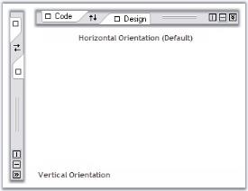

# Orientation

Orientation of the splitter in the TabSplitterContainer control is set using Orientation property. Default value is horizontal.





this.tabSplitterContainer1.Orientation = System.Windows.Forms.Orientation.Vertical;





Me.tabSplitterContainer1.Orientation = System.Windows.Forms.Orientation.Vertical





