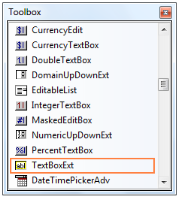

# Getting Started

This section briefly describes how to create a new Windows Forms project in Visual Studio and add **TextBoxExt** with it’s basic functionalities.

## Assembly deployment

Refer to the [control dependencies](https://help.syncfusion.com/windowsforms/control-dependencies#textboxext) section to get the list of assemblies or details of NuGet package details which needs to be added as reference to use the control in any application.

[Click here](https://help.syncfusion.com/windowsforms/visual-studio-integration/nuget-packages) to find more details on how to install nuget packages in Windows Forms application.

## Adding the TextBoxExt control via designer

1) Create a new Windows Forms application in Visual Studio.

2) The [TextBoxExt](https://help.syncfusion.com/cr/windowsforms/Syncfusion.Shared.Base~Syncfusion.Windows.Forms.Tools.TextBoxExt.html) control can be added to an application by dragging it from the toolbox to design view. The following dependent assemblies will be added automatically.

* Syncfusion.Shared.Base

   

## Adding the TextBoxExt control via code

1) Create a C# or VB application via Visual Studio.

2) Add the following assembly reference to the project.

* Syncfusion.Shared.Base

3) Include the required namespace.





using Syncfusion.Windows.Forms.Tools;





Imports Syncfusion.Windows.Forms.Tools





4) Create an instance of [TextBoxExt](https://help.syncfusion.com/cr/windowsforms/Syncfusion.Shared.Base~Syncfusion.Windows.Forms.Tools.TextBoxExt.html) control and add it to the form.





private Syncfusion.Windows.Forms.Tools.TextBoxExt textBoxExt1;
this.textBoxExt1 = new Syncfusion.Windows.Forms.Tools.TextBoxExt();
this.Controls.Add(this.textBoxExt1);





Private textBoxExt1 As Syncfusion.Windows.Forms.Tools.TextBoxExt
Me.textBoxExt1 = New Syncfusion.Windows.Forms.Tools.TextBoxExt()
Me.Controls.Add(Me.textBoxExt1)





## Size

The size of TextBoxExt control can be applied by the following properties.

* [MaximumSize](https://help.syncfusion.com/cr/windowsforms/Syncfusion.Shared.Base~Syncfusion.Windows.Forms.Tools.TextBoxExt~MaximumSize.html)
* [MinimumSize](https://help.syncfusion.com/cr/windowsforms/Syncfusion.Shared.Base~Syncfusion.Windows.Forms.Tools.TextBoxExt~MinimumSize.html)





this.textBoxExt1.MinimumSize = new System.Drawing.Size(267, 104);
this.textBoxExt1.MaximumSize = new System.Drawing.Size(267, 104);





Me.textBoxExt1.MaximumSize = New System.Drawing.Size(267, 104)
Me.textBoxExt1.MinimumSize = New System.Drawing.Size(267, 104)





## Multiline

The TextBoxExt control can be customized to display multiline text using the following properties.

* Multiline - The text of the edit control can span more than one line.
* WordWrap - Indicates if lines are automatically word-wrapped for multiline edit controls.
* ScrollBars - Enables scrollbars when text overflows the size of the tet box. The options available are Horizontal, Vertical, both and None.





this.textBoxExt1.Multiline = true;
this.textBoxExt1.WordWrap = true;
this.textBoxExt1.ScrollBars = System.Windows.Forms.ScrollBars.Vertical;





Me.textBoxExt1.Multiline = True
Me.textBoxExt1.WordWrap = True
Me.textBoxExt1.ScrollBars = System.Windows.Forms.ScrollBars.Vertical





