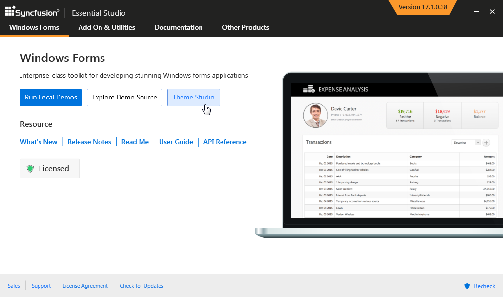
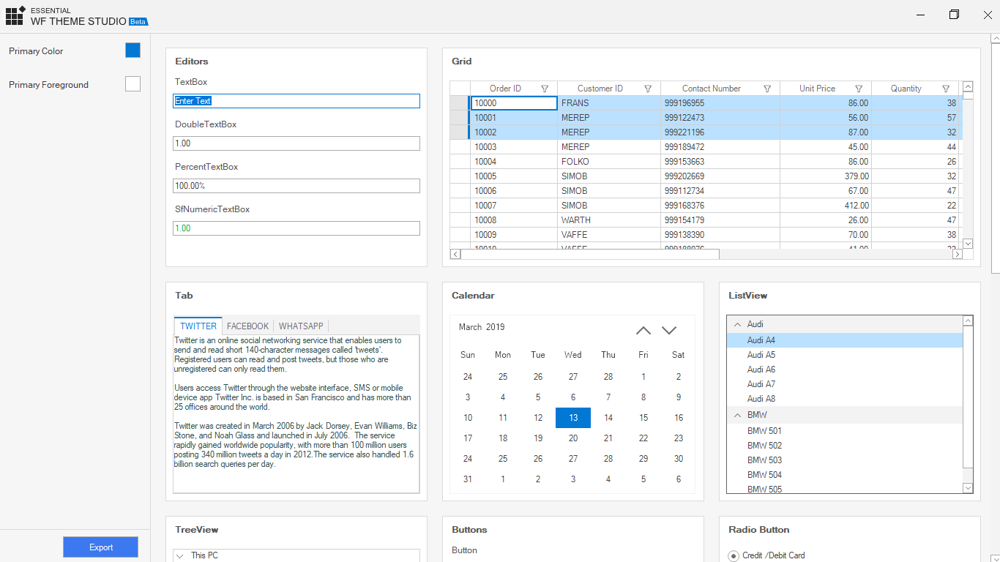
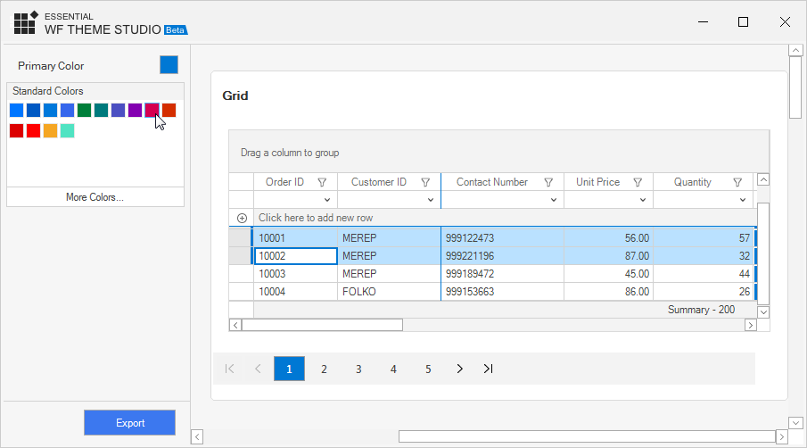
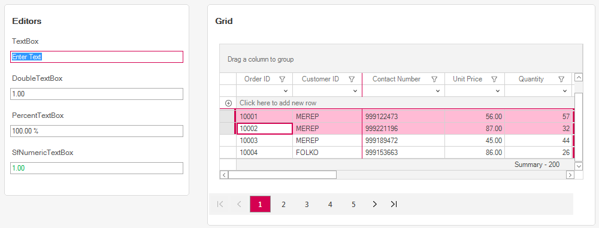
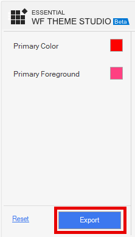
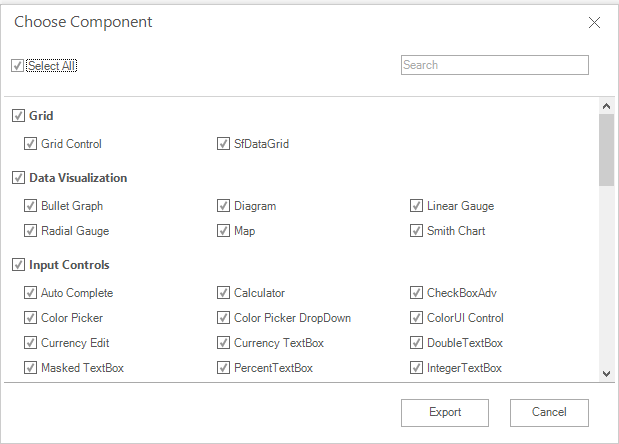
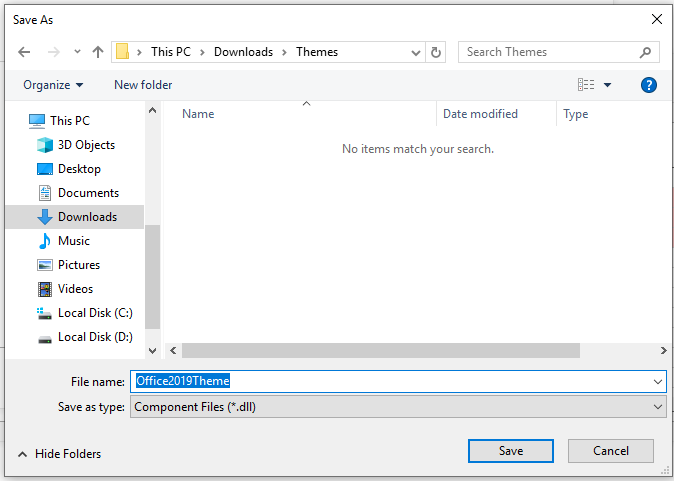
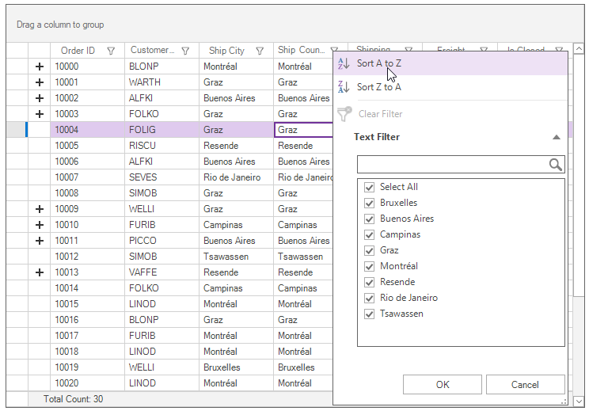

# Getting Started With Windows Forms Theme Studio

Theme Studio for WinForms can be used to create and apply a new theme for Syncfusion® controls from an existing theme. The primary goal here is to deliver appearance-rich Syncfusion® controls that best suit every user application, based on the application's needs.

## Customizing Theme Color in Theme Studio

In the Theme Studio utility, each theme has a unique common variable list. When the user changes a common variable's color code value, it will reflect in all the Syncfusion® WinForms controls. All Syncfusion® WinForms control styles are derived from these theme-based common variables.

The following steps describe how to launch and work with the Theme Studio utility.

**Step 1:**

After installing the "Syncfusion® Windows Forms" suite, launch and select "Theme Studio" from the start-up panel.

**Step 2:**

The Theme Studio window is divided into two sections: a controls preview on the right and a theme-customization panel on the left.

**Step 3:**

Click a color picker in the theme-customization section to select a color.

**Step 4:**

The Syncfusion® WinForms controls render with the newly selected colors in the preview section. 

## Export the Customized Theme
 
You can export the custom theme after changing the theme colors.

**Step 1:**

Click the Export button in the bottom left corner of the Theme Studio application. 

**Step 2:**

Now the export dialog appears with an option to select either all controls or just the desired control(s). This option is useful when you have integrated a selective list of Syncfusion® WinForms controls in your application. The Theme Studio will filter only the selected controls and customize the final output for those controls alone, thereby reducing the final output assembly size. 

**Step 3:**

The exported theme is delivered as an assembly (*.dll) file that contains color codes for the selected Syncfusion® WinForms controls. 

**Note:** You can enter the assembly name of your own choice while exporting. But remember that the assembly (*.dll) name will be the custom theme name, when you refer to it in your WinForms application.

## Using the Customized Theme in a Windows Forms Application

You can now add the exported assembly to your Windows Forms application and set the custom theme to the appropriate controls. In the following example, the custom theme is applied to the SfDataGrid control. 

**Step 1:**

Add the exported assembly (*.dll) as a reference in your Windows Forms project (for example, right-click the project in **Solution Explorer** and choose **Add** → **Reference** → **Browse**, then select the exported DLL).

**Note:** Close Theme Studio before referencing the exported DLL to avoid file-lock errors.

**Step 2:**

Load the theme assembly in `Program.cs` of your application and then initialize the SfDataGrid control in the main form. Set the `ThemeName` property of the SfDataGrid exactly to the exported assembly name. The exported assembly name and the class name follow the convention `Syncfusion.YourThemeName.Theme` (for example, `Syncfusion.VioletTheme.Theme`).

**C# — Program.cs**




using System;
using System.Windows.Forms;
using Syncfusion.Licensing;
using Syncfusion.WinForms.Themes;

namespace ThemeStudioDemo
{
    static class Program
    {
        /// 

        /// The main entry point for the application.
        /// 

        [STAThread]
        static void Main()
        {
            // Replace with your actual Syncfusion license key.
            // See https://help.syncfusion.com/windowsforms/licensing for details.
            SyncfusionLicenseProvider.RegisterLicense("YOUR_LICENSE_KEY");

            // Load the exported theme assembly before any Syncfusion control is created.
            SkinManager.LoadAssembly(typeof(Syncfusion.VioletTheme.Theme).Assembly);

            Application.EnableVisualStyles();
            // SetCompatibleTextRenderingDefault must be called before any control is created.
            Application.SetCompatibleTextRenderingDefault(false);
            Application.Run(new Form1());
        }
    }
}



{{ codesnippet1 | OrderList_Indent_Level_1 }}

**C# — Form1.cs**




using System.Windows.Forms;
using Syncfusion.WinForms.DataGrid;

namespace ThemeStudioDemo
{
    public partial class Form1 : Form
    {
        private SfDataGrid sfDataGrid1;

        public Form1()
        {
            InitializeComponent();

            // The ThemeName must match the exported assembly name.
            sfDataGrid1 = new SfDataGrid();
            sfDataGrid1.ThemeName = "VioletTheme";
            this.Controls.Add(sfDataGrid1);
        }
    }
}



{{ codesnippet2 | OrderList_Indent_Level_1 }}

**VB — Program.vb**




Imports System
Imports System.Windows.Forms
Imports Syncfusion.Licensing
Imports Syncfusion.WinForms.Themes

Module Program
    <STAThread>
    Private Sub Main()
        ' Replace with your actual Syncfusion license key.
        ' See https://help.syncfusion.com/windowsforms/licensing for details.
        SyncfusionLicenseProvider.RegisterLicense("YOUR_LICENSE_KEY")

        ' Load the exported theme assembly before any Syncfusion control is created.
        SkinManager.LoadAssembly(GetType(Syncfusion.VioletTheme.Theme).Assembly)

        Application.EnableVisualStyles()
        ' SetCompatibleTextRenderingDefault must be called before any control is created.
        Application.SetCompatibleTextRenderingDefault(False)
        Application.Run(New Form1())
    End Sub
End Module



{{ codesnippet3 | OrderList_Indent_Level_1 }}

**VB — Form1.vb**




Imports System.Windows.Forms
Imports Syncfusion.WinForms.DataGrid

Public Class Form1
    Private sfDataGrid1 As SfDataGrid

    Public Sub New()
        InitializeComponent()

        ' The ThemeName must match the exported assembly name.
        sfDataGrid1 = New SfDataGrid()
        sfDataGrid1.ThemeName = "VioletTheme"
        Me.Controls.Add(sfDataGrid1)
    End Sub
End Class



{{ codesnippet4 | OrderList_Indent_Level_1 }}

**Step 3:**

Compile and run the Windows Forms application. The custom theme is applied to the SfDataGrid control at run-time. 

