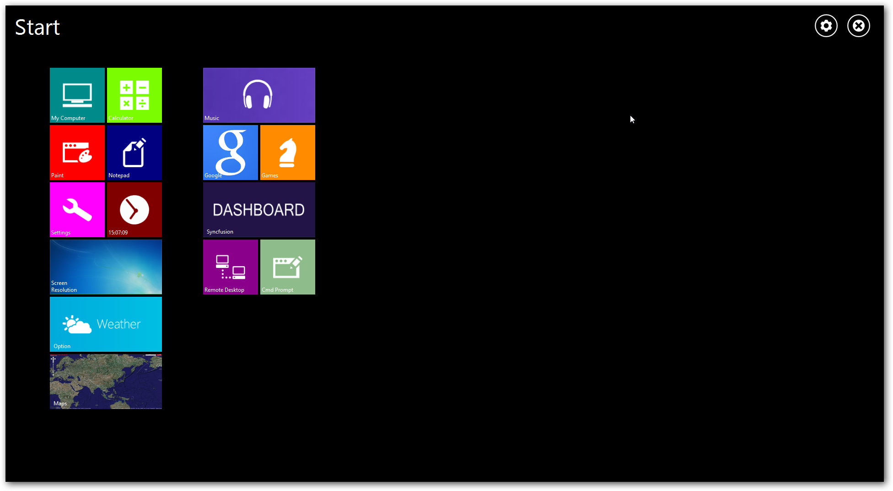

# Overview

[TileLayout](https://help.syncfusion.com/cr/cref_files/windowsforms/Syncfusion.Tools.Windows~Syncfusion.Windows.Forms.Tools.TileLayout.html) control is Windows 8 Start screen inspired control . It acts as a container that holds a set of tile view items that can be maximized, minimized, dragged to reorder and arranged in matrix position to achieve best layout. 

# Key features

* **Grouping** - Provides option to divide tile elements into logical groups.

* **Drag and drop** - Supports Drag and drop to reorder items.

* **Live tiles** - Supports live tiles which can rotate images and texts.