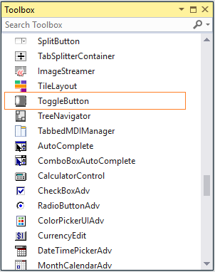
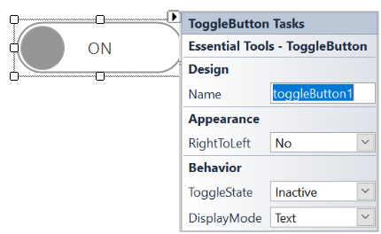

# Getting Started 

This section briefly describes how to create a new Windows Forms project in Visual Studio and add **"ToggleButton"** with it's basic functionalities.

## Assembly deployment

Refer to the [control dependencies](https://help.syncfusion.com/windowsforms/control-dependencies#togglebutton) section to get the list of assemblies or NuGet package details which needs to be added as reference to use the control in any application.

[Click here](https://help.syncfusion.com/windowsforms/nuget-packages) to find more details on how to install nuget packages in Windows Forms application.

## Adding a ToggleButton control through designer

The **"ToggleButton"** control can be added through designer by following steps.

**Step 1**: Create a new Windows Forms application in Visual Studio.

**Step 2**: The **"ToggleButton"** control can be added to an application by dragging it from the toolbox to design view. The following dependent assemblies will be added automatically.

* Syncfusion.Tools.Windows
* Syncfusion.Grid.Base
* Syncfusion.Grid.Windows
* Syncfusion.Shared.Base
* Syncfusion.SpellChecker.Base
* Syncfusion.Shared.Windows
* Syncfusion.Tools.Base

**Step 3**: Run the application.

## Adding a ToggleButton control through code

**Step 1**: Create a C# or VB application through Visual Studio.

**Step 2**: Add the following required assembly reference to the project.

* Syncfusion.Tools.Windows.dll

**Step 3**: Include the required namespace.




 
using Syncfusion.Windows.Forms.Tools;





Imports Syncfusion.Windows.Forms.Tools




   
**Step 4**: Create an instance of **"ToggleButton"** control and add it to the Form.




ToggleButton togglebutton1;
this.togglebutton1 = new Syncfusion.Windows.Forms.Tools.ToggleButton();
this.Controls.Add(togglebutton1);





Dim togglebutton1 As Syncfusion.Windows.Forms.Tools.ToggleButton
Me.ToggleButton1 = New Syncfusion.Windows.Forms.Tools.ToggleButton()
Me.Controls.Add(togglebutton1)




**Step 5**: Run the application.

### Configuring the ToggleButton

The most commonly used settings of the **"ToggleButton"** Control can be configured either through designer via smart tag or through Properties window or through code behind.

The following screenshot illustrates the **"ToggleButton"** Control customization through smart tag.

