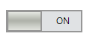

# Toggle State Configuration

Toggle Button is configured with two states (Active and Inactive) contrasting each other. Toggling can be handled at runtime either through mouse click or through space key.




this.toggleButton1.ToggleState = ToggleButtonState.Active; 

//ToggleButtonState.Inactive, for inactive state          





Me.ToggleButton1.ToggleState = ToggleButtonState.Active

'ToggleButtonState.Inactive , for inactive state




## Active state

In the Toggle Button, active state is represented uniquely through its styling properties: BackColor, BorderColor, ForeColor, and HoverColor.




this.toggleButton1.ActiveState.Text = "ON";
this.toggleButton1.ActiveState.BackColor = Color.Gray;
this.toggleButton1.ActiveState.BorderColor = Color.Black; 
this.toggleButton1.ActiveState.ForeColor = Color.Black; 
this.toggleButton1.ActiveState.HoverColor = Color.Blue;   





Me.ToggleButton1.ActiveState.Text = "ON"
Me.ToggleButton1.ActiveState.BackColor = Color.Gray
Me.ToggleButton1.ActiveState.BorderColor = Color.Black
Me.ToggleButton1.ActiveState.ForeColor = Color.Black
Me.ToggleButton1.ActiveState.HoverColor = Color.Blue




## Inactive state

Similar to the active state, inactive state is represented uniquely through its styling properties: BackColor, BorderColor, ForeColor, and HoverColor.




this.toggleButton1.InactiveState.Text = "OFF";
this.toggleButton1.InactiveState.BackColor = Color.Gray;
this.toggleButton1.InactiveState.BorderColor = Color.Black;
this.toggleButton1.InactiveState.ForeColor = Color.Blue;
this.toggleButton1.InactiveState.HoverColor = Color.Blue;                 





Me.ToggleButton1.InactiveState.Text = "OFF"
Me.ToggleButton1.InactiveState.BackColor = Color.Gray
Me.ToggleButton1.InactiveState.BorderColor = Color.Black
Me.ToggleButton1.InactiveState.ForeColor = Color.Blue
Me.ToggleButton1.InactiveState.HoverColor = Color.Blue




