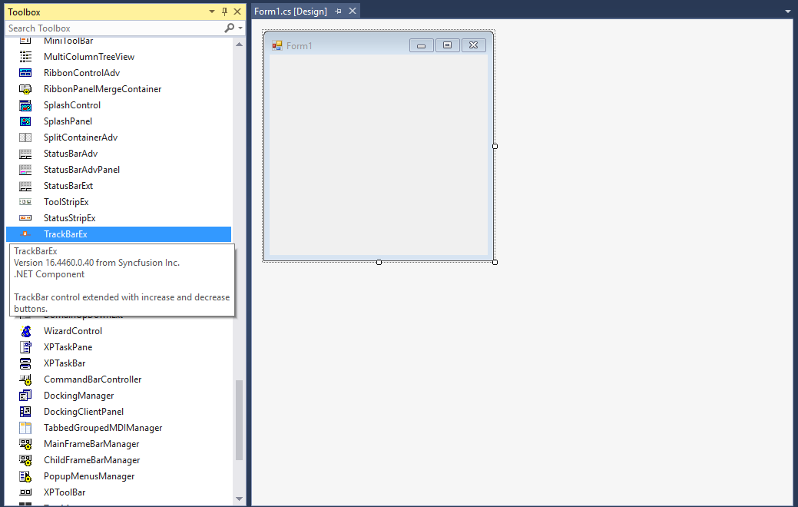
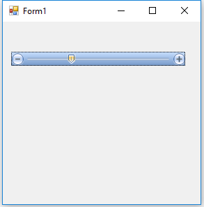

# Getting started

This section describes how to add [TrackBarEx](https://help.syncfusion.com/cr/windowsforms/Syncfusion.Tools.Windows~Syncfusion.Windows.Forms.Tools.TrackBarEx.html) control in a Windows Forms application and overview of its basic functionalities.

## Assembly deployment

Refer to the [control dependencies](https://help.syncfusion.com/windowsforms/control-dependencies#trackbarex) section to get the list of assemblies or NuGet package that needs to be added as a reference to use the control in any application.

You can find more details about installing the NuGet packages in a Windows Forms application in the following link: 

[How to install nuget packages](https://help.syncfusion.com/windowsforms/nuget-packages)

### Create a simple application with TrackBarEx

You can create a Windows Forms application with [TrackBarEx](https://help.syncfusion.com/cr/windowsforms/Syncfusion.Tools.Windows~Syncfusion.Windows.Forms.Tools.TrackBarEx.html) using the following steps:

### Create a project

Create a new Windows Forms project in Visual Studio to display the [TrackBarEx](https://help.syncfusion.com/cr/windowsforms/Syncfusion.Tools.Windows~Syncfusion.Windows.Forms.Tools.TrackBarEx.html) control.

## Add control through designer

The [TrackBarEx](https://help.syncfusion.com/cr/windowsforms/Syncfusion.Tools.Windows~Syncfusion.Windows.Forms.Tools.TrackBarEx.html) control can be added to an application by dragging it from the toolbox to a designer view. The following assembly references are added automatically:

* Syncfusion.Grid.Base.dll
* Syncfusion.Grid.Windows.dll
* Syncfusion.Shared.Base.dll
* Syncfusion.Shared.Windows.dll
* Syncfusion.Tools.Base.dll
* Syncfusion.Tools.Windows.dll

## Add control manually in code

To add the control manually in C#, follow the given steps:

**1.** Add the following required assembly references to the project: 

* Syncfusion.Grid.Base.dll
* Syncfusion.Grid.Windows.dll
* Syncfusion.Shared.Base.dll
* Syncfusion.Shared.Windows.dll
* Syncfusion.Tools.Base.dll
* Syncfusion.Tools.Windows.dll

**2.** Include the **Syncfusion.Windows.Forms.Tools** namespace.



using Syncfusion.Windows.Forms.Tools;


Imports Syncfusion.Windows.Forms.Tools

 

**3.** Create a [TrackBarEx](https://help.syncfusion.com/cr/windowsforms/Syncfusion.Tools.Windows~Syncfusion.Windows.Forms.Tools.TrackBarEx.html) instance, and add it to the window.



//Instance of TrackBarEx
TrackBarEx trackBarEx1 = new TrackBarEx();
this.Controls.Add(trackBarEx1);


'Instance of TrackBarEx
Dim trackBarEx1 As TrackBarEx = New TrackBarEx
Me.Controls.Add(tabSplitterContainer1)



## Change value

You can define the minimum and maximum values by setting the [Minimum](https://help.syncfusion.com/cr/windowsforms/Syncfusion.Tools.Windows~Syncfusion.Windows.Forms.Tools.TrackBarEx~Minimum.html) and [Maximum](https://help.syncfusion.com/cr/windowsforms/Syncfusion.Tools.Windows~Syncfusion.Windows.Forms.Tools.TrackBarEx~Maximum.html) properties of [TrackBarEx](https://help.syncfusion.com/cr/windowsforms/Syncfusion.Tools.Windows~Syncfusion.Windows.Forms.Tools.TrackBarEx.html).



this.trackBarEx1.Minimum = 10;
this.trackBarEx1.Maximum = 25;


Me.trackBarEx1.Minimum = 10
Me.trackBarEx1.Maximum = 30



## Horizontal or vertical track bar

The [TrackBarEx](https://help.syncfusion.com/cr/windowsforms/Syncfusion.Tools.Windows~Syncfusion.Windows.Forms.Tools.TrackBarEx.html) control can be oriented horizontally or vertically using the [Orientation](https://help.syncfusion.com/cr/windowsforms/Syncfusion.Tools.Windows~Syncfusion.Windows.Forms.Tools.TrackBarEx~Orientation.html) property.



// To set the control to be vertically oriented.
this.trackBarEx1.Orientation = Orientation.Vertical;

// To set the control to be horizontally oriented.
this.trackBarEx1.Orientation = Orientation.Horizontal;


'To set the control to be vertically oriented.
Me.trackBarEx1.Orientation = Orientation.Vertical

'To set the control to be horizontally oriented.
Me.trackBarEx1.Orientation = Orientation.Horizontal



