# Appearance in Windows Forms TreeView

This section deals with the appearance of TreeViewAdv control

## Border Customization
	
We can customize the border with the below properties.

### BorderStyle

BorderStyle Property has the following styles

* None

    If the BorderStyle set as none, border of TreeViewAdv will be collapsed

* FixedSingle (For 2D)

    If the BorderStyle set as FixedSingle , then the border of the TreeViewAdv will be visible and we can customize the border 

* Fixed3D (Default)

    If the BorderStyle set as Fixed3D, then the border of the TreeViewAdv will be visible in 3D and we can customize the border settings

### BorderSingle

It Indicates the following 2D border styles

*	Solid (default)
*	Dashed
*	Dotted
*	Inset
*	Outset
*	None

### BorderColor

BorderColor Property sets the color of Border

### BorderSides

BorderSides Property specify the sides of the control to which 3D border should be set.

It has the following Options

* All 

   Three-dimensional border will be set for all sides

* Right 

    Three-dimensional border on the right side of TreeViewAdv

* Left

    Three-dimensional border on the left side of TreeViewAdv 

* Top

    Three-dimensional border on the top of TreeViewAdv

* Bottom

    Three-dimensional border on the bottom of TreeViewAdv

* Middle     

  
### Border3DStyle

Border3DStyle Property indicates the style of 3D border when BorderStyle is set as Fixed3D

It has the following Styles 

* Adjust
* Bump
* Etched
* Flat
* Raised
* RaisedInner
* RaisedOuter
* Sunken
* SunkenInner
* SunkenOuter

>NOTE
>
>The settings will have applied only when TreeViewAdv.BorderStyle property is set to FixedSingle or Fixed3D.
To customize the 2D border of TreeViewAdv, set the below properties as follows.

<b>Property Table</b>

<table>
<tr>
<th>
Property</th><th>
Description</th></tr>
<tr>
<td>
BorderColor</td><td>
Indicates the color of the 2D border.</td></tr>
<tr>
<td>
BorderStyle</td><td>
Sets the 2D border style for the Treeview control.</td></tr>
<tr>
<td>
BorderSingle</td><td>	
Indicates the 2D border style.</td></tr>
</table>




this.treeViewAdv1.BorderColor = System.Drawing.Color.SteelBlue;
this.treeViewAdv1.BorderSingle = System.Windows.Forms.ButtonBorderStyle.Dashed;
this.treeViewAdv1.BorderStyle = System.Windows.Forms.BorderStyle.FixedSingle;




Me.treeViewAdv1.BorderColor = System.Drawing.Color.SteelBlue
Me.treeViewAdv1.BorderSingle = System.Windows.Forms.ButtonBorderStyle.Dashed
Me.treeViewAdv1.BorderStyle = System.Windows.Forms.BorderStyle.FixedSingle




To customize the 3D border of TreeViewAdv, set the below property as follows

<b>Property Table</b>

<table>
<tr>
<th>
TreeViewAdv Property </th><th>
Description</th></tr><tr><td>
BorderStyle</td><td>
Sets the 3D border style for the Treeview control. It must be set as Fixed3D</td></tr><tr><td> 
Border3DStyle</td><td>
Indicates the style of the 3D border when BorderStyle is set to Fixed3D.</td></tr><tr><td> 
BorderSides</td><td>
Specifies the sides of the control to which border should be set.</td></tr>
</table>




this.treeViewAdv1.BorderStyle = BorderStyle.Fixed3D;
this.treeViewAdv1.BorderSides = Border3DSide.Right;
this.treeViewAdv1.Border3DStyle = Border3DStyle.RaisedOuter;
this.treeViewAdv1.BorderColor = Color.SteelBlue;




Me.treeViewAdv1.BorderStyle = BorderStyle.Fixed3D;
Me.treeViewAdv1.BorderSides = Border3DSide.Right;
Me.treeViewAdv1.Border3DStyle = Border3DStyle.RaisedOuter;
Me.treeViewAdv1.BorderColor = Color.SteelBlue;




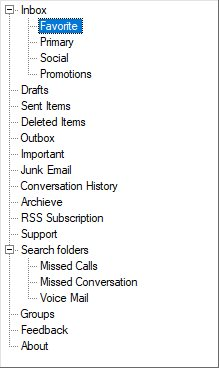

## ColorCustomization

### BackColor

Indicates the background color of the text and the graphics of the control.




this.treeViewAdv1.BackColor = Color.LightBlue;




Me.treeViewAdv1.BackColor = Color.LightBlue;




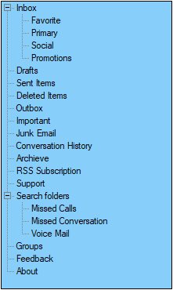

### BackgroundColor

Indicates the background color of the control. It provides options to set style, back color, fore color, gradient color and gradient styles. 

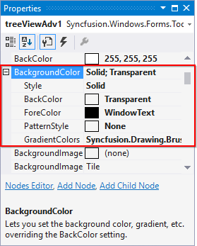




this.treeViewAdv1.BackgroundColor = new Syncfusion.Drawing.BrushInfo(Color.LightSteelBlue);




Me.treeViewAdv1.BackgroundColor = new Syncfusion.Drawing.BrushInfo(Color.LightSteelBlue)




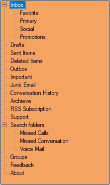

>Note
>
>Both BackColor and Background color sets the background color of the control. If we set background color, backcolor property overridden by background color and also we can set gradient color and gradient styles through background color property rather than backcolor.

### BaseStylePairs

It defines the style for the Nodes. BaseStylePairs property is a collection property of type StyleNamePairsList and it holds one more base style pairs

### BaseStyles

Apart from the Standard style, we can also create custom Base styles using the following steps in Base Styles Collection Editor 

1. Open the Base Style Collection Editor by clicking the BaseStyles property in property window.

2. Clicking the Add Base Style button, will add a new BaseStyle whose properties can be edited.

    

3. This new base style can be applied to any of the nodes, using TreeNodeAdv.BaseStyle property of the respective nodes.

    

4. This overrides the [Standard Style](#standard-style) settings for the specified nodes and displays the image as follows.

    

### LineColor

Indicates the color of RootLines in TreeViewAdv.




this.treeViewAdv1.LineColor = Color.Red;




Me.treeViewAdv1.LineColor = Color.Red 




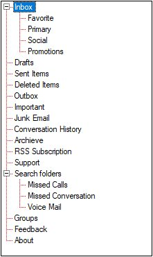

### SelectedNodeBackground

Background for the selected node can be set using SelectedNodeBackground property.

### SelectedNodeForeColor

Fore color for the selected node can be set using SelectedNodeForeColor property. 

### InactiveSelectedNodeBackground

The selection rectangle gets grayed out when the TreeViewAdv loses focus. If the user still wishes to maintain the node’s active colors, then the InactiveSelectedNodeBackground and InactiveSelectedNodeForeColor properties can be set.

### InactiveSelectedNodeForeColor

Fore Color for the selected node when control loses focus can be set using InactiveSelectedNodeForeColor property

>NOTE:
>
>The settings will have applied only when TreeViewAdv.HideSelection property should be set to false.




this.treeViewAdv1.SelectedNodeBackground = new Syncfusion.Drawing.BrushInfo(Color.Gray);

this.treeViewAdv1.SelectedNodeForeColor = System.Drawing.Color.White;

this.treeViewAdv1.InactiveSelectedNodeBackground = new Syncfusion.Drawing.BrushInfo(Syncfusion.Drawing.GradientStyle.ForwardDiagonal, System.Drawing.Color.Ivory, System.Drawing.Color.DarkOrange);

this.treeViewAdv1.InactiveSelectedNodeForeColor = System.Drawing.Color.SteelBlue;




Me.treeViewAdv1.SelectedNodeBackground = new Syncfusion.Drawing.BrushInfo(Color.Gray)

Me.treeViewAdv1.SelectedNodeForeColor = System.Drawing.Color.White

Me.treeViewAdv1.InactiveSelectedNodeBackground = new Syncfusion.Drawing.BrushInfo(Syncfusion.Drawing.GradientStyle.ForwardDiagonal, System.Drawing.Color.Ivory, System.Drawing.Color.DarkOrange)

Me.treeViewAdv1.InactiveSelectedNodeForeColor = System.Drawing.Color.SteelBlue




## Style

Style provides rich and professional look and feel UI for the TreeViewAdv control. 

Style can be applied for the TreeViewAdv using Style property.
Some of the available Styles are as follows:

### Default

By default, TreeViewAdv has `Default` visual style.

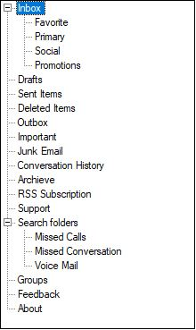

### Office2007

####  Office2007ColorScheme

TreeViewAdv includes new color schemes as available in the Office 2007 suite to provide a more personalized experience with the TreeViewAdv.

TreeViewAdv now supports four themes: 
*	Black
*	Blue (Default)
*	Managed
*	Silver




this.treeViewAdv1.Style = TreeStyle.Office2007;
this.treeViewAdv1.Office2007ColorScheme = Syncfusion.Windows.Forms.Office2007Theme.Silver;




Me.treeViewAdv1.Style = TreeStyle.Office2007
Me.treeViewAdv1.Office2007ColorScheme = Syncfusion.Windows.Forms.Office2007Theme.Silver	




#### Office2007ColorTable

TreeViewAdv has new color table based on Office2007ColorScheme.

TreeViewAdv has following color tables

*	Office2007BlueColors
*	Office2007SilverColors
*	Office2007BlackColors

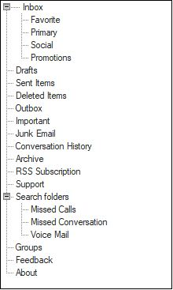

### Office2010

#### Office2010ColorScheme

TreeViewAdv includes new color schemes as available in the Office 2010 suite to provide a more personalized experience with the TreeViewAdv. TreeViewAdv now supports four themes: 

*	Black
*	Blue (Default)
*	Managed
*	Silver




this.treeViewAdv1.Style = TreeStyle.Office2010;
this.treeViewAdv1.Office2010ColorScheme = Syncfusion.Windows.Forms.Office2010Theme.Silver;




Me.treeViewAdv1.Style = TreeStyle.Office2010
Me.treeViewAdv1.Office2007ColorScheme = Syncfusion.Windows.Forms.Office2010Theme.Silver	




#### Office2010ColorTable

TreeViewAdv has new color table based on Office2010ColorScheme.

TreeViewAdv has following color tables
*	Office2010BlueColors
*	Office2010SilverColors
*	Office2010BlackColors

 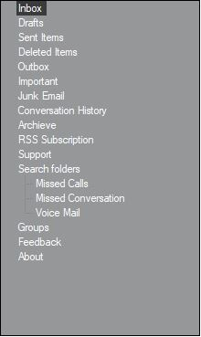
	
### Metro
 
#### MetroArrowColorTable

We can customize the expander arrow style using MetroArrowColorTable property

#### MetroColor

Indicates the metro color of the control.(Applicable for metro style only)



this.treeViewAdv1.Style = TreeStyle.Metro;
this.treeViewAdv1.MetroColor = Color.SteelBlue;
this.treeViewAdv1.MetroArrowColorTable.ArrowNormal = Color.LightBlue;




Me.treeViewAdv1.Style = TreeStyle.Metro
Me.treeViewAdv1.MetroColor = Color.SteelBlue
Me.treeViewAdv1.MetroArrowColorTable.ArrowNormal = Color.LightBlue




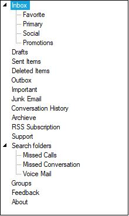

### Office2016Colorful




this.treeViewAdv1.Style = TreeStyle.Office2016Colorful;




Me.treeViewAdv1.Style = TreeStyle.Office2016Colorful




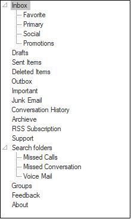

###  Office2016White




this.treeViewAdv1.Style = TreeStyle.Office2016White;




Me.treeViewAdv1.Style = TreeStyle.Office2016White




### Office2016Black




this.treeViewAdv1.Style = TreeStyle.Office2016Black;




Me.treeViewAdv1.Style = TreeStyle.Office2016Black




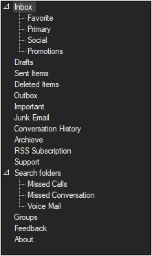

### Office2016DarkGray




this.treeViewAdv1.Style = TreeStyle.Office2016DarkGray;




Me.treeViewAdv1.Style = TreeStyle.Office2016DarkGray




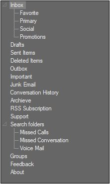

## Gradient Background

This section discusses those events that are handled on changing some appearance related properties. They are as follows.

### GradientBackgroundChanged Event

This event occurs when the GradientBackground of the tree changes.




private void treeViewAdv1_GradientBackgroundChanged(object sender, EventArgs e)
{

//The below line will be printed in the output window at run time.
    Console.Write("Gradient Background Changed Event is raised ");
}





Private Sub treeViewAdv1_GradientBackgroundChanged(ByVal sender As Object, ByVal e As EventArgs)

'The below line will be printed in the output window at run time.
Console.Write("Gradient Background Changed Event is raised ")

End Sub




### GradientColorsChanged Event

This event occurs when the GradientColors of the tree changes.




private void treeViewAdv1_GradientColorsChanged(object sender, EventArgs e)
{

//The below line will be printed in the output window at run time.
    Console.Write("Gradient Colors Changed Event is raised ");
}





Private Sub treeViewAdv1_GradientColorsChanged(ByVal sender As Object, ByVal e As EventArgs)

'The below line will be printed in the output window at run time.
Console.Write("Gradient Colors Changed Event is raised ")
End Sub




## VerticalGradientChanged Event

This event occurs when the tree's VerticalGradient is changed.




private void treeViewAdv1_VerticalGradientChanged(object sender, EventArgs e)
{

//The below line will be printed in the output window at run time.
    Console.Write("Vertical GradientChanged Event is raised ");
}





Private Sub treeViewAdv1_VerticalGradientChanged(ByVal sender As Object, ByVal e As EventArgs)

'The below line will be printed in the output window at run time.
Console.Write("Vertical GradientChanged Event is raised ")

End Sub




## Paint TreeNodeAdv

### OwnerDrawn 

Indicates whether the BeforeNodePaint and AfterNodePaint events will be fired before drawing a node. The default value is false.

### BeforeNodePaint Event

User can paint specific nodes using the BeforeNodePaint event.

OwnerDrawNodes property should be set to true while handling this event

<b>Event Table</b>

<table>
<tr>
<th>
Node Paint Events</th><th>
Description</th></tr><tr><td>
BeforeNodePaint</td><td>
Handled before a node is being painted.</td></tr>
</table>

<b>Property Table</b>
<table>
<tr>
<th>
TreeViewAdv Property</th><th>
Description</th></tr><tr><td>
OwnerDrawNodes</td><td>
Indicates if the BeforeNodePaint event will be fired before drawing a node.</td></tr>
</table>




this.treeViewAdv1.OwnerDrawNodes = true;
// Enabling Node's Foreground
private void treeViewAdv1_BeforeNodePaint(object sender, TreeNodeAdvPaintEventArgs e)
{
 	   if (e.Node.Index %2 == 0)
  	 	 {
       			 e.ForeColor=Color.Red;
    		}
}





Me.treeViewAdv1.OwnerDrawNodes = True
' Enabling Node's Foreground
Private Sub treeViewAdv1_BeforeNodePaint(ByVal sender As Object, ByVal e As TreeNodeAdvPaintEventArgs)
If e.Node.Index % 2 = 0 Then
e.ForeColor = Color.Red
End If
End Sub




### AfterNodePaint Event

Users can also draw on the node, after the default drawing routines have rendered the node appropriately. Users can do so by first turning on OwnerDrawNodes in the tree and listening to the AfterNodePaint event.

<b>Event Table</b>

<table>
<tr>
<th>
Node Paint Events</th><th>
Description</th></tr><tr><td>
AfterNodePaint</td><td>
Handled after a node is painted.</td></tr>
</table>

