# Data Binding in Windows Forms TreeView
[TreeViewAdv](https://help.syncfusion.com/cr/windowsforms/Syncfusion.Windows.Forms.Tools.TreeViewAdv.html) binds to any table, collection of tables, custom objects, etc. by using the [TreeViewAdv.DataSource](https://help.syncfusion.com/cr/windowsforms/Syncfusion.Windows.Forms.Tools.TreeViewAdv.html#Syncfusion_Windows_Forms_Tools_TreeViewAdv_DataSource) property. 

The following are the ways to bind various data sources to [TreeViewAdv](https://help.syncfusion.com/cr/windowsforms/Syncfusion.Windows.Forms.Tools.TreeViewAdv.html).
1.	Binding to Self-Referencing Data
2.	Binding to Data Relations
3.	Binding to Object-Relational Data

## Binding to Self-Referencing Data
In this type, [TreeViewAdv](https://help.syncfusion.com/cr/windowsforms/Syncfusion.Windows.Forms.Tools.TreeViewAdv.html) binds to self-referencing data where the [TreeViewAdv](https://help.syncfusion.com/cr/windowsforms/Syncfusion.Windows.Forms.Tools.TreeViewAdv.html) is bound to single table instead of multiple related tables.

Parent-Child relationship for all the records is defined by setting the [ParentMember](https://help.syncfusion.com/cr/windowsforms/Syncfusion.Windows.Forms.Tools.TreeViewAdv.html#Syncfusion_Windows_Forms_Tools_TreeViewAdv_ParentMember) and [ChildMember](https://help.syncfusion.com/cr/windowsforms/Syncfusion.Windows.Forms.Tools.TreeViewAdv.html#Syncfusion_Windows_Forms_Tools_TreeViewAdv_ChildMember) properties to the respective fields in the data source. If the Parent ID of one record has the respective value in the Child ID of any other records from the table, then that record is considered to have parent. If not, then the record is considered to have no parents and, in such case, it won’t be visible in the [TreeViewAdv](https://help.syncfusion.com/cr/windowsforms/Syncfusion.Windows.Forms.Tools.TreeViewAdv.html). 

If the value in [ParentMember](https://help.syncfusion.com/cr/windowsforms/Syncfusion.Windows.Forms.Tools.TreeViewAdv.html#Syncfusion_Windows_Forms_Tools_TreeViewAdv_ParentMember) field of some records matches with the [TreeViewAdv.SelfRelationRootValue](https://help.syncfusion.com/cr/windowsforms/Syncfusion.Windows.Forms.Tools.TreeViewAdv.html#Syncfusion_Windows_Forms_Tools_TreeViewAdv_SelfRelationRootValue), then those records are considered as root nodes of [TreeViewAdv](https://help.syncfusion.com/cr/windowsforms/Syncfusion.Windows.Forms.Tools.TreeViewAdv.html).
  
<table>
<tr>
<th>
Property</th><th>
Description</th></tr>
<tr>
<td>
DataSource </td><td>
Gets or sets the data source object in TreeViewAdv.</td></tr>
<tr>
<td>
DisplayMember  </td><td>
Gets or sets the field that populates the Text property of the TreeNodeAdv in TreeViewAdv.</td></tr>
<tr>
<td>
ValueMember  </td><td>
Gets or sets the field that populates the Value property of TreeNodeAdv in TreeViewAdv. </td></tr>
<tr>
<td>
ParentMember </td><td>
Gets or sets a value indicating the parent data field which behaves as a parent node in TreeViewAdv.</td></tr>
<tr>
<td>
ChildMember </td><td>
Gets or sets a value indicating the child data field which behaves as a child node in TreeViewAdv.</td></tr>
<tr>
<td>
DataMember </td><td>
Gets or sets the table name that should be bound to the TreeViewAdv. </td></tr>
<tr>
<td>
CheckedMember</td><td>
Gets or sets a value indicating the field to populate the state of checkbox of TreeNodeAdv in TreeViewAdv.</td></tr>
<tr>
<td>
SelfRelationRootValue </td><td>

Gets or sets the value that defines the root object in a self-relational mode when data source is used to define the underlying tree data. 
</td></tr>
</table>

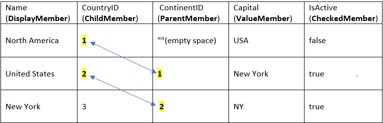
In the above table, **North America** is declared as root node by setting appropriate (or matching) [SelfRelationRootValue](https://help.syncfusion.com/cr/windowsforms/Syncfusion.Windows.Forms.Tools.TreeViewAdv.html#Syncfusion_Windows_Forms_Tools_TreeViewAdv_SelfRelationRootValue). Here the value is set to empty and so **North America** is added as root node.

**United States** is declared as child of **North America** by setting appropriate ContinentID. Here the value is set to 1 and it matches the CountryID of **North America**. As a result, **United States** is added as child node of **North America**.




treeViewAdv1.SelfRelationRootValue = "";
treeViewAdv1.DisplayMember = "Name";
treeViewAdv1.ParentMember = "ContinentID";
treeViewAdv1.ChildMember = "CountryID";
treeViewAdv1.ValueMember = "Capital";
treeViewAdv1.CheckedMember = "IsActive";
treeViewAdv1.DataSource = Table_1;




treeViewAdv1.SelfRelationRootValue = ""
treeViewAdv1.DisplayMember = "Name"
treeViewAdv1.ParentMember = "ContinentID"
treeViewAdv1.ChildMember = "CountryID"
treeViewAdv1.ValueMember = "Capital"
treeViewAdv1.CheckedMember = "IsActive"
treeViewAdv1.DataSource = Table_1




N> 
1)	Root nodes are parent less (for example, see **"North America"** node in the image above). All root nodes must have their parent member values **(TreeViewAdv.ParentMember)** set to **TreeViewAdv.SelfRelationRootValue**property. If the property is not specified then, you may notice empty TreeViewAdv. So, to avoid this, we suggest that you always set parent member values with TreeViewAdv.SelfRelationRootValue for root nodes.
2)	You must specify **TreeViewAdv.DisplayMember**, **TreeViewAdv.ParentMember**, **TreeViewAdv.ChildMember** properties mandatorily to populate the appropriate TreeViewAdv.

## Binding to Data Relations
In this type, [TreeViewAdv](https://help.syncfusion.com/cr/windowsforms/Syncfusion.Windows.Forms.Tools.TreeViewAdv.html) are bound to database where levels are created using [DataRelation](https://help.syncfusion.com/cr/windowsforms/Syncfusion.Windows.Forms.Tools.TreeViewAdv.html#Syncfusion_Windows_Forms_Tools_TreeViewAdv_DataRelations) class. Each [DataRelation](https://help.syncfusion.com/cr/windowsforms/Syncfusion.Windows.Forms.Tools.TreeViewAdv.html#Syncfusion_Windows_Forms_Tools_TreeViewAdv_DataRelations) class object describes the parent data being bound to, the child data being bound to and the data columns used to populate **Text** and selected **Value** properties of the nodes.

<table>
<tr><th>S.No</th><th>Property Name</th><th>Description</th></tr>
<tr><td>1</td><td>DataRelations</td><td>Contains the collection of DataRelation in TreeViewAdv.</td></tr></table>

<table>
<tr><th>S.No</th><th>Class Name</th><th>Description</th></tr>
<tr><td>1</td><td>DataRelation</td><td>Represents a parent/child relationship between two DataTable objects.</td></tr></table>

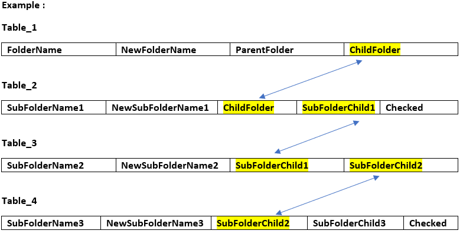




Syncfusion.Windows.Forms.Tools.DataRelation childRelation1;
Syncfusion.Windows.Forms.Tools.DataRelation childRelation2;
Syncfusion.Windows.Forms.Tools.DataRelation childRelation3;

childRelation1 = new Syncfusion.Windows.Forms.Tools.DataRelation(Table_2, "Table_2", "SubFolderName1", "ChildFolder", "SubFolderChild1", "SubFolderName1", "Checked");

childRelation2 = new Syncfusion.Windows.Forms.Tools.DataRelation(Table_3, "SubFolderName2", "SubFolderChild1", "SubFolderChild2");

childRelation3 = new Syncfusion.Windows.Forms.Tools.DataRelation(Table_4, "Table_4", "SubFolderName3", "SubFolderChild2", "SubFolderChild3", "SubFolderName3", "Checked");

treeViewAdv1.DataRelations.Clear();

treeViewAdv1.DisplayMember = "FolderName";
treeViewAdv1.ParentMember = "ParentFolder";
treeViewAdv1.ChildMember = "ChildFolder";

treeViewAdv1.DataRelations.Add(childRelation1);
treeViewAdv1.DataRelations.Add(childRelation2);
treeViewAdv1.DataRelations.Add(childRelation3);

treeViewAdv1.DataSource = Table_1;           




Dim childRelation1 As Syncfusion.Windows.Forms.Tools.DataRelation
Dim childRelation2 As Syncfusion.Windows.Forms.Tools.DataRelation
Dim childRelation3 As Syncfusion.Windows.Forms.Tools.DataRelation

childRelation1 = New Syncfusion.Windows.Forms.Tools.DataRelation(Table_2, "SubFolder1", "SubFolderName1", "FolderChild", "SubFolderChild1", "SubFolderName1", "Checked")    

childRelation2 = New Syncfusion.Windows.Forms.Tools.DataRelation(Table_3, "SubFolderName2", "SubFolderChild1", "SubFolderChild2")

childRelation3 = New Syncfusion.Windows.Forms.Tools.DataRelation(Table_4, "SubFolder3", "SubFolderName3", "SubFolderChild2", "SubFolderChild3", "SubFolderName3", "Checked")

treeViewAdv1.DataRelations.Clear()

treeViewAdv1.DisplayMember = "FolderName"
treeViewAdv1.ParentMember = "ParentFolder"
treeViewAdv1.ChildMember = "ChildFolder"

treeViewAdv1.DataRelations.Add(childRelation1)
treeViewAdv1.DataRelations.Add(childRelation2)
treeViewAdv1.DataRelations.Add(childRelation3)

treeViewAdv1.DataSource = Table_1




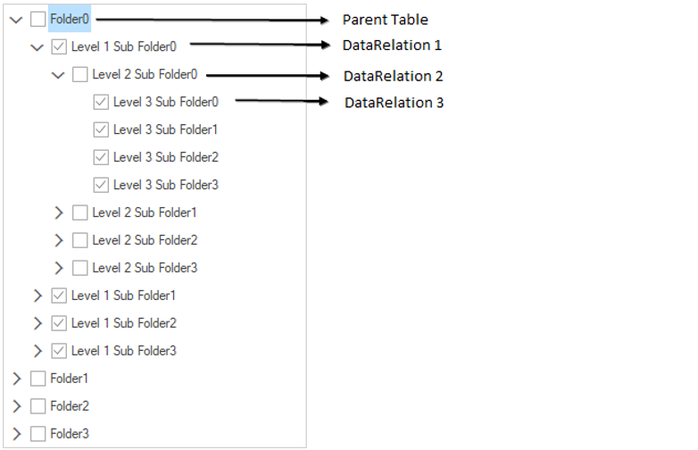

N> 1)	In this type, you must specify **DisplayMember**, **ParentMember**, **ChildMember** properties mandatorily to populate appropriate TreeViewAdv.
2)	Here levels are created using **DataRelation**, so if you want to dynamically add new level then you need to create new instance of **DataRelation** and add it to **TreeViewAdv.DataRelations** property with proper relation first.

## Binding to Object-Relational Data
In this type, [TreeViewAdv](https://help.syncfusion.com/cr/windowsforms/Syncfusion.Windows.Forms.Tools.TreeViewAdv.html) binds to class objects which have collections associated with other dependent class objects establishing proper relation.

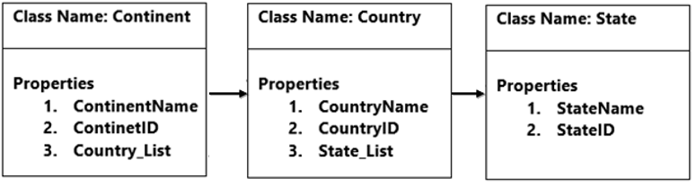

In this illustration, there are three classes named Continent, Country and State. In this case the **Continent** class has a property named **ContinentName**, **ContinentID** and **Country_List** which is a collection of **Country** objects. This is the first relation. The second relation is the **State_List** property in the **Country** class, it offers a reference to a collection of **State**. 

You must specify the [DisplayMember](https://help.syncfusion.com/cr/windowsforms/Syncfusion.Windows.Forms.Tools.TreeViewAdv.html#Syncfusion_Windows_Forms_Tools_TreeViewAdv_DisplayMember), [ChildMember]([ChildMember](https://help.syncfusion.com/cr/windowsforms/Syncfusion.Windows.Forms.Tools.TreeViewAdv.html#Syncfusion_Windows_Forms_Tools_TreeViewAdv_ChildMember)) property and here you need not define [ParentMember](https://help.syncfusion.com/cr/windowsforms/Syncfusion.Windows.Forms.Tools.TreeViewAdv.html#Syncfusion_Windows_Forms_Tools_TreeViewAdv_ParentMember) property. [TreeViewAdv](https://help.syncfusion.com/cr/windowsforms/Syncfusion.Windows.Forms.Tools.TreeViewAdv.html) must display it in hierarchical view.

<table>
<tr><th>S.No</th><th>Properties</th><th>Description</th></tr>
<tr><td>1</td><td>DisplayMember</td><td>Defines which property of the class needs to be in node's text. 

 Example:
 Continent -> ContinentName,
Country -> CountryName,
State -> StateName.
</td></tr>

<tr><td>2</td><td>ChildMember</td><td>Defines the class order.

Example:
Continent -> First level,
Country -> Second level,
State -> Third level.
</td></tr>
</table>



treeViewAdv1.DisplayMember = "ContinentName\\CountryName\\StateName"; 
treeViewAdv1.ChildMember = "Continent\\Country\\State";



treeViewAdv1.DisplayMember = "ContinentName\\CountryName\\StateName"
treeViewAdv1.ChildMember = "Continent\\Country\\State"



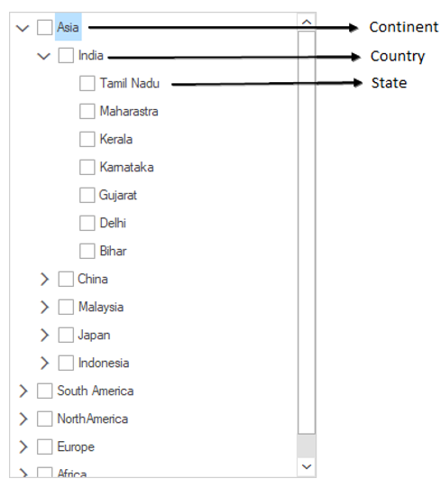

## See Also

[How to get value specified by ValueMember path for CheckedNodes?](https://www.syncfusion.com/forums/154006/get-value-of-nodes-after-checking)

## Binding Data from Microsoft Access

The [`TreeViewAdv`](https://help.syncfusion.com/cr/windowsforms/Syncfusion.Windows.Forms.Tools.TreeViewAdv.html) control supports to bind data from Microsoft Access database. This section describes about how to bind the data from Microsoft Access database to [`TreeViewAdv`](https://help.syncfusion.com/cr/windowsforms/Syncfusion.Windows.Forms.Tools.TreeViewAdv.html).

### Importing Microsoft Access Database

To load the data from Microsoft Access database, follow the below steps.

1) On the **View** menu, select **Other Windows > Data Sources**.

2) In the **Data Sources** window, click **Add New Data Source**, the DataSource configuration wizard will be opened.

3) Select **Database** on the **Choose a Data Source Type** page, and then select **Next**.

4) On the **Choose your Data Connection** page, select **New Connection** to configure a new data connection and Change the **Data source** to **.NET Framework Data Provider for OLE DB**.

5) In **OLE DB Provider**, select **Microsoft Office 12.0 Access Database Engine OLE DB Provider**. In **Server or file name**, specify the path and name of the .accdb file to which want to connect, and then select **OK**.

6) Select **Next** on the **Choose your Data Connection** page.

7) Select **Next** on the **Save connection string to the Application Configuration file** page.

8) Expand the **Tables** node on the **Choose your Database Objects** page.

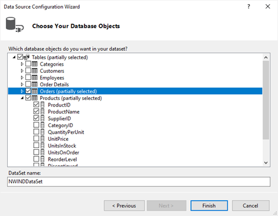

9) Select whatever tables or views in the dataset, and then select **Finish**.

### Loading Data from Microsoft Access Database

To access the Microsoft Access database, follow the below steps.

1) The [`DataSource`](https://help.syncfusion.com/cr/windowsforms/Syncfusion.Windows.Forms.Tools.TreeViewAdv.html#Syncfusion_Windows_Forms_Tools_TreeViewAdv_DataSource) property can be customized at designer level like below,

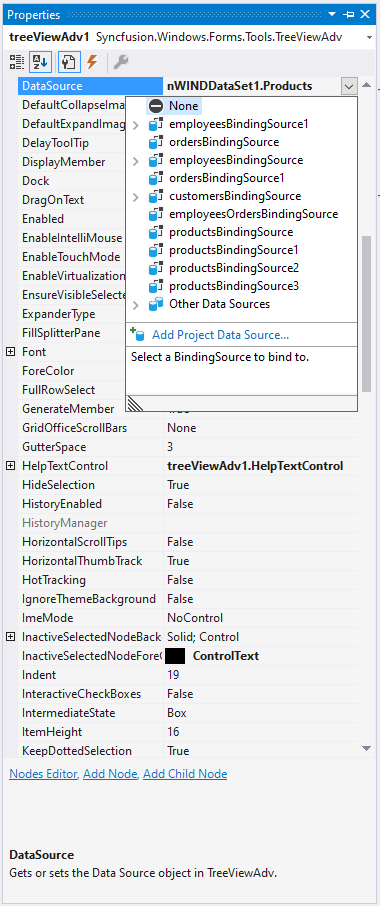

2) The value for [`DisplayMember`](https://help.syncfusion.com/cr/windowsforms/Syncfusion.Windows.Forms.Tools.TreeViewAdv.html#Syncfusion_Windows_Forms_Tools_TreeViewAdv_DisplayMember), [`ValueMember`](https://help.syncfusion.com/cr/windowsforms/Syncfusion.Windows.Forms.Tools.TreeViewAdv.html#Syncfusion_Windows_Forms_Tools_TreeViewAdv_ValueMember) and [`ParentMember`](https://help.syncfusion.com/cr/windowsforms/Syncfusion.Windows.Forms.Tools.TreeViewAdv.html#Syncfusion_Windows_Forms_Tools_TreeViewAdv_ParentMember) properties can be selected as like below, 

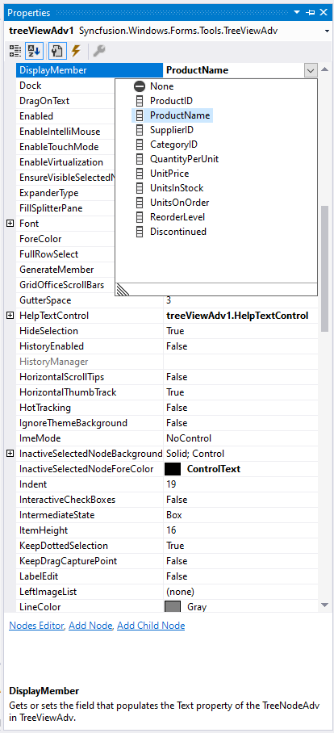

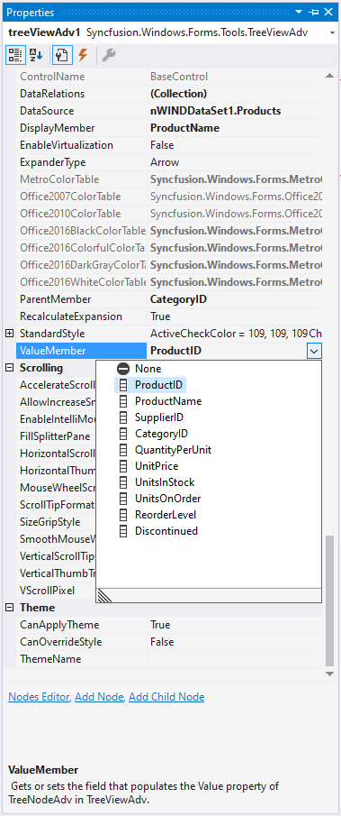

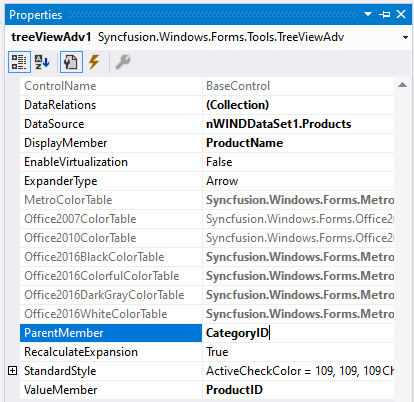

3) Based on the [`DataSource`](https://help.syncfusion.com/cr/windowsforms/Syncfusion.Windows.Forms.Tools.TreeViewAdv.html#Syncfusion_Windows_Forms_Tools_TreeViewAdv_DataSource) binding with the [`TreeViewAdv`](https://help.syncfusion.com/cr/windowsforms/Syncfusion.Windows.Forms.Tools.TreeViewAdv.html) control, the items can be displayed by using [`DisplayMember`](https://help.syncfusion.com/cr/windowsforms/Syncfusion.Windows.Forms.Tools.TreeViewAdv.html#Syncfusion_Windows_Forms_Tools_TreeViewAdv_DisplayMember), [`ValueMember`](https://help.syncfusion.com/cr/windowsforms/Syncfusion.Windows.Forms.Tools.TreeViewAdv.html#Syncfusion_Windows_Forms_Tools_TreeViewAdv_ValueMember) and [`ParentMember`](https://help.syncfusion.com/cr/windowsforms/Syncfusion.Windows.Forms.Tools.TreeViewAdv.html#Syncfusion_Windows_Forms_Tools_TreeViewAdv_ParentMember) properties.

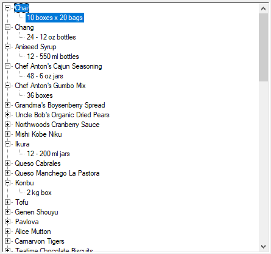

## DataRelations

1) The [`DataRelations`](https://help.syncfusion.com/cr/windowsforms/Syncfusion.Windows.Forms.Tools.TreeViewAdv.html#Syncfusion_Windows_Forms_Tools_TreeViewAdv_DataRelations) property can be customized at designer level like below,

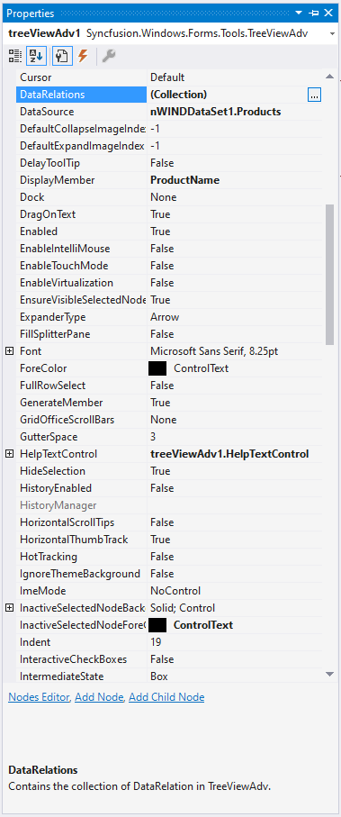

2) Click **Add** to create new data relation in the DataRelations Collection Editor.

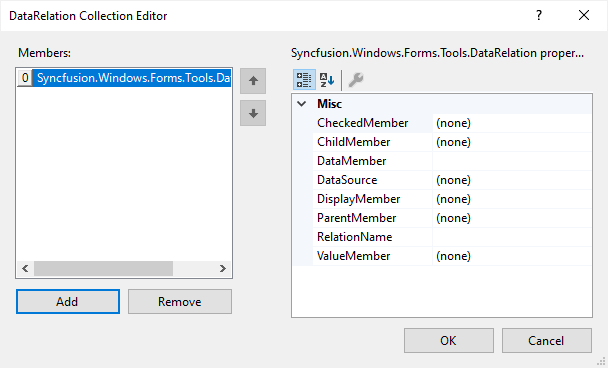

3) Choose the [`DataSource`](https://help.syncfusion.com/cr/windowsforms/Syncfusion.Windows.Forms.Tools.TreeViewAdv.html#Syncfusion_Windows_Forms_Tools_TreeViewAdv_DataSource) in the DataRelations Collection Editor like below,

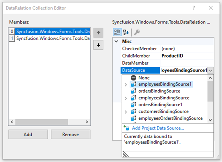

4) The value for [`DisplayMember`](https://help.syncfusion.com/cr/windowsforms/Syncfusion.Windows.Forms.Tools.TreeViewAdv.html#Syncfusion_Windows_Forms_Tools_TreeViewAdv_DisplayMember) and [`ParentMember`](https://help.syncfusion.com/cr/windowsforms/Syncfusion.Windows.Forms.Tools.TreeViewAdv.html#Syncfusion_Windows_Forms_Tools_TreeViewAdv_ParentMember) properties can be selected as like below,

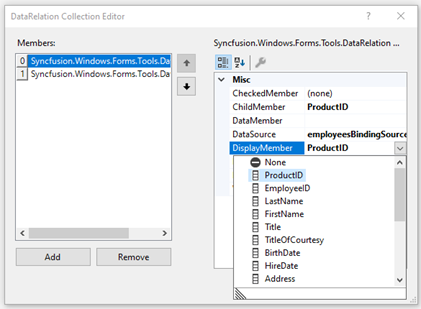

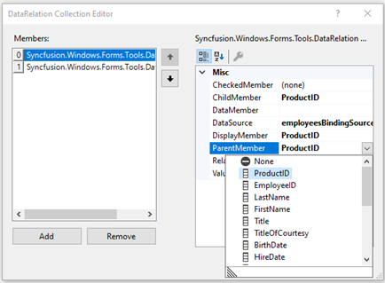

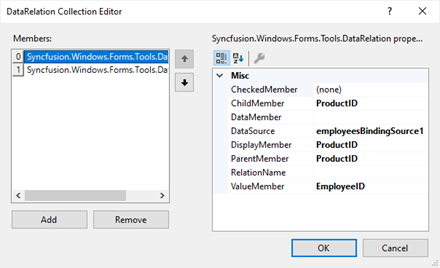

5) Based on the [`DataRelations`](https://help.syncfusion.com/cr/windowsforms/Syncfusion.Windows.Forms.Tools.TreeViewAdv.html#Syncfusion_Windows_Forms_Tools_TreeViewAdv_DataRelations) binding with the [`TreeViewAdv`](https://help.syncfusion.com/cr/windowsforms/Syncfusion.Windows.Forms.Tools.TreeViewAdv.html) control, the items can be displayed by using [`DisplayMember`](https://help.syncfusion.com/cr/windowsforms/Syncfusion.Windows.Forms.Tools.TreeViewAdv.html#Syncfusion_Windows_Forms_Tools_TreeViewAdv_DisplayMember) and [`ParentMember`](https://help.syncfusion.com/cr/windowsforms/Syncfusion.Windows.Forms.Tools.TreeViewAdv.html#Syncfusion_Windows_Forms_Tools_TreeViewAdv_ParentMember) properties.

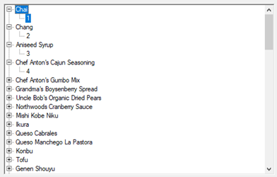