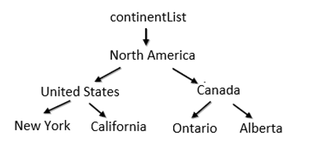

# Editing in Windows Forms TreeView

TreeViewAdv supports dynamic update of the underlying changes in data source settings. So, whenever user does insert, delete, rename (aka, update), drag and drop operations, it should also be reflected in the TreeViewAdv and data source.

For example, while we set the same data source object for two different controls such as GridGroupingControl and TreeViewAdv, whenever we do insert, delete, update, etc. operations in GridGroupingControl should reflect in TreeViewAdv and vice versa. Below code sample demonstrates the addition and removal of records in DataTable source at runtime. 



 // Initialize data sources                
  treeViewAdv1.DataSource = Table_1;
  gridGroupingControl1.DataSource = Table_1;

 // Addition                 
 DataTable dt = (this.treeViewAdv1.DataSource as DataTable);

 if (treeViewAdv1.SelectedItem != null)
 dt.Rows.Add("New Item", "10" + count.ToString(), (treeViewAdv1.SelectedItem as DataRow)[treeViewAdv1.ChildMember].ToString(), "New", false);

 if (dt != null)
    dt.AcceptChanges();

 // Deletion
(treeViewAdv1.DataSource as DataTable).AcceptChanges();

if (this.treeViewAdv1.SelectedItem != null)
{
  (treeViewAdv1.SelectedItem as DataRow).Delete();
}



' Initialize data sources
 treeViewAdv1.DataSource = Table_1
 gridGroupingControl1.DataSource = Table_1

' Addition                 
Dim dt As DataTable = (TryCast(Me.treeViewAdv1.DataSource, DataTable))

If treeViewAdv1.SelectedItem IsNot Nothing Then
    dt.Rows.Add("New Item", "10" & count.ToString(), (TryCast(treeViewAdv1.SelectedItem, DataRow))(treeViewAdv1.ChildMember).ToString(), "New", False)
End If

If dt IsNot Nothing Then
    dt.AcceptChanges()
End If

'Deletion
TryCast(treeViewAdv1.DataSource, DataTable).AcceptChanges()

If Me.treeViewAdv1.SelectedItem IsNot Nothing Then
  TryCast(treeViewAdv1.SelectedItem, DataRow).Delete()
End If



<table>
<tr><th>S.No</th><th>Types of View</th><th>Description</th></tr>
<tr><td>1</td><td>
Self-Referencing
</td><td>
In this type, you can do insert, delete, edit, drag and drop operations.
</td></tr>

<tr><td>2</td><td>Data Relations</td><td>In this type, you can do insert, delete, edit, drag and drop operations. Meanwhile when trying to insert new record in new level is not allowed. Here levels are created using DataRelation, so if you want to dynamically add new level then you need to create new instance of DataRelation and add it to TreeViewAdv.DataRelations property with proper relation first. 
</td></tr>

<tr><td>3</td><td>Object-Relational</td><td>In this type, you can do insert, delete, edit, drag and drop operation. Meanwhile when trying to insert new record in new level is not allowed. Because levels are created based on number of classes specified in ChildMember. Editing operation can be performed within the number of classes defined and not beyond that. 
</td></tr>
</table>

N> 
1.	For all the types, in order to allow editing in TreeViewAdv control, TreeViewAdv.LabelEdit property and AllowDrop property must be enabled in TreeViewAdv.
2.	For Self-referencing and Data relation type, you need to call AcceptChanges() after adding new rows and before deleting the existing rows to allow the dynamic updates in TreeViewAdv. 

## Editing Object-Relational View
In this type, you can insert, delete, edit and drag drop the new or existing data. Custom objects must be implemented either with **INotifyPropertyChanged** or **INotifyCollectionChanged** interface, so that TreeViewAdv will automatically refresh the UI when any item gets changed, added, removed or the list gets cleared.

**Example**


public class Form1 : Form
    {
            // Initialize data sources
            treeViewAdv1.DataSource = continentList;
            gridGroupingControl1.DataSource = continentList;  

            treeViewAdv1.DisplayMember = "ContinentName\\CountryName\\StateName";
            treeViewAdv1.ChildMember = "Continent\\Country\\State";          
            
    }

public class NotifyPropertyChanged : INotifyPropertyChanged
    {
        public event PropertyChangedEventHandler PropertyChanged;
        public void RaisePropertyChanged(string name)
        {
            if (PropertyChanged != null)
                PropertyChanged(this, new PropertyChangedEventArgs(name));

        }
    }

    public class Continent : NotifyPropertyChanged
    {
        
    }

    public class Country : NotifyPropertyChanged
    {
       
    }

    public class State: NotifyPropertyChanged
    {
       
    }
    


        Public Class Form1
	Inherits Form
        ' Initialize data sources

		treeViewAdv1.DisplayMember = "ContinentName\\CountryName\\StateName"
		treeViewAdv1.ChildMember = "Continent\\Country\\State"

		treeViewAdv1.DataSource = continentList
		gridGroupingControl1.DataSource = continentList

        End Class

        Public Class NotifyPropertyChanged`
	Implements INotifyPropertyChanged

		Public Event PropertyChanged As PropertyChangedEventHandler Implements INotifyPropertyChanged.PropertyChanged
		Public Sub RaisePropertyChanged(ByVal name As String)
			RaiseEvent PropertyChanged(Me, New PropertyChangedEventArgs(name))

		End Sub
        End Class

	Public Class Continent
		Inherits NotifyPropertyChanged

	End Class

	Public Class Country
		Inherits NotifyPropertyChanged

	End Class

	Public Class State
		Inherits NotifyPropertyChanged

	End Class


