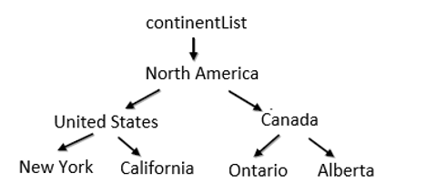

# Editing in Windows Forms TreeView

TreeViewAdv supports dynamic update of the underlying changes in data source settings. So, whenever user does insert, delete, rename (aka, update), drag and drop operations, it should also be reflected in the TreeViewAdv and data source.

For example, while we set the same data source object for two different controls such as GridGroupingControl and TreeViewAdv, whenever we do insert, delete, update, etc. operations in GridGroupingControl should reflect in TreeViewAdv and vice versa. Below code sample demonstrates the addition and removal of records in DataTable source at runtime. 



// Initialize data sources
  treeViewAdv1.DataSource = Table_1;
  gridGroupingControl1.DataSource = Table_1;

  // Counter used while generating new IDs for added rows.
  int count = 0;

 // Addition
 DataTable dt = (this.treeViewAdv1.DataSource as DataTable);

 if (treeViewAdv1.SelectedItem != null)
 {
     dt.Rows.Add("New Item", "10" + count.ToString(), (treeViewAdv1.SelectedItem as DataRow)[treeViewAdv1.ChildMember].ToString(), "New", false);
     count++;
 }

 if (dt != null)
    dt.AcceptChanges();

 // Deletion
 (treeViewAdv1.DataSource as DataTable).AcceptChanges();

 if (this.treeViewAdv1.SelectedItem != null)
 {
     (treeViewAdv1.SelectedItem as DataRow).Delete();
 }



' Initialize data sources
 treeViewAdv1.DataSource = Table_1
 gridGroupingControl1.DataSource = Table_1

' Counter used while generating new IDs for added rows.
 Dim count As Integer = 0

' Addition
Dim dt As DataTable = (TryCast(Me.treeViewAdv1.DataSource, DataTable))

If treeViewAdv1.SelectedItem IsNot Nothing Then
    dt.Rows.Add("New Item", "10" & count.ToString(), (TryCast(treeViewAdv1.SelectedItem, DataRow))(treeViewAdv1.ChildMember).ToString(), "New", False)
    count += 1
End If

If dt IsNot Nothing Then
    dt.AcceptChanges()
End If

'Deletion
TryCast(treeViewAdv1.DataSource, DataTable).AcceptChanges()

If Me.treeViewAdv1.SelectedItem IsNot Nothing Then
    TryCast(treeViewAdv1.SelectedItem, DataRow).Delete()
End If



<table>
<tr><th>S.No</th><th>Types of View</th><th>Description</th></tr>
<tr><td>1</td><td>
Self-Referencing
</td><td>
In this type, you can do insert, delete, edit, drag and drop operations.
</td></tr>

<tr><td>2</td><td>Data Relations</td><td>You can perform insert, delete, edit, and drag-and-drop operations. Inserting a new record into a new level is not allowed because levels are created using DataRelation. To dynamically add a new level, you must create a new instance of DataRelation and add it to the TreeViewAdv.DataRelations property with the proper relation.
</td></tr>

<tr><td>3</td><td>Object-Relational</td><td>You can perform insert, delete, edit, and drag-and-drop operations. Inserting a new record into a new level is not allowed because levels are based on the number of classes specified in ChildMember. Editing is limited to the number of classes defined and cannot go beyond that.
</td></tr>
</table>

N>
1.	For all binding types, the `TreeViewAdv.LabelEdit` property and the `AllowDrop` property must be enabled on the TreeViewAdv in order to allow editing.
2.	For Self-referencing and Data Relation binding types, you need to call `AcceptChanges()` after adding new rows and before deleting the existing rows to allow dynamic updates in the TreeViewAdv.

## Editing Object-Relational View
In this type, you can insert, delete, edit, and drag-and-drop the new or existing data. Custom objects must be implemented with either the **INotifyPropertyChanged** or **INotifyCollectionChanged** interface so that the TreeViewAdv automatically refreshes the UI when any item is changed, added, removed, or the list is cleared.

**Example**


using System.ComponentModel;

public class Form1 : Form
    {
            // Initialize data sources
            treeViewAdv1.DataSource = continentList;
            gridGroupingControl1.DataSource = continentList;

            treeViewAdv1.DisplayMember = "ContinentName\\CountryName\\StateName";
            treeViewAdv1.ChildMember = "Continent\\Country\\State";

    }

public class NotifyPropertyChanged : INotifyPropertyChanged
    {
        public event PropertyChangedEventHandler PropertyChanged;
        public void RaisePropertyChanged(string name)
        {
            if (PropertyChanged != null)
                PropertyChanged(this, new PropertyChangedEventArgs(name));

        }
    }

    public class Continent : NotifyPropertyChanged
    {

    }

    public class Country : NotifyPropertyChanged
    {

    }

    public class State: NotifyPropertyChanged
    {

    }



        Public Class Form1
            Inherits Form
            ' Initialize data sources

            treeViewAdv1.DisplayMember = "ContinentName\CountryName\StateName"
            treeViewAdv1.ChildMember = "Continent\Country\State"

            treeViewAdv1.DataSource = continentList
            gridGroupingControl1.DataSource = continentList

        End Class

        Public Class NotifyPropertyChanged
            Implements INotifyPropertyChanged

            Public Event PropertyChanged As PropertyChangedEventHandler Implements INotifyPropertyChanged.PropertyChanged
            Public Sub RaisePropertyChanged(ByVal name As String)
                RaiseEvent PropertyChanged(Me, New PropertyChangedEventArgs(name))

            End Sub
        End Class

        Public Class Continent
            Inherits NotifyPropertyChanged

        End Class

        Public Class Country
            Inherits NotifyPropertyChanged

        End Class

        Public Class State
            Inherits NotifyPropertyChanged

        End Class


