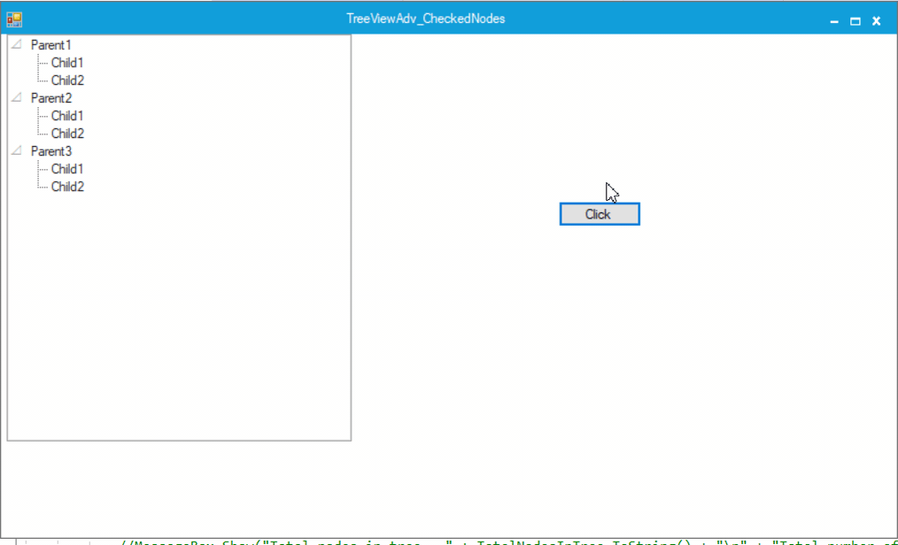
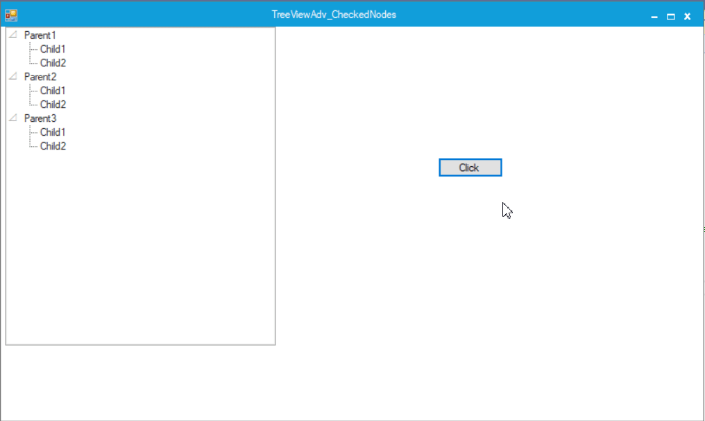
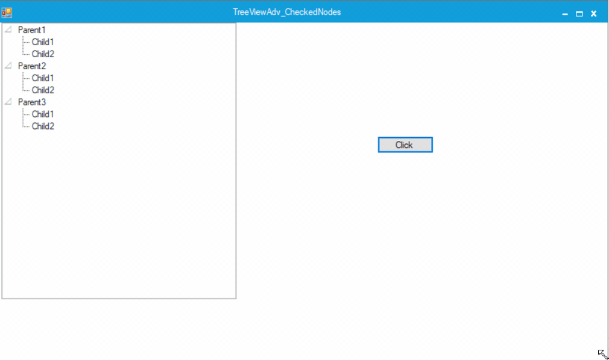

# How to Add/Remove a Node to the TreeViewAdv

Nodes in the TreeViewAdv can be added by specifying the index and also they can be added using the Keyboard. The following section briefs both the scenario.

Adding nodes into the TreeViewAdv at a specific index

By declaring the new node object outside the control and by using the `Insert` method, a new node can be either added to a parent node or child node of TreeViewAdv at the specific index.

## Adding a parent node to the TreeViewAdv

A new object for the parent node can be created to insert it at the specific index in the TreeViewAdv using the `Insert` method.




// Declare the new node object. 
Syncfusion.Windows.Forms.Tools.TreeNodeAdv newParentNode=new Syncfusion.Windows.Forms.Tools.TreeNodeAdv("Inserted Node"); 
private void button1_Click(object sender, System.EventArgs e) 
{ 
    TreeNodeAdv newParentNode=new TreeNodeAdv(); 

// Use Insert method to add parent nodes at particular index.
    this.treeViewAdv1.Nodes.Insert(2, newParentNode); 
}





'Declare the new node object. 
Private NewNode As Syncfusion.Windows.Forms.Tools.newParentNode = New Syncfusion.Windows.Forms.Tools.TreeNodeAdv("Inserted Node") 
Private Sub button1_Click(ByVal sender As Object, ByVal e As System.EventArgs) 
    Dim newParentNode As TreeNodeAdv = New TreeNodeAdv() 

' Use Insert method to add parent nodes at particular index.
    Me.treeViewAdv1.Nodes.Insert(2, newParentNode) 
End Sub
 



## Adding a child node to the TreeViewAdv

A new child node object can be created to insert it at the specific index to the parent node in the TreeViewAdv using the `Insert` method.




private void button1_Click(object sender, EventArgs e)
{
TreeNodeAdv newChildNode = new TreeNodeAdv();

// Use Insert method to add nodes at particular index.
this.treeView1.Nodes[0].Nodes.Insert(0, newChildNode);
}





Private Sub button1_Click(ByVal sender As Object, ByVal e As EventArgs)
    Dim newChildNode As TreeNodeAdv = New TreeNodeAdv()
    Me.treeView1.Nodes(0).Nodes.Insert(0, newChildNode)
End Sub




N> Nodes can also be added using Nodes.Add method.

## Removing a node from the TreeViewAdv

A selected node can be removed irrespective of parent or child node using `Nodes`. The remove method can be used like below.




//Remove the selected node
private void button3_Click(object sender, System.EventArgs e)
{
    this.treeViewAdv1.SelectedNode.Parent.Nodes.Remove(this.treeViewAdv1.SelectedNode);
}





'Remove the selected node
Private Sub button3_Click(ByVal sender As Object, ByVal e As System.EventArgs)
    Me.treeViewAdv1.SelectedNode.Parent.Nodes.Remove(Me.treeViewAdv1.SelectedNode)
End Sub






KeyDownEvent


