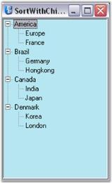

# How to Sort all the Nodes in the TreeViewAdv Control

This can be done by setting the SortWithChildNodes property to true.

Property Table

<table>
<tr>
<th>
TreeViewAdv Properties</th><th>
Description</th></tr>
<tr>
<td>
SortWithChildNodes</td><td>
This indicates the sorting of all nodes including child nodes.</td></tr>
</table>

If the SortWithChildNodes property is set to true, the user can sort all the nodes including the child nodes in the TreeViewAdv. The SortOrder should be specified for the sorting of all the nodes.




private void button1_Click(object sender, System.EventArgs e)
{

// Sorts only the root nodes.
   this.treeViewAdv1.Nodes.Sort();
}
private void button2_Click_1(object sender, System.EventArgs e)
{

// Sorts all the nodes in the tree.
   this.treeViewAdv1.Root.SortOrder=SortOrder.Ascending;
   this.treeViewAdv1.SortWithChildNodes=true;
   this.treeViewAdv1.Root.Sort();
}





Private Sub button1_Click(ByVal sender As Object, ByVal e As System.EventArgs)

' Sorts only the root nodes.
Me.treeViewAdv1.Nodes.Sort()
End Sub
Private Sub button2_Click_1(ByVal sender As Object, ByVal e As System.EventArgs)

' Sorts all the nodes in the tree.
Me.treeViewAdv1.Root.SortOrder=SortOrder.Ascending
Me.treeViewAdv1.SortWithChildNodes=True
Me.treeViewAdv1.Root.Sort()
End Sub




Given below is a screen shot of sorting the nodes in ascending order.


Sorting


