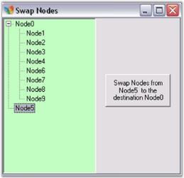

# How to Swap Nodes from One ParentNode to Another ParentNode

This can be done by using the following code.




private void button1_Click(object sender, System.EventArgs e)
{
// Set the destination parent node.
      TreeNodeAdv node = this.treeViewAdv1.Nodes[0];
      TreeNodeAdv[] nodes =new TreeNodeAdv[this.treeViewAdv1.SelectedNodes.Count];
      this.treeViewAdv1.SelectedNodes.CopyTo(nodes);

// Remove the selected nodes from their earlier parent nodes collection.
      foreach (TreeNodeAdv node in nodes)
      {
          node.Remove();
      }

// Add the selected nodes to the destination parent nodes collection.                        
      foreach (TreeNodeAdv node in nodes)
      {
          node.Nodes.Add(node);
      }
}





Private Sub button1_Click(ByVal sender As Object, ByVal e As System.EventArgs)

' Set the destination parent node.
Dim node As TreeNodeAdv = Me.treeViewAdv1.Nodes(0)
Dim nodes As TreeNodeAdv() = New TreeNodeAdv(Me.treeViewAdv1.SelectedNodes.Count - 1) {}
Me.treeViewAdv1.SelectedNodes.CopyTo(nodes)

' Remove the selected nodes from their earlier parent nodes collection.
For Each node As TreeNodeAdv In nodes
node.Remove()
Next node

' Add the selected nodes to the destination parent nodes collection.                        
For Each node As TreeNodeAdv In nodes
node.Nodes.Add(node)
Next node
End Sub  




Given below are screen shots depicting this process.

