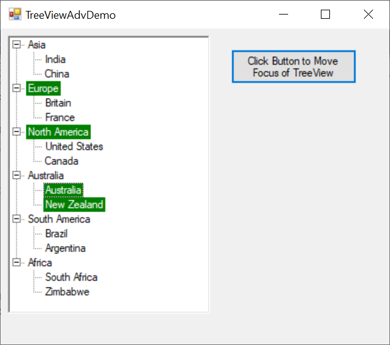

# How to keep highlighting selected node when TreeViewAdv loses focus

By setting the **HideSelection** property to **false**, you can keep the currently selected node highlighted in the TreeViewAdv control even when the control loses focus.  




// To ensure that the selected node is highlighted always
this.treeViewAdv1.HideSelection = false;

// The appearance of selection rectangle can be changed by following property
// To identify selected node is highlighted or not when TreeViewAdv loses focus  
// Set custom colors to the selection rectangle
this.treeViewAdv1.InactiveSelectedNodeBackground = new BrushInfo(Color.Green);
this.treeViewAdv1.InactiveSelectedNodeForeColor = Color.White;





' To ensure that the selected node is highlighted always
Me.treeViewAdv1.HideSelection = False

' The appearance of selection rectangle can be changed by following property
' To identify selected node is highlighted or not when TreeViewAdv loses focus  
' Set custom colors to the selection rectangle
Me.treeViewAdv1.InactiveSelectedNodeBackground = New BrushInfo(Color.Green)
Me.treeViewAdv1.InactiveSelectedNodeForeColor = Color.White




The screenshot below illustrates the TreeViewAdv control with selected nodes highlighted, even when the control does not have focus

[View Sample in GitHub](https://github.com/SyncfusionExamples/How-to-keep-highlighting-the-selected-node-when-winforms-treeview-loses-focus)
