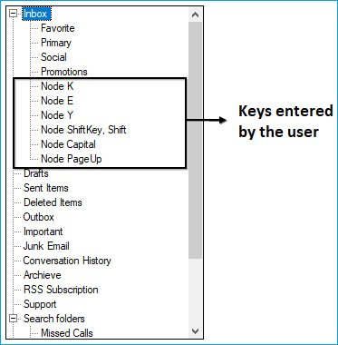

# Find and Replace in Windows Forms TreeView

## TreeViewAdvFindReplaceDialog

The find and replace feature enables users to search and replace a specific tree node present in the `TreeViewAdv` control. You can implement the fastest Find and Replace functionality in the `TreeViewAdv` control by using the `TreeViewAdvFindReplaceDialog` class. This class provides the methods that are necessary to perform a find and replace operation.

The value entered in the Search Text field is highlighted in the TreeViewAdv control after the search action is performed. You can switch to each highlighted tree node by clicking the Find Next button. This functionality is available only when there is more than one search result.

* Search and replace functionalities can be performed for the entire TreeViewAdv control or specific levels of tree nodes.

* Search and replace functionalities can be performed for 
individual tree nodes by using the Find Next and Replace buttons.

* Search and replace functionalities can be performed for all the search results by using the Find All and Replace All buttons

<b> TreeView Search Options</b>

The available search options are as follows:

1. <b>Match Case </b>: Matches letter casing while performing a search.

2. <b>Match Whole Node</b>: Matches the search text with the entire text in a tree node.

<b>TreeViewAdv Search Navigation</b>

1. <b>Search Up</b>: Specifies whether the search can be performed from the bottom of the control up.

2. <b>Search Down</b>: Specifies whether the search can be performed from the top down.

3. <b>Search All</b>: Specifies whether the search can be performed from the bottom up, and then back to the bottom.

<b>TreeViewAdv Search Range</b>

1. <b>TreeView</b>: Specifies whether the search can be performed in entire TreeViewAdv control.

2. <b>Root Node</b>: Specifies whether the search can be performed only on the parent node level.

3. <b>Child Node</b>: Specifies whether the search can be performed only on the child node level.

The find and replace feature can be enabled for the TreeViewAdv control by using the following code:




TreeViewAdvFindReplaceDialog dialog = new TreeViewAdvFindReplaceDialog(this.TreeView);
dialog.Find("India", TreeViewSearchOption.MatchWholeText, TreeViewSearchRange.TreeView);
dialog.FindAll("India", TreeViewSearchOption.MatchWholeText, TreeViewSearchRange.TreeView);
dialog.Replace("India", TreeViewSearchOption.MatchWholeText, TreeViewSearchRange.TreeView);
dialog.ReplaceAll ("India", TreeViewSearchOption.MatchWholeText, TreeViewSearchRange.TreeView);





Dim dialog As New TreeViewAdvFindReplaceDialog(Me.TreeView)
dialog.Find("India", TreeViewSearchOption.MatchWholeText, TreeViewSearchRange.TreeView)
dialog.FindAll("India", TreeViewSearchOption.MatchWholeText, TreeViewSearchRange.TreeView)
dialog.Replace ("India", TreeViewSearchOption.MatchWholeText, TreeViewSearchRange.TreeView)
dialog.ReplaceAll ("India", TreeViewSearchOption.MatchWholeText, TreeViewSearchRange.TreeView)




## OnNodeBeforeFind Event

This event will be triggered before the matching tree nodes are highlighted in the TreeViewAdv control. 

<b>Event Data</b>

TreeNodeAdvBeforeFindArgs contains the following members that provide information specific to this event:

<b>Members Table</b>

<table>
<tr>
<th>
Members</th><th>
Description</th></tr>
<tr>
<td>
Node</td><td>
This will return the matched TreeNodeAdv based on user input.</td></tr>
<tr>
<td>
SearchText</td><td>
This will return the search string to highlight in the        TreeNodeAdv.</td></tr>
<tr>
<td>
Cancel</td><td>
This enables users to disable highlighting matched TreeNodeAdv.</td></tr>
</table>




Void treeViewAdv1_OnNodeBeforeFind(object sender, Syncfusion.Windows.Forms.Tools.TreeNodeAdvBeforeFindArgs e)
{

// This will return the matched TreeNodeAdv.
    TreeNodeAdv matchedNode = e.Node;

// This will return the searched string.
    string matchedString = e.SearchText;

// Cancel arguments.
    bool cancelFind = e.Cancel;
}





Private Sub treeViewAdv1_OnNodeBeforeFind(sender As Object, e As Syncfusion.Windows.Forms.Tools. TreeNodeAdvBeforeFindArgs)

' This will return the matched TreeNodeAdv.
Dim matchedNode As TreeNodeAdv = e.Node

' This will return the searched string.
Dim matchedString As string = e.SearchText

' Cancel arguments.
Dim cancelFind As Boolean = e.Cancel

End Sub




## OnNodeAfterFound Event

This event will be triggered after the matching TreeNodeAdv is highlighted in the TreeViewAdv control. 

<b>Event Data</b>

TreeNodeAdvAfterFindArgs contains the following members that provide information specific to this event:

<b>Members Table</b>

<table>
<tr>
<th>
Members</th><th>
Description</th></tr>
<tr>
<td>
Node</td><td>
This will return matched TreeNodeAdv based on user input.</td></tr>
<tr>
<td>
SearchText</td><td>
This will return the search string to be highlighted in TreeNodeAdv.</td></tr>
</table>




void treeViewAdv1_OnNodeAfterFound(object sender, Syncfusion.Windows.Forms.Tools.TreeNodeAdvAfterFindArgs e)
{

// This will return matched TreeNodeAdv.
    TreeNodeAdv matchedNode = e.Node;

// This will return the searched string.
    string searchedString = e.SearchText;
}





Private Sub treeViewAdv1_OnNodeAfterFound(sender As Object, e As Syncfusion.Windows.Forms.Tools. TreeNodeAdvAfterFindArgs)

' This will return the matched TreeNodeAdv.
Dim matchedNode As TreeNodeAdv = e.Node

' This will return the searched string.
Dim searchedString As string = e.SearchText
End Sub




## OnNodeReplacing Event

This event will be triggered before replacing the matched tree node text in the TreeViewAdv control. 

<b>Event Data</b>

TreeNodeAdvOnReplacingArgs contains the following members that provide information specific to this event:

<b>Members Table</b>

<table>
<tr>
<th>
Members</th><th>
Description</th></tr>
<tr>
<td>
Node</td><td>
This will return the matched TreeNodeAdv based on user input.</td></tr>
<tr>
<td>
SearchText</td><td>
This will return the searched string to be highlighted in TreeNodeAdv.</td></tr>
<tr>
<td>
ReplaceText</td><td>
This will return the TreeNodeAdv text that is to be replaced.</td></tr>
<tr>
<td>
TreeViewSearchOption</td><td>
This will return TreeViewSearchOption to find or replace TreeNodeAdv.</td></tr>
<tr>
<td>
TreeViewSearchRange</td><td>
This will return TreeViewSearchRange level to find or replace TreeNodeAdv.</td></tr>
<tr>
<td>
Cancel</td><td>
This will enable users to disable replacing matched TreeNodeAdv text.</td></tr>
</table>




void treeViewAdv1_OnNodeReplacing(object sender, Syncfusion.Windows.Forms.Tools.TreeNodeAdvOnReplacingArgs e)
{

// This will return the replaced TreeNodeAdv.
    TreeNodeAdv replaceNode = e.Node;

// This will return the searched string.
    string matchedString = e.SearchText;

// This will return the replaced string.
    string ReplacedString = e.ReplaceText;

// TreeViewAdv search options.
    TreeViewSearchOption searchOption = e.TreeViewSearchOption;

// This will return the TreeViewAdv search range.
    TreeViewSearchRange searchRange = e.TreeViewSearchRange;

// Cancel arguments.
    bool cancelReplace = e.Cancel;
}





Private Sub treeViewAdv1_OnNodeReplacing(sender As Object, e As Syncfusion.Windows.Forms.Tools. TreeNodeAdvOnReplacingArgs)

' This will return the replaced TreeNodeAdv.
Dim replaceNode As TreeNodeAdv = e.Node

' This will return the searched string.
Dim matchedString As string = e.SearchText

' This will return the replaced string.
Dim ReplacedString As string = e.ReplaceText

' TreeViewAdv search options.
Dim searchOption As TreeViewSearchOption = e.TreeViewSearchOption

' This will return the TreeViewAdv search range.
Dim searchRange As TreeViewSearchRange = e.TreeViewSearchRange

' Cancel arguments.
Dim cancelReplace As Boolean = e.Cancel
End Sub




## OnNodeReplaced Event

This event will be triggered after the matched TreeNodeAdv text is replaced in the TreeViewAdv control. 

<b>Event Data</b>

The TreeViewOnReplacedArgs contains the following members that provide information specific to this event:

<b>Members Table</b>

<table>
<tr>
<th>
Members</th><th>
Description</th></tr>
<tr>
<td>
Node</td><td>
This will return the TreeNodeAdv whose text will be replaced.</td></tr>
<tr>
<td>
SearchText</td><td>
This will return the search string to highlight in TreeNodeAdv.</td></tr>
<tr>
<td>
ReplaceText</td><td>
This will return TreeNodeAdv text that has been replaced.</td></tr>
</table>




void treeViewAdv1_OnNodeReplaced(object sender, Syncfusion.Windows.Forms.Tools.TreeNodeAdvOnReplacedArgs e)
{

// This will return the replaced TreeNodeAdv.
    TreeNodeAdv replacedNode = e.Node;

// This will return the searched string.
    string matchedString = e.SearchText;

// This will return the replaced string.
    string ReplacedString = e.ReplaceText;
}





Private Sub treeViewAdv1_OnNodeReplaced(sender As Object, e As Syncfusion.Windows.Forms.Tools. TreeNodeAdvOnReplacedArgs)

' This will return Replaced TreeNodeAdv
Dim replacedNode As TreeNodeAdv = e.Node

' This will return Searched String
Dim matchedString As String = e.SearchText

' This will return Replaced String
Dim ReplacedString As String = e.ReplaceText
End Sub




## Keyboard Search

Setting AllowKeyboardSearch property of the treeview to true, will allow the user to search for a node by typing the name of the node using the keyboard.

<b>Property Table</b>

<table>
<tr><th>
TreeViewAdv Property</th><th>
Description</th></tr><tr><td>
AllowKeyboardSearch</td><td>
Gets or sets a value indicating if keyboard-based searching should be allowed.</td></tr>
</table>




this.treeViewAdv1.AllowKeyboardSearch = true;




Me.treeViewAdv1.AllowKeyboardSearch = True




### KeyDown Event

This event is triggered when the key is first pressed. An example which uses the KeyDown event is as follows.

####  Event Data

The KeyEventHandler receives an argument of type KeyEventArgs containing data related to this event. The following KeyEventArgs members provide information specific to this event.

Members Table
<table>
<tr>
<th>
Members</th><th>
Description</th></tr>
<tr>
<td>
Alt	</td><td>
Gets a value indicating whether the ALT key was pressed.</td></tr>
<tr>
<td>
Control	</td><td>
Gets a value indicating whether the CTRL key was pressed.</td></tr>
<tr>
<td>Handled	</td><td>
Gets or sets a value indicating whether the event was handled.</td></tr>
<tr>
<td>KeyCode	</td><td>
Gets the keyboard code for a KeyDown or KeyUp event.</td></tr>
<tr>
<td>KeyData	</td><td>
Gets the key data for a KeyDown or KeyUp event.</td></tr>
<tr>
<td>KeyValue</td><td>
Gets the keyboard value for a KeyDown or KeyUp event.</td></tr>
<tr>
<td>Modifiers</td><td>
Gets the modifier flags for a KeyDown or KeyUp event. The flags indicate which combination of CTRL, SHIFT, and ALT keys was pressed.</td></tr>
<tr>
<td>Shift</td><td>
Gets a value indicating whether the SHIFT key was pressed.</td></tr>
<tr>
<td>SuppressKeyPress</td><td>
Gets or sets a value indicating whether the key event should be passed on to the underlying control.
</td>
</tr>
</table>

#### Adding Nodes into the TreeViewAdv using KeyBoard

The nodes can be added to the TreeViewAdv when any key is pressed, whereby the text of the node reflects the key that has been used for adding the node, by using the following code in the TreeViewAdv KeyDown event handler.

#### Border Settings




// Setting the key data to the newly added node.
// Add the nodes to the selected node.
private void treeViewAdv1_KeyDown(object sender, System.Windows.Forms.KeyEventArgs e) 
{ 
 // Setting the key data to the newly added node.
     TreeNodeAdv node=new TreeNodeAdv("Node"+" "+e.KeyData.ToString()); 

// Add the nodes to the selected node.
     this.treeViewAdv1.SelectedNode.Nodes.Add(node); 
     Console.WriteLine("The "+node.Text+" "+"is added"); 
}





Private Sub treeViewAdv1_KeyDown(ByVal sender As Object, ByVal e As System.Windows.Forms.KeyEventArgs)

' Setting the key data to the newly added node.
Dim node As TreeNodeAdv = New TreeNodeAdv("Node" & " " & e.KeyData.ToString())

' Add the nodes to the selected node.
Me.treeViewAdv1.SelectedNode.Nodes.Add(node)
Console.WriteLine("The " & node.Text & " " & "is added")
End Sub




