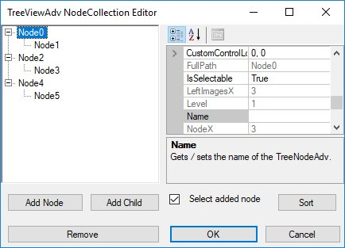
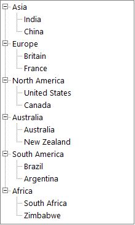

# Getting Started

This section will provide a step-by-step procedure to design a `TreeViewAdv` control by using designer and through programming approach in .NET application.

## Assembly Deployment

<b>Namespace</b>: Syncfusion.Windows.Forms.Tools

<b>Assembly</b>: Syncfusion.Tools.Windows

<b>Dependent assembly</b>: Syncfusion.Shared.Base

<table>
<tr>
<th>
Required Assemblies</th><th>
Description</th></tr>
<tr>
<td>
Syncfusion.Shared.Base</td><td>
Contains the base classes for Scrolling and Utilities.</td></tr>
<tr>
<td>
Syncfusion.Tools.Windows </td><td>
Contains classes that handles all UI operations, fundamentals and base classes of TreeViewAdv.</td></tr>
</table>

## Adding control via Designer

Create a new Windows Forms application in the Visual Studio and follow the steps given. 

Drag and drop the `TreeViewAdv` control from the toolbox to the designer. It generates the `TreeViewAdv` as shown:

## Adding control manually in C#

To create a `TreeViewAdv` control through C#, use the following code.

1. Add the below required assembly references to the project,

    * Syncfusion.Shared.Base

    * Syncfusion.Tools.Windows

2. Create the TreeViewAdv control instance and add it to the Form

    

    

    TreeViewAdv treeViewAdv1 = new TreeViewAdv();
    this.Controls.Add(treeViewAdv1);

    

    

    Dim treeViewAdv1 As New TreeViewAdv()
    Me.Controls.Add(treeViewAdv1)      

    

    

## Adding Node to the control

### Through Designer

Tree nodes can be added to the control at design time as follows.

1. Select the `TreeViewAdv` control in the form. 

2. Click the smart tag of the TreeViewAdv and click Edit Node Collection to open the TreeNodeAdv NodeCollection Editor.

    

    You can also open this editor using task window or by right clicking the control and selecting Nodes Editor.

    

3. In the NodeCollection Editor, Click "Add Node" to add a new top-level node. We can also add top level nodes by clicking the Add Node option on right clicking the control.

4. The Nodes can be customized using the properties displayed in the NodeCollection Editor. Specify a custom label for the node by changing its text property as shown in the below image. 

5. Click "Add Node" to add another sibling to the selected node.

6. Click "Add Child" to add a child node to the selected node.

7. Repeat steps 5 and 6 as required in the application.

8. Click "Remove" to delete a selected node.

9. To move a node to a different parent, just drag-and-drop that node over the parent or besides the desired sibling.

10. Click "OK" to save changes.

### Through Code

Tree nodes can be added to the control programmatically as follows.

<b>Step 1</b>: Create a new instance of a node.





//Creating new instance of node.
TreeNodeAdv node = new TreeNodeAdv("Asia");




  
'Creating new instance of node.
Dim node As New TreeNodeAdv("Asia")





<b>Step 2</b>: Add the created node to the tree control. This will add as a top-level node.





//Add the created nodes to the TreeViewAdv.
this.treeViewAdv1.Nodes.Add(node);





'Add the created nodes to the TreeViewAdv.
 Me.treeViewAdv1.Nodes.Add(node)





<b>Step 3</b>: We can add a child node to an existing node, using the below code snippet





//Add nodes to the existing nodes.
node.Nodes.Add(new TreeNodeAdv("India"));





'Add nodes to the existing nodes.
node.Nodes.Add(New TreeNodeAdv("India"))





<b>Step 4</b>: Repeat steps 1 to 3 to continue adding more top-level nodes and child nodes.

<b>Step 5</b>: Run the application.

<b>Step 6</b>: The resulting form is shown in the below image.

    

## Customize Nodes

### Root Lines

We can display the Root lines between the root nodes by setting the property `ShowRootLines` to True. Whereas the property `ShowLines` displays connecting line for rest of the nodes in the control except between the root nodes. By default, `ShowRootLines` and `ShowLines` are set as `true`.

When `ShowLines` is set to `false`, the connecting lines will not be displayed for the entire control

#### Property Table

<table>
<tr>
<th>
TreeViewAdv Property</th><th>
Description</th></tr>
<tr>
<td>
ShowLines</td><td>
Indicates if the tree lines are visible.</td></tr>
<tr>
<td>
ShowRootLines</td><td>
Indicates whether lines are displayed between root nodes.</td></tr>
</table>




this.treeViewAdv1.ShowLines = false;





Me.treeViewAdv1.ShowLines = False




### Plus/Minus

We can display Plus/Minus sign for the parent nodes by setting the property `ShowPlusMinus` to True. This will set Plus/Minus sign for all the parent nodes in `TreeViewAdv`. 
We can also set this for nodes using ShowPlusMinus property in the `TreeNodeAdv`.

The nodes in the `TreeViewAdv`, even when it is in the expanded state, can still display the Plus sign using the `ShowPlusOnExpand` property. `LoadOnDemand` property should be set to true for this feature to be effective.

#### Property Table

#### TreeViewAdv Property

<table>
<tr>
<th>
Property</th><th>
Description</th></tr>
<tr>
<td>
ShowPlusMinus</td><td>
Indicates if the plus or minus sign is visible for the TreeViewAdv.</td></tr>
</table>

#### TreeNodeAdv Property

<table>
<tr>
<th>
Property</th><th>
Description</th></tr>
<tr>
<td>
ShowPlusMinus</td><td>
Indicates if the plus or minus sign is visible for the individual nodes in TreeNodeAdv.</td></tr>
<tr>
<td>
ShowPlusOnExpand</td><td>
Indicates if the plus sign is visible for the expanded TreeNodeAdv.</td></tr>
</table>




this.treeViewAdv1.ShowPlusMinus = false;





Me.treeViewAdv1.ShowPlusMinus = False




### CheckBox

We can display CheckBox for all nodes in `TreeViewAdv` by setting `ShowCheckBoxes`  property to True. The CheckBox for individual nodes can also be shown or hidden using `ShowCheckBox` property in `TreeNodeAdv`.

#### Property Table

#### TreeViewAdv Property

<table>
<tr>
<th>
Property</th><th>
Description</th></tr>
<tr>
<td>
ShowCheckBoxes</td><td>
Indicates if the checkboxes are visible for all nodes in TreeViewAdv.</td></tr>
</table>

#### TreeNodeAdv Property

<table>
<tr>
<th>
Property</th><th>
Description</th></tr>
<tr>
<td>
ShowCheckBox</td><td>
Indicates if the checkbox is visible for individual nodes in TreeNodeAdv.</td></tr>
</table>




this.treeViewAdv1.ShowCheckBoxes = false;
treeNode.ShowCheckBox = true;





Me.treeViewAdv1.ShowCheckBoxes = False
Me.treeNode.ShowCheckBox = True



In the above image we can show check box for India and china node.

### OptionButton

The Option Buttons can be displayed for the nodes in the `TreeViewAdv` using the `ShowOptionButtons` property. We can also show or hide the Option Button for individual nodes using `ShowOptionButton` property in the `TreeNodeAdv`.

#### Property Table

#### TreeViewAdv Property

<table>
<tr>
<th>
Property</th><th>
Description</th></tr>
<tr>
<td>
ShowOptionButtons</td><td>
Indicates if the option buttons are visible for all nodes in TreeViewAdv.</td></tr>
</table>

#### TreeNodeAdv Property

<table>
<tr>
<th>
Property</th><th>
Description</th></tr>
<tr>
<td>
ShowOptionButton</td><td>
Indicates if the option button is visible for individual nodes in TreeNodeAdv.</td></tr>
</table>




this.treeViewAdv1.ShowOptionButtons = false;
treeNode.ShowOptionButton = true;





Me.treeViewAdv1.ShowOptionButtons = False
Me.treeNode.ShowOptionButton = True




In the above image we can show option button for India and china node.

## Assigning Active Nodes
    
`ActiveNode` holds  a currently selected node. By default, it is null.