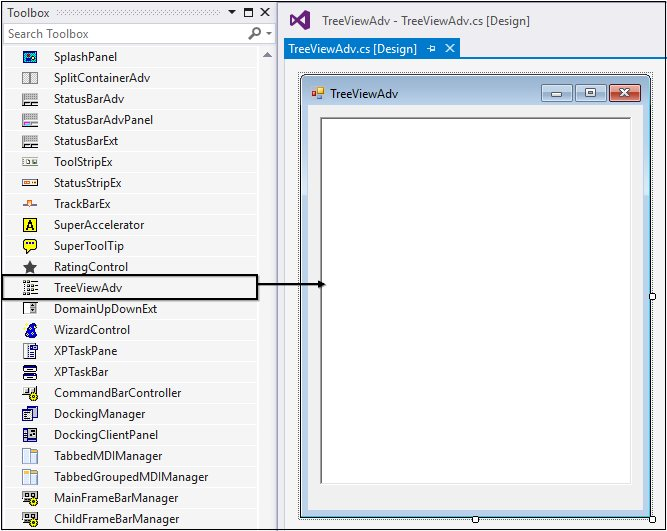
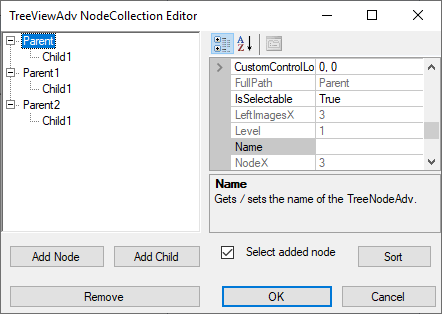
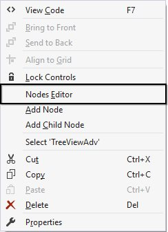
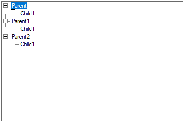
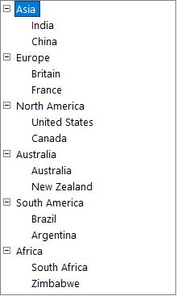
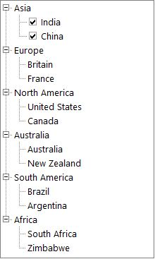
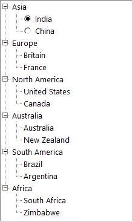

# Getting Started with Windows Forms TreeView

This section provides a quick overview for working with the [Windows Forms TreeView](https://www.syncfusion.com/winforms-ui-controls/treeview) (TreeViewAdv) for WinForms. Walk through the entire process of creating a real world TreeView.

## Assembly Deployment

Refer [control dependencies](https://help.syncfusion.com/windowsforms/control-dependencies#treeviewadv) section to get the list of assemblies or [NuGet package](https://help.syncfusion.com/windowsforms/installation/install-nuget-packages) needs to be added as reference to use the TreeViewAdv control in any application.

## Creating Application with TreeViewAdv

In this walk through, users will create WinForms application that contains TreeViewAdv control.

### Creating the Project

Create new Windows Forms Project in Visual Studio to display [TreeViewAdv](https://help.syncfusion.com/windowsforms/treeview/overview) with data objects.

## Adding control via Designer

[TreeViewAdv](https://help.syncfusion.com/windowsforms/treeview/overview) control can be added to the application by dragging it from Toolbox and dropping it in Designer. The required assembly references will be added automatically.

## Adding control manually in C#

In order to add control manually, do the below steps,

1.Add the required [assembly references](https://help.syncfusion.com/windowsforms/control-dependencies#treeviewadv) to the project.

2.Create the `TreeViewAdv` control instance and add it to the Form.




//Adding Namespace for TreeViewAdv control
using Syncfusion.Windows.Forms.Tools;

namespace WindowsFormsApplication1
{
    public partial class Form1 : Form
    {
        public Form1()
        {
            InitializeComponent();
            //Intialize new instance of TreeViewAdv
            TreeViewAdv treeviewadv1 = new TreeViewAdv();
            treeviewadv1.Location = new System.Drawing.Point(85, 108);
            treeviewadv1.Size = new System.Drawing.Size(240, 150);
            this.Controls.Add(treeviewadv1);
        }
    }
}



'Adding Namespace for TreeViewAdv control

Imports using Syncfusion.Windows.Forms.Tools

Namespace WindowsFormsApp4
  Public Partial Class Form1
     Inherits Form

        Public Sub New()
            InitializeComponent()
            'Intialize new instance of TreeViewAdv
            Dim treeviewadv1 As TreeViewAdv = New TreeViewAdv()
            treeviewadv1.Location = New System.Drawing.Point(85, 108)
            treeviewadv1.Size = New System.Drawing.Size(240, 150)
            Me.Controls.Add(treeviewadv1)
        End Sub
  End Class
End Namespace





## Adding Node to the control

### Through Designer

Tree nodes can be added to the control at design time as follows.

1.Select the [TreeViewAdv](https://help.syncfusion.com/cr/windowsforms/Syncfusion.Windows.Forms.Tools.TreeViewAdv.html) control in the form. 

2.Click the smart tag of the TreeViewAdv and click Edit Node Collection to open the TreeNodeAdv NodeCollection Editor.

You can also open this editor using task window or by right clicking the control and selecting Nodes Editor.

3.In the NodeCollection Editor, Click "Add Node" to add a new top-level node. We can also add top level nodes by clicking the Add Node option on right clicking the control.

4.The Nodes can be customized using the properties displayed in the NodeCollection Editor. Specify a custom label for the node by changing its text property as shown in the below image. 

5.Click "Add Node" to add another sibling to the selected node.

6.Click "Add Child" to add a child node to the selected node.

7.Repeat steps 5 and 6 as required in the application.

8.Click "Remove" to delete a selected node.

9.To move a node to a different parent, just drag-and-drop that node over the parent or besides the desired sibling.

10.Click "OK" to save changes.

### Through Code

Tree nodes can be added to the control programmatically as follows.

Create the Windows Forms TreeView (TreeViewAdv) control instance and add newly created instance of TreeNodeAdv as child of TreeViewAdv control as follows.





//Adding Namespace for TreeViewAdv control

using Syncfusion.Windows.Forms.Tools;

namespace WindowsFormsApp4
{
    public partial class Form1 : Form
    {
        //Create instance of TreeViewAdv
        private Syncfusion.Windows.Forms.Tools.TreeViewAdv treeView1;
        public Form1()
        {
            InitializeComponent();

            //Intialize new instance of TreeViewAdv
            treeView1 = new Syncfusion.Windows.Forms.Tools.TreeViewAdv();
            treeView1.Location = new System.Drawing.Point(202, 75);
            treeView1.Name = "treeView1";

            //Create instance of TreeNodeAdv named treeNode1
            Syncfusion.Windows.Forms.Tools.TreeNodeAdv treeNode1 = new Syncfusion.Windows.Forms.Tools.TreeNodeAdv("Node1");

            //Adding the subnode of [treeNode1] in Root [treeNode2].
            Syncfusion.Windows.Forms.Tools.TreeNodeAdv treeNode2 = new Syncfusion.Windows.Forms.Tools.TreeNodeAdv("Node0", new Syncfusion.Windows.Forms.Tools.TreeNodeAdv[] {
            treeNode1});

            //Create instance of TreeNodeAdv named treeNode3
            Syncfusion.Windows.Forms.Tools.TreeNodeAdv treeNode3 = new Syncfusion.Windows.Forms.Tools.TreeNodeAdv("Node3");

            //Adding the subnode of [treeNode3 ] in Root [treeNode4].
            Syncfusion.Windows.Forms.Tools.TreeNodeAdv treeNode4 = new Syncfusion.Windows.Forms.Tools.TreeNodeAdv("Node2", new Syncfusion.Windows.Forms.Tools.TreeNodeAdv[] {
            treeNode3});

            // Create instance of TreeNodeAdv named treeNode5
            Syncfusion.Windows.Forms.Tools.TreeNodeAdv treeNode5 = new Syncfusion.Windows.Forms.Tools.TreeNodeAdv("Node5");

            //Adding the subnode of [treeNode5] in Root [treeNode6].
            Syncfusion.Windows.Forms.Tools.TreeNodeAdv treeNode6 = new Syncfusion.Windows.Forms.Tools.TreeNodeAdv("Node4", new Syncfusion.Windows.Forms.Tools.TreeNodeAdv[] {
            treeNode5});

            //Assigning the text and Name

            treeNode1.Name = "Node1";
            treeNode1.Text = "Child1";
            treeNode2.Name = "Node0";
            treeNode2.Text = "Parent";
            treeNode3.Name = "Node3";
            treeNode3.Text = "Child1";
            treeNode4.Name = "Node2";
            treeNode4.Text = "Parent1";
            treeNode5.Name = "Node5";
            treeNode5.Text = "Child1";
            treeNode6.Name = "Node4";
            treeNode6.Text = "Parent2";

            //Add the nodes in TreeViewAdv nodes collection
            
            treeView1.Nodes.AddRange(new Syncfusion.Windows.Forms.Tools.TreeNodeAdv[] {
            treeNode2,
            treeNode4,
            treeNode6});
            treeView1.Size = new System.Drawing.Size(377, 250);

           // Add the TreeViewAdv to the Form controls
            this.Controls.Add(treeView1);
        }
    }
    
}




'Adding Namespace for TreeViewAdv control

Imports using Syncfusion.Windows.Forms.Tools

Namespace WindowsFormsApp4
 Public Partial Class Form1
    Inherits Form
        'Create new instance of node.
        Private treeView1 As Syncfusion.Windows.Forms.Tools.TreeViewAdv

        Public Sub New()
            InitializeComponent()

            'Intialize new instance of TreeViewAdv.
            treeView1 = New Syncfusion.Windows.Forms.Tools.TreeViewAdv()
            treeView1.Location = New System.Drawing.Point(202, 75)
            treeView1.Name = "treeView1"

            'Create instance of TreeNodeAdv named treenode1
            Dim treeNode1 As Syncfusion.Windows.Forms.Tools.TreeNodeAdv = New Syncfusion.Windows.Forms.Tools.TreeNodeAdv("Node1")

            'Adding the subnode of [treeNode1] in Root [treeNode2]
            Dim treeNode2 As Syncfusion.Windows.Forms.Tools.TreeNodeAdv = New Syncfusion.Windows.Forms.Tools.TreeNodeAdv("Node0", New Syncfusion.Windows.Forms.Tools.TreeNodeAdv() {treeNode1})

            'Create instance of TreeNodeAdv named treeNode3
            Dim treeNode3 As Syncfusion.Windows.Forms.Tools.TreeNodeAdv = New Syncfusion.Windows.Forms.Tools.TreeNodeAdv("Node3")

            'Adding the subnode of [treeNode3] in Root [treeNode4].
            Dim treeNode4 As Syncfusion.Windows.Forms.Tools.TreeNodeAdv = New Syncfusion.Windows.Forms.Tools.TreeNodeAdv("Node2", New Syncfusion.Windows.Forms.Tools.TreeNodeAdv() {treeNode3})

            'Create instance of TreeNodeAdv named treeNode5
            Dim treeNode5 As Syncfusion.Windows.Forms.Tools.TreeNodeAdv = New Syncfusion.Windows.Forms.Tools.TreeNodeAdv("Node5")

            'Adding the subnode of [treeNode5] in Root [treeNode6].
            Dim treeNode6 As Syncfusion.Windows.Forms.Tools.TreeNodeAdv = New Syncfusion.Windows.Forms.Tools.TreeNodeAdv("Node4", New Syncfusion.Windows.Forms.Tools.TreeNodeAdv() {treeNode5})

            'Assigning the text and Name

            treeNode1.Name = "Node1"
            treeNode1.Text = "Child1"
            treeNode2.Name = "Node0"
            treeNode2.Text = "Parent"
            treeNode3.Name = "Node3"
            treeNode3.Text = "Child1"
            treeNode4.Name = "Node2"
            treeNode4.Text = "Parent1"
            treeNode5.Name = "Node5"
            treeNode5.Text = "Child1"
            treeNode6.Name = "Node4"
            treeNode6.Text = "Parent2"

            'Add the nodes in TreeViewAdv nodes collection

            treeView1.Nodes.AddRange(New Syncfusion.Windows.Forms.Tools.TreeNodeAdv() {treeNode2, treeNode4, treeNode6})
            treeView1.Size = New System.Drawing.Size(377, 250)

            'Add the TreeViewAdv to the Form controls
            Me.Controls.Add(treeView1)
        End Sub
    End Class
End Namespace





## Customize Nodes

### Root Lines

We can display the Root lines between the root nodes by setting the property [TreeViewAdv.ShowRootLines](https://help.syncfusion.com/cr/windowsforms/Syncfusion.Windows.Forms.Tools.TreeViewAdv.html#Syncfusion_Windows_Forms_Tools_TreeViewAdv_ShowRootLines) to True. Whereas the property [TreeViewAdv.ShowLines](https://help.syncfusion.com/cr/windowsforms/Syncfusion.Windows.Forms.Tools.TreeViewAdv.html#Syncfusion_Windows_Forms_Tools_TreeViewAdv_ShowLines) displays connecting line for rest of the nodes in the control except between the root nodes. By default, [TreeViewAdv.ShowRootLines](https://help.syncfusion.com/cr/windowsforms/Syncfusion.Windows.Forms.Tools.TreeViewAdv.html#Syncfusion_Windows_Forms_Tools_TreeViewAdv_ShowRootLines) and[TreeViewAdv.ShowLines](https://help.syncfusion.com/cr/windowsforms/Syncfusion.Windows.Forms.Tools.TreeViewAdv.html#Syncfusion_Windows_Forms_Tools_TreeViewAdv_ShowLines) are set as `true`.

When [TreeViewAdv.ShowLines](https://help.syncfusion.com/cr/windowsforms/Syncfusion.Windows.Forms.Tools.TreeViewAdv.html#Syncfusion_Windows_Forms_Tools_TreeViewAdv_ShowLines) is set to `false`, the connecting lines will not be displayed for the entire control.




this.treeViewAdv1.ShowLines = false;





Me.treeViewAdv1.ShowLines = False




### Plus/Minus

We can display Plus/Minus sign for the parent nodes by setting the property [TreeViewAdv.ShowPlusMinus](https://help.syncfusion.com/cr/windowsforms/Syncfusion.Windows.Forms.Tools.TreeViewAdv.html#Syncfusion_Windows_Forms_Tools_TreeViewAdv_ShowPlusMinus) to True. This will set Plus/Minus sign for all the parent nodes in [TreeViewAdv](https://help.syncfusion.com/cr/windowsforms/Syncfusion.Windows.Forms.Tools.TreeViewAdv.html). 
We can also set this for nodes using [TreeNodeAdv.ShowPlusMinus](https://help.syncfusion.com/cr/windowsforms/Syncfusion.Windows.Forms.Tools.TreeNodeAdv.html#Syncfusion_Windows_Forms_Tools_TreeNodeAdv_ShowPlusMinus) property in the [TreeNodeAdv](https://help.syncfusion.com/cr/windowsforms/Syncfusion.Windows.Forms.Tools.TreeNodeAdv.html).

The nodes in the [TreeViewAdv](https://help.syncfusion.com/cr/windowsforms/Syncfusion.Windows.Forms.Tools.TreeViewAdv.html), even when it is in the expanded state, can still display the Plus sign using the [TreeNodeAdv.ShowPlusOnExpand](https://help.syncfusion.com/cr/windowsforms/Syncfusion.Windows.Forms.Tools.TreeNodeAdv.html#Syncfusion_Windows_Forms_Tools_TreeNodeAdv_ShowPlusOnExpand) property. [TreeViewAdv.LoadOnDemand](https://help.syncfusion.com/cr/windowsforms/Syncfusion.Windows.Forms.Tools.TreeViewAdv.html#Syncfusion_Windows_Forms_Tools_TreeViewAdv_LoadOnDemand) property should be set to true for this feature to be effective.





this.treeViewAdv1.ShowPlusMinus = false;





Me.treeViewAdv1.ShowPlusMinus = False




### CheckBox

We can display CheckBox for all nodes in [TreeViewAdv](https://help.syncfusion.com/cr/windowsforms/Syncfusion.Windows.Forms.Tools.TreeViewAdv.html) by setting [TreeViewAdv.ShowCheckBoxes](https://help.syncfusion.com/cr/windowsforms/Syncfusion.Windows.Forms.Tools.TreeViewAdv.html#Syncfusion_Windows_Forms_Tools_TreeViewAdv_ShowCheckBoxes)  property to True. The CheckBox for individual nodes can also be shown or hidden using [TreeNodeAdv.ShowCheckBox](https://help.syncfusion.com/cr/windowsforms/Syncfusion.Windows.Forms.Tools.TreeNodeAdv.html#Syncfusion_Windows_Forms_Tools_TreeNodeAdv_ShowCheckBox) property in [TreeNodeAdv](https://help.syncfusion.com/cr/windowsforms/Syncfusion.Windows.Forms.Tools.TreeNodeAdv.html).




this.treeViewAdv1.ShowCheckBoxes = false;
treeNode.ShowCheckBox = true;





Me.treeViewAdv1.ShowCheckBoxes = False
Me.treeNode.ShowCheckBox = True



In the above image we can show check box for India and china node.

### OptionButton

The Option Buttons can be displayed for the nodes in the [TreeViewAdv](https://help.syncfusion.com/cr/windowsforms/Syncfusion.Windows.Forms.Tools.TreeViewAdv.html) using the [TreeViewAdv.ShowOptionButtons](https://help.syncfusion.com/cr/windowsforms/Syncfusion.Windows.Forms.Tools.TreeViewAdv.html#Syncfusion_Windows_Forms_Tools_TreeViewAdv_ShowOptionButtons) property. We can also show or hide the Option Button for individual nodes using [TreeNodeAdv.ShowOptionButton](https://help.syncfusion.com/cr/windowsforms/Syncfusion.Windows.Forms.Tools.TreeNodeAdv.html#Syncfusion_Windows_Forms_Tools_TreeNodeAdv_ShowOptionButton) property in the [TreeNodeAdv](https://help.syncfusion.com/cr/windowsforms/Syncfusion.Windows.Forms.Tools.TreeNodeAdv.html).




this.treeViewAdv1.ShowOptionButtons = false;
treeNode.ShowOptionButton = true;





Me.treeViewAdv1.ShowOptionButtons = False
Me.treeNode.ShowOptionButton = True




In the above image we can show option button for India and china node.

## Assigning Active Nodes
    
[TreeViewAdv.ActiveNode](https://help.syncfusion.com/cr/windowsforms/Syncfusion.Windows.Forms.Tools.TreeViewAdv.html#Syncfusion_Windows_Forms_Tools_TreeViewAdv_ActiveNode) holds  a currently selected node. By default, it is null.

N> You can refer to our [WinForms TreeView](https://www.syncfusion.com/winforms-ui-controls/treeview) control feature tour page for its groundbreaking feature representations. You can also explore our [WinForms TreeView example](https://github.com/syncfusion/winforms-demos/tree/master/treeview) that shows you how to render and configure the TreeView.
