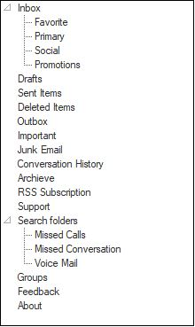

# Windows Forms TreeView Overview

[WinForms TreeView control](https://www.syncfusion.com/winforms-ui-controls/treeview) displays a collection of data in a hierarchical tree structure, and the data in the TreeViewAdv can be expanded and collapsed. The TreeViewAdv offers many advanced features like drag-and-drop, load on demand, context menus, and data binding that can make the control unique and extraordinary. While the [TreeViewAdv](https://help.syncfusion.com/cr/windowsforms/Syncfusion.Windows.Forms.Tools.TreeViewAdv.html) exposes some global styles that are to be applied for all the nodes, the [TreeNodeAdv](https://help.syncfusion.com/cr/windowsforms/Syncfusion.Windows.Forms.Tools.TreeNodeAdv.html) lets the users specify styles for a specific node. The control comes with complete design-time support.

## Key Features

*	[Enabling enhanced performance by Virtualization support](performance)

*	[Data binding support](data-binding).

*	[Select multiple items using the CTRL + SHIFT keys](runtime-features#scrolling).

*	Provides support for [advanced drag and drop of the nodes](drag-and-drop).

*   [TreeViewAdv](https://help.syncfusion.com/cr/windowsforms/Syncfusion.Windows.Forms.Tools.TreeViewAdv.html) can associate the [context menus](runtime-features#context-menu) with the option to show and hide wherever necessary.

*	Provides [automatic scrolling support](scrollbar-customization) for the TreeViewAdv.

*	[Customize the complete look and feel of the control](treeview-appearance).

*	[Sort TreeViewAdv items at run time](sorting).

*	[Add images to expanded and collapsed states of TreeViewAdv](treenode-features#expand-and-collapse-image).

*	[Add images as left, right, and state image sources to the TreeNodeAdv](treenode-features#node-images).

N> You can also explore our [WinForms TreeView example](https://github.com/syncfusion/winforms-demos/tree/master/treeview) that shows you how to render and configure the TreeView.

## Compatibility

The WinForms TreeViewAdv control is compatible with applications targeting .NET Framework 4.5 and above as well as .NET (Core) 3.1 / 6.0 / 7.0 / 8.0+ and is shipped as part of the Syncfusion Essential Studio WinForms suite.
