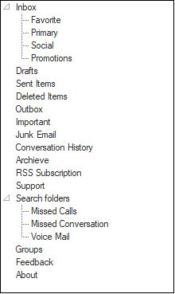

# About Syncfusion® Windows Forms WinForms TreeView Control

[WinForms TreeView control](https://www.syncfusion.com/winforms-ui-controls/treeview) displays a collection of data in a hierarchical tree structure, and the data can be expanded and collapsed. It offers many advanced features such as drag-and-drop, load on demand, context menus, and data binding that make the control unique and powerful. While the `WinForms TreeView` exposes global styles that can be applied to all nodes, the [TreeNodeAdv](https://help.syncfusion.com/cr/windowsforms/Syncfusion.Windows.Forms.Tools.TreeNodeAdv.html) class allows users to specify styles for individual nodes. The control comes with complete design-time support.

## Key Features

*	Enabling enhanced performance by Virtualization support

*	Data binding support.

*	Select multiple items using the CTRL+ SHIFT keys.

*	Provides support for advanced drag and drop of the nodes.

*   [WinForms TreeView](https://help.syncfusion.com/cr/windowsforms/Syncfusion.Windows.Forms.Tools.TreeViewAdv.html) can associate the context menus with the option to show and hide wherever necessary

*	Provides automatic scrolling support for the WinForms TreeView

*	Customize the complete look and feel of the control.

*	Sort [WinForms TreeView](https://help.syncfusion.com/cr/windowsforms/Syncfusion.Windows.Forms.Tools.TreeViewAdv.html) items at run time.

*	Add images to expanded and collapsed states of WinForms TreeView.

*	Add images as left, right and state image sources to the [TreeNodeAdv](https://help.syncfusion.com/cr/windowsforms/Syncfusion.Windows.Forms.Tools.TreeNodeAdv.html).

N> You can also explore our [WinForms TreeView example](https://github.com/syncfusion/winforms-demos/tree/master/treeview) that shows you how to render and configure the WinForms TreeView control.
