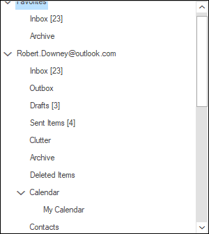

# Scrollbar Customization in Windows Forms TreeView

## Enabling horizontal scrollbar

`HScroll` property is used to show/hide the horizontal scrollbar. By default, `HScroll` will be set as true, when `HScroll` value is false then visibility of horizontal scroll bar will be collapsed.

## Enabling vertical scrollbar

`VScroll` property is used to show/hide the vertical scrollbar. By default, `VScroll` will be set as true, when `VScroll` value is false then visibility of vertical scroll bar will be collapsed.




this.treeViewAdv1.HScroll = false;
this.treeViewAdv1.VScroll = false;




Me.treeViewAdv1.HScroll = False
Me.treeViewAdv1.VScroll = False




## Enable pixel scrolling

Pixel scrolling allows to perform scrolling operation based on pixels instead of nodes. The [VScrollPixel](https://help.syncfusion.com/cr/windowsforms/Syncfusion.Windows.Forms.Tools.TreeViewAdv.html#Syncfusion_Windows_Forms_Tools_TreeViewAdv_VScrollPixel) property is used to enable the vertical pixel scrolling where scrolling is done using scrollbar thumb. By default, the [VScrollPixel](https://help.syncfusion.com/cr/windowsforms/Syncfusion.Windows.Forms.Tools.TreeViewAdv.html#Syncfusion_Windows_Forms_Tools_TreeViewAdv_VScrollPixel) is set to false.
 


 
this.treeViewAdv1.VScrollPixel = true;
 


 
Me.treeViewAdv1.VScrollPixel = True
 



## MetroScrollBars
		
`TreeViewAdv` provides support for Metro scrollbars.

`MetroScrollBars` property use to toggle between standard scrollbar and metro scrollbar. By default, `MetroScrollBars` will set as false. If it is true, then scrollbar style will be switched to metro style or it displays metro scrollbar.




this.treeViewAdv1.MetroScrollBars = true;




Me.treeViewAdv1.MetroScrollBars = True




## Office2007ScrollBars

TreeViewAdv provides support for Office2007 Scroll bar with all color schemes.

`Office2007ScrollBars` property use to toggle between standard scrollbar and Office2007 scrollbar. By default, `Office2007ScrollBars` will set as `false`. If it is true, then scrollbar style will be switched to Office2007 style or it displays office2007 scrollbar.




this.treeViewAdv1.Office2007ScrollBars = true;
treeViewAdv1.Office2007ScrollBarsColorScheme = Syncfusion.Windows.Forms.Office2007ColorScheme.Silver;




Me.treeViewAdv1.Office2007ScrollBars =  True
Me.treeViewAdv1.Office2007ScrollBarsColorScheme = Syncfusion.Windows.Forms.Office2007ColorScheme.Silver




## FillSplitterPane

When the control is been used under a splitter window and if it is sharing the scrollbars with the parent control or the parent window, then setting FillSplitterPane property to true, will toggle support for doing that.

<b>Property Table</b>

<table>
<tr>
<th>
TreeViewAdv Properties</th><th>
Description</th></tr>
<tr>
<td>
FillSplitterPane</td><td>
Provides support for using the control inside dynamic splitter window and sharing the scrollbars with the parent window.</td></tr>
</table>

### FillSplitterPaneChanged Event

The FillSplitterPane property of a TreeViewAdv control is the one that toggles support for using the control inside a dynamic splitter window and sharing scrollbars with the parent window. The FillSplitterPaneChanged event will be raised when this property is changed.




private void treeViewAdv1_FillSplitterPaneChanged(object sender, EventArgs e)
{

//The below line will be printed in the output window at run time.
    Console.Write("FillSplitterPaneChanged Event is raised ");
}





Private Sub treeViewAdv1_FillSplitterPaneChanged(ByVal sender As Object, ByVal e As EventArgs)

'The below line will be printed in the output window at run time.
Console.Write("FillSplitterPaneChanged Event is raised ")
End Sub




## ScrollIncrement
			
### HScrollIncrement

`HScrollIncrement` property used to set the multiplier of mouse wheel scrolling while doing horizontal scroll. User can customize the increment value per mouse wheel using this property

### VScrollIncrement

`VScrollIncrement` property used to set the multiplier of mouse wheel scrolling while doing vertical scroll. User can customize the increment value per mouse wheel using this property.

> NOTE
>
> By Default, the value of both HScrollIncrement and VScrollIncrement are 1.



			
this.treeViewAdv1.HScrollIncrement = 5;
this.treeViewAdv1.VScrollIncrement = 5;




Me.treeViewAdv1.HScrollIncrement = 5
Me.treeViewAdv1.VScrollIncrement = 5




## ScrollbarsVisibleChanged Event

This event is triggered when the scrollbars are hidden or shown.




private void treeViewAdv1_ScrollbarsVisibleChanged(object sender, EventArgs e)
{

//The below line will be printed in the output window at run time.
    Console.Write("ScrollbarsVisibleChanged Event is raised ");
}





Private Sub treeViewAdv1_ScrollbarsVisibleChanged(ByVal sender As Object, ByVal e As EventArgs)

'The below line will be printed in the output window at run time.
Console.Write("ScrollbarsVisibleChanged Event is raised ")
End Sub




## ScrollControlHandledMouseDown Event

The event, MouseDown is raised when the mouse pointer is over the control and a mouse button is pressed. Once this event is raised, ScrollControlHandledMouseDown event will also be raised.

<b>Event Data</b>

The event handler receives an argument of type MouseEventArgs containing data related to this event. The following MouseEventArgs members provide information specific to this event.

<b>Members Table</b>

<table>
<tr>
<th>
Members</th><th>
Description</th></tr>
<tr>
<td>
Button</td><td>
Gets which mouse button was pressed.</td></tr>
<tr>
<td>
Clicks</td><td>
Gets the number of times the mouse button was pressed and released.</td></tr>
<tr>
<td>
Delta</td><td>
Gets a signed count of the detects the mouse had rotated, whereas a detect is one notch of the mouse wheel.</td></tr>
<tr>
<td>
Location</td><td>
Gets the location of the mouse during generating mouse events.</td></tr>
<tr>
<td>
X</td><td>
Gets the X-coordinates of the mouse during generating mouse events.</td></tr>
<tr>
<td>
Y</td><td>
Gets the Y-coordinates of the mouse during generating mouse events.</td></tr>
</table>




private void treeViewAdv1_ScrollControlHandledMouseDown(object sender, MouseEventArgs e)
{

//This code prints mouse button that is pressed.
    Console.Write("Button :" + e.Button.ToString());

//This returns the no of times the mouse button was pressed.
    Console.Write("Clicks :" + e.Clicks.ToString());

//This print the Delta value.
    Console.Write("Delta value :" + e.Delta.ToString());

//This returns the location of the mouse while generating mouse events.
    Console.Write("Location :" + e.Location.ToString());

//This returns the X coordinates of the mouse while generating mouse events.
    Console.Write("X coordinate :" + e.X.ToString());

//This returns the Y coordinates of the mouse while generating mouse events.
    Console.Write("Y coordinate :" + e.Y.ToString());
}





Private Sub treeViewAdv1_ScrollControlHandledMouseDown(ByVal sender As Object, ByVal e As MouseEventArgs)

'This code prints mouse button that is pressed.
Console.Write("Button :" + e.Button.ToString())

'This returns the no of times the mouse button was pressed.
Console.Write("Clicks  :" + e.Clicks.ToString())

'This print the Delta value.
Console.Write("delta Value :" + e.Delta.ToString())

'This returns the location of the mouse while generating mouse events.
Console.Write("Location :" + e.Location.ToString())

'This returns the X coordinates of the mouse while generating mouse events.
Console.Write("X coordinate :" + e.X.ToString())

'This returns the Y coordinates of the mouse while generating mouse events.
Console.Write("Y coordinate :" + e.Y.ToString())

End Sub




## ScrollControlHandledMouseMove Event

The event, MouseMove is raised when the mouse pointer is moved over the control. After AutoScrolling and once this event is raised, ScrollControlHandledMouseMove event will also be triggered.

<b>Event Data</b>

The event handler receives an argument of type MouseEventArgs containing data related to this event. The following MouseEventArgs members provide information specific to this event.

<b>Members Table</b>

<table>
<tr>
<th>
Members</th><th>
Description</th></tr>
<tr>
<td>
Button</td><td>
Gets which mouse button was pressed.</td></tr>
<tr>
<td>
Clicks</td><td>
Gets the number of times the mouse button was pressed and released.</td></tr>
<tr>
<td>
Delta</td><td>
Gets a signed count of the detects the mouse had rotated, whereas a detect is one notch of the mouse wheel.</td></tr>
<tr>
<td>
Location</td><td>
Gets the location of the mouse during generating mouse events.</td></tr>
<tr>
<td>
X</td><td>
Gets the X-coordinates of the mouse during generating mouse events.</td></tr>
<tr>
<td>
Y</td><td>
Gets the Y-coordinates of the mouse during generating mouse events.</td></tr>
</table>




private void treeViewAdv1_ScrollControlHandledMouseMove(object sender, MouseEventArgs e)
{

//This code prints mouse button that is pressed.
    Console.Write("Button :" + e.Button.ToString());

//This returns the no of times the mouse button was pressed.
    Console.Write("Clicks :" + e.Clicks.ToString());

//This print the Delta value.
    Console.Write("Delta value :" + e.Delta.ToString());

//This returns the location of the mouse while generating mouse events.
    Console.Write("Location :" + e.Location.ToString());

//This returns the X coordinates of the mouse while generating mouse events.
    Console.Write("X coordinate :" + e.X.ToString());

//This returns the Y coordinates of the mouse while generating mouse events.
    Console.Write("Y coordinate :" + e.Y.ToString());
}





Private Sub treeViewAdv1_ScrollControlHandledMouseMove(ByVal sender As Object, ByVal e As MouseEventArgs)

'This code prints mouse button that is pressed.
Console.Write("Button :" + e.Button.ToString())

'This returns the no of times the mouse button was pressed.
Console.Write("Clicks  :" + e.Clicks.ToString())

'This print the Delta value.
Console.Write("delta Value :" + e.Delta.ToString())

'This returns the location of the mouse while generating mouse events.
Console.Write("Location :" + e.Location.ToString())

'This returns the X coordinates of the mouse while generating mouse events.
Console.Write("X coordinate :" + e.X.ToString())

'This returns the Y coordinates of the mouse while generating mouse events.
Console.Write("Y coordinate :" + e.Y.ToString())
End Sub




## ScrollControlHandledMouseUp Event

The event, MouseUp is raised when the mouse pointer is over the control and a mouse button is released. Once this event is raised, ScrollControlHandledMouseUp event will also be triggered.

<b>Event Data</b>

The event handler receives an argument of type MouseEventArgs containing data related to this event. The following MouseEventArgs members provide information specific to this event.

<b>Members Table</b>

<table>
<tr>
<th>
Members</th><th>
Description</th></tr>
<tr>
<td>
Button</td><td>
Gets which mouse button was pressed.</td></tr>
<tr>
<td>
Clicks</td><td>
Gets the number of times the mouse button was pressed and released.</td></tr>
<tr>
<td>
Delta</td><td>
Gets a signed count of the detects the mouse had rotated, whereas a detect is one notch of the mouse wheel.</td></tr>
<tr>
<td>
Location</td><td>
Gets the location of the mouse during generating mouse events.</td></tr>
<tr>
<td>
X</td><td>
Gets the X-coordinates of the mouse during generating mouse events.</td></tr>
<tr>
<td>
Y</td><td>
Gets the Y-coordinates of the mouse during generating mouse events.</td></tr>
</table>




private void treeViewAdv1_ScrollControlHandledMouseUp(object sender, MouseEventArgs e)
{

//This code prints mouse button that is pressed.
    Console.Write("Button :" + e.Button.ToString());

//This returns the no of times the mouse button was pressed.
    Console.Write("Clicks :" + e.Clicks.ToString());

//This print the Delta value.
    Console.Write("Delta value :" + e.Delta.ToString());

//This returns the location of the mouse while generating mouse events.
    Console.Write("Location :" + e.Location.ToString());

//This returns the X coordinates of the mouse while generating mouse events.
    Console.Write("X coordinate :" + e.X.ToString());

//This returns the Y coordinates of the mouse while generating mouse events.
    Console.Write("Y coordinate :" + e.Y.ToString());
}





Private Sub treeViewAdv1_ScrollControlHandledMouseUp(ByVal sender As Object, ByVal e As MouseEventArgs)

'This code prints mouse button that is pressed.
Console.Write("Button :" + e.Button.ToString())

'This returns the no of times the mouse button was pressed.
Console.Write("Clicks  :" + e.Clicks.ToString())

'This print the Delta value.
Console.Write("delta Value :" + e.Delta.ToString())

'This returns the location of the mouse while generating mouse events.
Console.Write("Location :" + e.Location.ToString())

'This returns the X coordinates of the mouse while generating mouse events.
Console.Write("X coordinate :" + e.X.ToString())

'This returns the Y coordinates of the mouse while generating mouse events.
Console.Write("Y coordinate :" + e.Y.ToString())
End Sub




## ScrollControlMouseDown Event

The event, MouseDown is raised when the mouse pointer is over the control and a mouse button is pressed. The ScrollControlMouseDown event will be raised before a MouseDown is raised and allows you to cancel the mouse event.

<b>Event Data</b>

The event handler receives an argument of type CancelMouseEventArgs containing data related to this event. The following CancelMouseEventArgs members provide information specific to this event.

<b>Members Table</b>

<table>
<tr>
<th>
Members</th><th>
Description</th></tr>
<tr>
<td>
Cancel</td><td>
Gets or sets a value indicating whether event should be canceled.</td></tr>
<tr>
<td>
MouseEventArgs</td><td>
Indicates the MouseEventArgs data for this event.</td></tr>
</table>




private void treeViewAdv1_ScrollControlMouseDown(object sender, Syncfusion.Windows.Forms.CancelMouseEventArgs e)
{

//Returns the MouseEventArgs data for this event
    Console.Write("Mouse Button :" + e.MouseEventArgs.Button.ToString() + "No of clicks" + e.MouseEventArgs.Clicks.ToString() + "Delta value" + e.MouseEventArgs.Delta.ToString() + "Location of the mouse" + e.MouseEventArgs.Location.ToString() + "X cord" + e.MouseEventArgs.X.ToString() + " Y cord:" + e.MouseEventArgs.Y.ToString()");

//Cancel the event using the below code.
    e.Cancel = true;
}





Private Sub treeViewAdv1_ScrollControlMouseDown(ByVal sender As Object, ByVal e As Syncfusion.Windows.Forms.CancelMouseEventArgs)

//Returns the MouseEventArgs data for this event
Console.Write("Mouse Button :" + e.MouseEventArgs.Button.ToString() + "No of clicks" + e.MouseEventArgs.Clicks.ToString() + "Delta value" + e.MouseEventArgs.Delta.ToString() + "Location of the mouse" + e.MouseEventArgs.Location.ToString() + "X cord" + e.MouseEventArgs.X.ToString() + " Y cord:" + e.MouseEventArgs.Y.ToString()")

//Cancel the event using the below code.
e.Cancel = True
End Sub




## ScrollControlMouseMove Event

The event, MouseMove is raised when the mouse pointer is moved over the control. ScrollControlMouseMove event occurs before a MouseMove event is raised and allows you to cancel the mouse event.

<b>Event Data</b>

The event handler receives an argument of type CancelMouseEventArgs containing data related to this event. The following CancelMouseEventArgs members provide information specific to this event.

<b>Members Table</b>

<table>
<tr>
<th>
Members</th><th>
Description</th></tr>
<tr>
<td>
Cancel</td><td>
Gets or sets a value indicating whether event should be canceled.</td></tr>
<tr>
<td>
MouseEventArgs</td><td>
Indicates the MouseEventArgs data for this event.</td></tr>
</table>




private void treeViewAdv1_ScrollControlMouseMove(object sender, Syncfusion.Windows.Forms.CancelMouseEventArgs e)
{

//Returns the MouseEventArgs data for this event
    Console.Write("Mouse Button :" + e.MouseEventArgs.Button.ToString() + "No of clicks" + e.MouseEventArgs.Clicks.ToString() + "Delta value" + e.MouseEventArgs.Delta.ToString() + "Location of the mouse" + e.MouseEventArgs.Location.ToString() + "X cord" + e.MouseEventArgs.X.ToString() + " Y cord:" + e.MouseEventArgs.Y.ToString()");

//Cancel the event using the below code.
    e.Cancel = true;
}





Private Sub treeViewAdv1_ScrollControlMouseMove(ByVal sender As Object, ByVal e As Syncfusion.Windows.Forms.CancelMouseEventArgs)

//Returns the MouseEventArgs data for this event
Console.Write("Mouse Button :" + e.MouseEventArgs.Button.ToString() + "No of clicks" + e.MouseEventArgs.Clicks.ToString() + "Delta value" + e.MouseEventArgs.Delta.ToString() + "Location of the mouse" + e.MouseEventArgs.Location.ToString() + "X cord" + e.MouseEventArgs.X.ToString() + " Y cord:" + e.MouseEventArgs.Y.ToString()")

//Cancel the event using the below code.
e.Cancel = True
End Sub




## ScrollControlMouseUp Event

The event, MouseUp is raised when the mouse pointer is over the control and a mouse button is released. ScrollControlMouseUp event occurs before a MouseUp event is raised and allows you to cancel the mouse event.

<b>Event Data</b>

The event handler receives an argument of type CancelMouseEventArgs containing data related to this event. The following CancelMouseEventArgs members provide information specific to this event.

<b>Members Table</b>

<table>
<tr>
<td>
Members</td><td>
Description</td></tr>
<tr>
<td>
Cancel</td><td>
Gets or sets a value indicating whether event should be canceled.</td></tr>
<tr>
<td>
MouseEventArgs</td><td>
Indicates the MouseEventArgs data for this event.</td></tr>
</table>




private void treeViewAdv1_ScrollControlMouseUp(object sender, Syncfusion.Windows.Forms.CancelMouseEventArgs e)
{

//Returns the MouseEventArgs data for this event
    Console.Write("Mouse Button :" + e.MouseEventArgs.Button.ToString() + "No of clicks :" + e.MouseEventArgs.Clicks.ToString() + "Delta value :" + e.MouseEventArgs.Delta.ToString() + "Location of the mouse :" + e.MouseEventArgs.Location.ToString() + "X coordinate :" + e.MouseEventArgs.X.ToString() + " Y coordinate :" + e.MouseEventArgs.Y.ToString()");

//Cancel the event using the below code.
    e.Cancel = true;
}





Private Sub treeViewAdv1_ScrollControlMouseUp(ByVal sender As Object, ByVal e As Syncfusion.Windows.Forms.CancelMouseEventArgs)

//Returns the MouseEventArgs data for this event
Console.Write("Mouse Button :" + e.MouseEventArgs.Button.ToString() + "No of clicks :" + e.MouseEventArgs.Clicks.ToString() + "Delta value :" + e.MouseEventArgs.Delta.ToString() + "Location of the mouse:" + e.MouseEventArgs.Location.ToString() + "X coordinate :" + e.MouseEventArgs.X.ToString() + " Y coordinate :" + e.MouseEventArgs.Y.ToString()")

//Cancel the event using the below code.
e.Cancel = True
End Sub




## ScrollTipFeedback Event

This event is triggered when the user is dragging the scrollbar thumb.

<b>Event Data</b>

The event handler receives an argument of type ScrollTipFeedbackEventArgs containing data related to this event. The following ScrollTipFeedbackEventArgs members provide information specific to this event.

<b>Members Table</b>

<table>
<tr>
<th>
Members</th><th>
Description</th></tr>
<tr>
<td>
Action</td><td>
Returns a ScrollTipAction value that specifies the user action that led to this event.</td></tr>
<tr>
<td>
BackColor</td><td>
Gets or sets the back color to be used for the scroll tip text.</td></tr>
<tr>
<td>
BorderStyle</td><td>
Gets or sets the border style to be used for the scroll tip text.</td></tr>
<tr>
<td>
Font</td><td>
Gets or sets the Font to be used for the scroll tip text.</td></tr>
<tr>
<td>
ForeColor</td><td>
Gets or sets the text color to be used for the scroll tip text.</td></tr>
<tr>
<td>
Format</td><td>
Gets or sets the text layout information for the text in the Scroll tip.</td></tr>
<tr>
<td>
Location</td><td>
Gets or sets the location of the scroll tip window.</td></tr>
<tr>
<td>
ScrollBar</td><td>
Returns the scrollbar that is the source of this event.</td></tr>
<tr>
<td>
Size</td><td>
Gets or sets the size of the scroll tip window.</td></tr>
<tr>
<td>
Text</td><td>
Get or sets the text to display in scroll tip.</td></tr>
<tr>
<td>
Value</td><td>
Returns the new scroll position.</td></tr>
</table>




private void treeViewAdv1_ScrollTipFeedback(object sender, Syncfusion.Windows.Forms.ScrollTipFeedbackEventArgs e)
{

//Returns the ScrollTipActions value
    Console.Write("Action :" + e.Action.ToString());

//This prints the Back Color to be used for the Scroll Tip Text
    Console.Write("BackColor:" + e.BackColor.ToString());

//This prints the Border style to be used for the Scroll Tip Text
    Console.Write("Border Style:" + e.BorderStyle.ToString());

//This prints the Font to be used for the Scroll Tip text
    Console.Write("Font:" + e.Font.ToString());

//This prints the text color to be used for the Scroll Tip text
    Console.Write("Fore Color:" + e.ForeColor.ToString());

//This prints the layout out info to be used for the Scroll Tip text
    Console.Write("Format:" + e.Format.ToString());

//This prints the Location of the ScrollTipWindow
    Console.Write("Location:" + e.Location.ToString());

//This prints the scrollbar which is the source of this event.
    Console.Write("Scrollbar:" + e.ScrollBar.ToString());

//This prints the size of the ScrollTipWindow
    Console.Write("Size :" + e.Size.ToString());

//This prints the text for the ScrollTip
    Console.Write("Scrolltip Text:" + e.Text.ToString());

//This returns the new scroll position
    Console.Write("Scroll position:" + e.Value.ToString());
}





Private Sub treeViewAdv1_ScrollTipFeedback(ByVal sender As Object, ByVal e As Syncfusion.Windows.Forms.ScrollTipFeedbackEventArgs)

'Returns the ScrollTipActions value
Console.Write("Action :" + e.Action.ToString())

'This prints the Back Color to be used for the Scroll Tip Text
Console.Write("BackColor:" + e.BackColor.ToString())

'This prints the Border style to be used for the Scroll Tip Text
Console.Write("Border Style:" + e.BorderStyle.ToString())

'This prints the Font to be used for the Scroll Tip text
Console.Write("Font:" + e.Font.ToString())

'This prints the text color to be used for the Scroll Tip text
Console.Write("Fore Color:" + e.ForeColor.ToString())

'This prints the layout out info to be used for the Scroll Tip text
Console.Write("Format:" + e.Format.ToString())

'This prints the Location of the ScrollTipWindow
Console.Write("Location:" + e.Location.ToString())

'This prints the scrollbar which is the source of this event.
Console.Write("Scrollbar:" + e.ScrollBar.ToString())

'This prints the size of the ScrollTipWindow
Console.Write("Size :" + e.Size.ToString())

'This prints the text for the ScrollTip
Console.Write("Scrolltip Text:" + e.Text.ToString())

'This returns the new scroll position
Console.Write("Scroll position:" + e.Value.ToString())
End Sub



