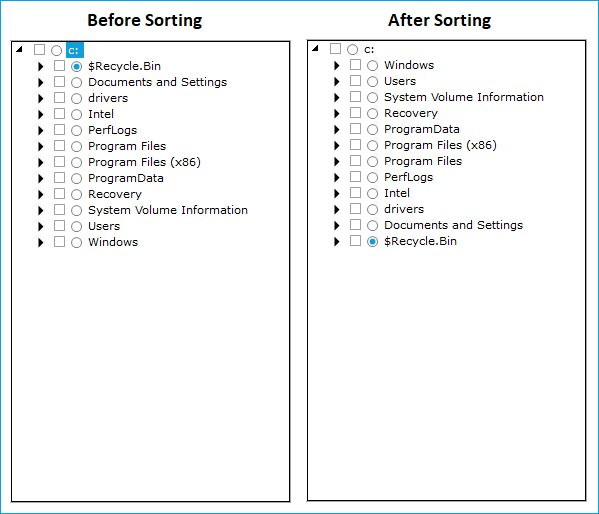

# Sorting in Windows Forms TreeView

Sorting can be performed on the tree nodes using the Sort function and specifying the function to be performed on either the checkbox or tag or text values in ascending or descending order.

The Sort operation sorts only the level 1 nodes. To perform the function on the other levels of nodes, the [SortWithChildNode](https://help.syncfusion.com/cr/windowsforms/Syncfusion.Windows.Forms.Tools.TreeViewAdv.html#Syncfusion_Windows_Forms_Tools_TreeViewAdv_SortWithChildNodes) property should be set to true. The sort function can be done based on the value type which can be specified using [SortType](https://help.syncfusion.com/cr/windowsforms/Syncfusion.Windows.Forms.Tools.TreeNodeAdv.html#Syncfusion_Windows_Forms_Tools_TreeNodeAdv_SortType) to either the option of [Checkbox](https://help.syncfusion.com/cr/windowsforms/Syncfusion.Windows.Forms.Tools.TreeNodeAdv.html#Syncfusion_Windows_Forms_Tools_TreeNodeAdv_CheckBox) or [Tag](https://help.syncfusion.com/cr/windowsforms/Syncfusion.Windows.Forms.Tools.TreeNodeAdv.html#Syncfusion_Windows_Forms_Tools_TreeNodeAdv_Tag) or [Text](https://help.syncfusion.com/cr/windowsforms/Syncfusion.Windows.Forms.Tools.TreeNodeAdv.html#Syncfusion_Windows_Forms_Tools_TreeNodeAdv_Text). The order in which the sort function must be performed can be specified using the [SortOrder](https://help.syncfusion.com/cr/windowsforms/Syncfusion.Windows.Forms.Tools.TreeNodeAdv.html#Syncfusion_Windows_Forms_Tools_TreeNodeAdv_SortOrder) that holds the values of Ascending or Descending.

<b>Property Table</b>

<table>
<tr>
<th>
TreeNodeAdv Properties</th><th>
Description</th></tr>
<tr>
<td>
SortOrder</td><td>
The SortOrder property indicates the order of the sorting: Ascending,Descending, None.</td></tr>
<tr>
<td>
SortType</td><td>
The SortType property indicates the field. Nodes will be sorted based on the type of sorting.</td></tr>
</table>




treeNode.SortOrder = System.Windows.Forms.SortOrder.Ascending;
treeNode.SortType = Syncfusion.Windows.Forms.Tools.TreeNodeAdvSortType.CheckBox;





treeNode.SortOrder = System.Windows.Forms.SortOrder.Ascending
treeNode.SortType = Syncfusion.Windows.Forms.Tools.TreeNodeAdvSortType.CheckBox




<b>Comparing Options for Sorting</b>

* The [CompareOptions](https://help.syncfusion.com/cr/windowsforms/Syncfusion.Windows.Forms.Tools.TreeNodeAdv.html#Syncfusion_Windows_Forms_Tools_TreeNodeAdv_CompareOptions) property gives additional options of comparing the texts of the nodes.[TreeViewAdv](https://help.syncfusion.com/cr/windowsforms/Syncfusion.Windows.Forms.Tools.TreeViewAdv.html) provides the following CompareOptions

    1. IgnoreCase

    2. IgnoreNonSpace

    3. IgnoreSymbols

    4. IgnoreType

    5. IgnoreWidth

    6. OrdinalIgnoreCase

    7. StringSort and Ordinal.

* The [Comparer](https://help.syncfusion.com/cr/windowsforms/Syncfusion.Windows.Forms.Tools.TreeNodeAdv.html#Syncfusion_Windows_Forms_Tools_TreeNodeAdv_Comparer) property is an object that implements the IComparer interface. If you need to compare the nodes by some other field, create an object of this type, set it to the node and that node will use the object in comparing the sub nodes. 

<b>Property Table</b>

<table>
<tr>
<th>
TreeNodeAdv Properties</th><th>
Description</th></tr>
<tr>
<td>
CompareOptions</td><td>
Indicates the compare options used in the sorting of the nodes. 
</td></tr>
<tr>
<td>
Comparer</td><td>
Indicates the  object which compares two nodes.</td></tr>
</table>




treeNodeAdv9.CompareOptions = System.Globalization.CompareOptions.IgnoreCase;
treeNodeAdv9.Comparer = null;





TreeNodeAdv9.CompareOptions = System.Globalization.CompareOptions.IgnoreCase;
TreeNodeAdv9.Comparer = Null




## See Also

[How to sort root node alone (keep child nodes intact) ?](https://www.syncfusion.com/forums/154542/solved-sort-parent-node-question)

