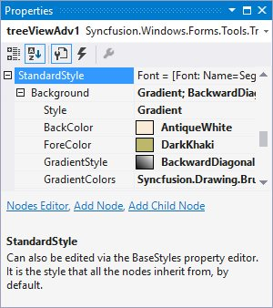
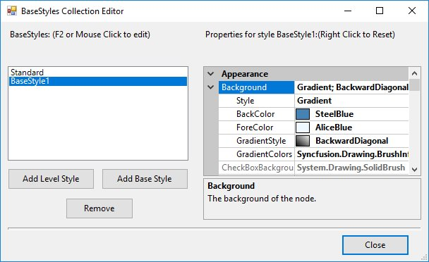
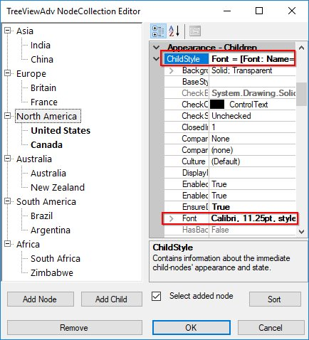
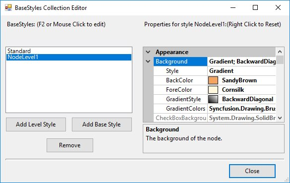
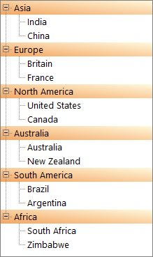

# Styles Architecture in Windows Forms TreeView

The tree control employs an extensive Styles Architecture, that let users specify node styles globally, specifically for a class of nodes. This is possible by using a style information instance for each class of nodes, represented by a `TreeNodeAdvStyleInfo`. Users will notice that for some of these classes of nodes, the style needs to be declared with a name at the tree level and stored in the tree's BaseStyles hatch table. 

As illustrated below, implicit style inheritance is enforced by the Framework while explicit style inheritance can be setup by the programmer. For all styles, explicit inheritance precedes implicit inheritance.

### Implicit Style Inheritance

When a style is not set in a style info object, it inherits the style from the previous level and so on until it reaches the default global style on top of the hierarchy. This is called implicit style inheritance and is illustrated below.

The different levels in the above hierarchy are,

* <b>Node Specific Style</b>: At the bottom of the hierarchy is the node specific style which lets users specify a style directly on a TreeNodeAdv. Refer Node specific Style.

* <b>Node's Child Style</b>: Each node also exposes a ChildStyle property where you can specify the style for the immediate children of that node. Refer Child Style for setting style of children nodes.

* <b>Node Level Styles</b>: The Framework also lets you specify a style for all nodes at a particular level in the tree hierarchy, the top-most level being 1. Refer Node Level Style for setting node level style settings.

* <b>Standard Style or Global Style</b>: A standard, global style is exposed by the TreeViewAdv control to be applied on all the nodes in the tree. Refer Standard Style for setting style in a Tree level.

### Explicit Style Inheritance

Any StyleInfo instance can also inherit explicitly from a specific named StyleInfo object. This can be done using the BaseStyle property of the TreeNodeAdvStyleInfo type. As noted previously, such named styles should be available in the tree control's BaseStyles Collection Editor. You can also add custom styles using this editor.

Property Table

<table>
<tr>
<th>
TreeViewAdv Properties</th><th>
Description</th></tr>
<tr>
<td>
BaseStyle</td><td>
Indicates the base style of the nodes.</td></tr>
</table>

## Standard Style

StandardStyle is the default style for the nodes. It can be edited using `StandardStyle` property. It can also be edited through BaseStyles Collection Editor dialog.

Setting a Common Style for All the Nodes in the TreeViewAdv

We can modify the background for all the children of a parent node by editing the `StandardStyle` property. 

The below image displays a gradient style for all the nodes of the TreeView control.

## Node Custom Style

Make a Node's Style Inherit from Another Base Style

Apart from the default style [Standard Style](#standard-style),we can also create custom Base styles using the following steps in Base Styles Collection Editor 

1. Clicking the Add Base Style button, will add a new BaseStyle whose properties can be edited.

    

2. This new base style can be applied to any of the nodes, using TreeNodeAdv.BaseStyle property of the respective nodes.

    

3. This overrides the [Standard Style](#standard-style) settings for the specified nodes and displays the image as follows.

    

## Child Style

Setting a Common Style for All the Children of a Parent Node

This topic illustrates how the appearance of all the children of a particular node can be affected by modifying the `ChildStyle` property of that TreeNodeAdv. In this example, we will modify the font for all the children of a parent node.

In the Node Collection Editor, modify the settings in the `TreeNodeAdv.ChildStyle` property. These changes will be reflected in the child node of this node.

## Node Level Style

Setting a Common Style for all the Nodes in a Level

TreeView lets you add node level styles using the BaseStyles Collection Editor.

By default this style will be applied to the first level nodes as shown in the image below.

You can also apply this style to any of the node by using `TreeNodeAdv.BaseStyle` property for a particular node.

